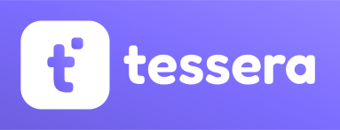

<p align="right"><b>Русский</b> · <a href="README.en.md">English</a></p>

<p align="center">
  
</p>

<p align="center">
  <b>Самостоятельно размещаемый (self-hosted) таск-трекер</b> — разверни у себя и владей своими данными.
</p>

<p align="center">
  <a href="https://github.com/msdnna/tessera/actions/workflows/ci.yml"></a>
  
  
  
  
  
</p>

**Tessera** — таск-трекер, который вы разворачиваете на своём сервере: задачи,
заметки и напоминания под полным контролем, без облачных подписок и без передачи
данных третьим сторонам. Один `docker compose up` поднимает бэкенд, БД и веб-интерфейс;
для мобильных и десктопа есть нативные клиенты.

## Возможности

- **Канбан-доски** с колонками, drag-and-drop, приоритетами, сроками, оценками и
  Done-колонкой; уникальная **группировка карточек по тегам** (колонки = теги).
- **Иерархия проектов**: Workspace → группы проектов (вложенные) → проекты → доски →
  задачи с деревом подзадач, тегами и исполнителями (M:N).
- **Дополнительные представления доски**: список, календарь, таймлайн, диаграмма
  Ганта (с зависимостями) и матрица Эйзенхауэра.
- **Богатые задачи**: Markdown-описания и комментарии, вложения, журнал изменений,
  зависимости, повторяющиеся задачи, этапы (milestones), оценки времени.
- **Совместная работа**: рабочие пространства с ролями, приглашения по email,
  realtime-обновления досок через WebSocket, тосты активности.
- **Уведомления**: настраиваемые каналы и правила роутинга (email / webhook /
  Telegram), расписание и тихие часы; push — на Android.
- **Интеграция с GitLab Issues** (self-hosted): двусторонняя синхронизация задач,
  меток, исполнителей и комментариев, разрешение конфликтов, журнал синка.
- **Заметки, документы и личные напоминания**: быстрые заметки, совместные
  Markdown-страницы (модуль «Документы») и напоминания с расписанием.
- **MCP-сервер** — Tessera выдаёт задачи AI-агентам ранжированной очередью и
  принимает результаты работы, так что проектом можно управлять из агентных
  инструментов (этот репозиторий разрабатывается именно так).
- **Встроенный справочный центр**: раздел «Помощь» с категориями, поиском и
  офлайн-доступом — статьи едут вместе с приложением (docs-as-code, `/help`).
- **Интернационализация**: русский и английский интерфейс с автоопределением
  языка на экранах входа; выбранный язык сохраняется в профиле, справочный центр
  тоже двуязычный.
- **Оформление**: светлая/тёмная темы, 7 акцентных схем, адаптив десктоп/мобильный.

## Клиенты

| Клиент  | Технологии                              |
|---------|-----------------------------------------|
| Web     | Vue 3 + Vite + Naive UI + Pinia         |
| Android | Kotlin + Jetpack Compose (online-first) |
| Desktop | Tauri v2 (Windows / Linux)              |

## Стек

- **Backend** — Go + gin, PostgreSQL 17 (JSONB), `pgx/v5` + `sqlc` +
  `golang-migrate`; realtime — WebSocket fan-out hub; JWT-аутентификация.
- **Frontend** — Vue 3 SPA (Vite, Naive UI, Pinia).
- **Mobile / Desktop** — Android (Compose) и Tauri-обёртка того же веб-клиента.
- **MCP** — отдельный Go-сервер (Model Context Protocol) для агентной разработки.
- **Наблюдаемость** — опциональная интеграция с self-hosted Sentry (трекинг
  ошибок бэкенда и фронтенда); включается заданием DSN, по умолчанию выключена.

## Развёртывание (self-hosted)

Нужен только Docker и доменное имя.

```bash
git clone https://github.com/msdnna/tessera.git && cd tessera
cp deploy/.env.example deploy/.env      # задать DOMAIN, JWT_SECRET, ENCRYPTION_KEY, POSTGRES_PASSWORD
docker compose -f deploy/docker-compose.yml up -d
```

Caddy автоматически выпускает TLS-сертификат (Let's Encrypt) и проксирует на
фронтенд-nginx; PostgreSQL наружу не публикуется; бэкенд — distroless-образ с
fail-closed-проверкой секретов. Подробности и обновление — в
[`deploy/README.md`](deploy/README.md). Первый зарегистрированный пользователь
становится администратором.

## Разработка и вклад

Как поднять dev-окружение, тулчейн, конвенции и процесс PR — в
[**CONTRIBUTING.md**](CONTRIBUTING.md).

## Лицензия

[Apache License 2.0](LICENSE) — см. также [`NOTICE`](NOTICE).
