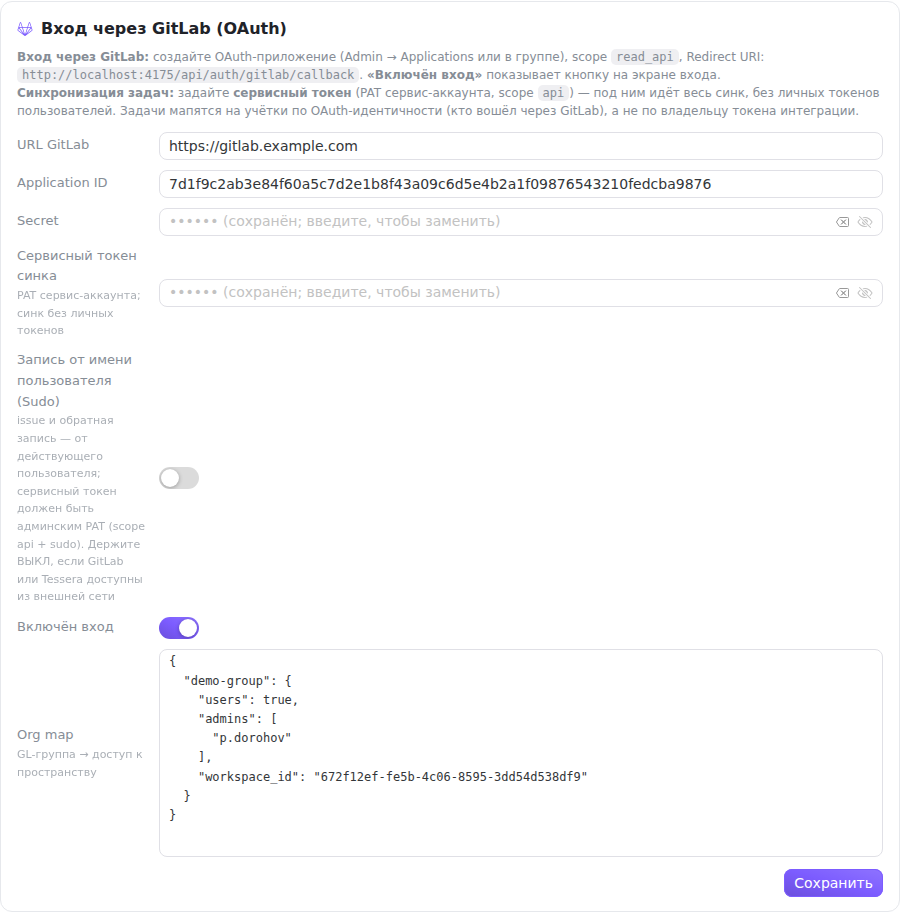

Карточка **«Вход через GitLab (OAuth)»** — верхний блок экрана [«Администрирование»](/help/admin-users). Она настраивает сразу две вещи, хотя лежат они рядом не случайно:

- **вход в Tessera через GitLab** — кнопка «Войти через GitLab» на экране входа вместо пары «почта + пароль»;
- **сервисный токен синхронизации** — учётные данные, под которыми работает интеграция с задачами GitLab.

Обе части заполняются один раз на весь экземпляр и доступны только администратору экземпляра.



## Приложение OAuth на стороне GitLab

Сначала приложение заводится в самом GitLab — в админке (**Admin → Applications**), в настройках группы или в личном профиле, в зависимости от того, чьим приложением вы хотите его сделать.

Нужны два значения:

- **Scopes** — достаточно `read_api`. Этого хватает и на профиль пользователя, и на список его групп (по нему работает Org map ниже). Более широкие права здесь не нужны: под этим токеном Tessera ничего не пишет.
- **Redirect URI** — точный адрес, на который GitLab вернёт пользователя. Он показан прямо в карточке, в строке подсказки, и выглядит как `https://ваш-адрес/api/auth/gitlab/callback`. Скопируйте его оттуда, а не собирайте руками: GitLab сверяет адрес посимвольно и при расхождении отказывает во входе.

Адрес callback Tessera берёт из переменной окружения `PUBLIC_URL`, а если она не задана — из заголовков запроса. На проде задавайте `PUBLIC_URL` явно: за обратным прокси заголовки могут не донести порт или схему, и тогда карточка покажет — а Tessera отправит в GitLab — адрес, которого GitLab не знает.

GitLab выдаст **Application ID** и **Secret** — их и вносим в карточку.

## Поля карточки

**URL GitLab** — адрес экземпляра GitLab, например `https://gitlab.example.com`. Тот же адрес используется и для синхронизации.

**Application ID** и **Secret** — из приложения GitLab.

**Сервисный токен синка** — персональный токен доступа (PAT) сервисного аккаунта GitLab со scope `api`. Под ним идёт вся синхронизация задач, поэтому личные токены пользователям подключать не нужно. Задачи при этом раскладываются по учёткам Tessera не по владельцу токена, а по OAuth-идентичности: кто вошёл через GitLab, тот и опознаётся как исполнитель.

**Запись от имени пользователя (Sudo)** — выключатель, после которого создание issue и обратная запись идут от лица действующего пользователя, а не от сервисного аккаунта. Для этого сервисный токен должен быть админским PAT со scope `api` **и** `sudo`. Такой токен умеет действовать от имени любого пользователя GitLab, поэтому **держите переключатель выключенным, если GitLab или Tessera доступны из внешней сети**: цена утечки такого токена несопоставима с удобством правильного авторства в issue.

**Включён вход** — показывает кнопку «Войти через GitLab» на экране входа. Кнопка появляется, только когда одновременно включён переключатель, заполнен Application ID и задан URL GitLab; при незаполненной паре её не будет даже с включённым переключателем.

**Org map** — правила, по которым членство в группах GitLab превращается в доступ к пространствам Tessera (разбор ниже).

## Как хранятся секреты

Secret и сервисный токен возвращаются с сервера не значением, а признаком «сохранён»: в поле стоит `•••••• (сохранён; введите, чтобы заменить)`. Пустое поле означает «оставить как есть» — сохранение карточки не затирает секрет только потому, что вы его не перевводили.

Чтобы **стереть** сохранённое значение, нажмите кнопку с ластиком в правой части поля: она блокирует поле и меняет подсказку на «будет очищено при сохранении». Отменить — соседняя кнопка со стрелкой, или просто начните печатать новое значение: замена отменяет очистку. Фактическое стирание происходит при нажатии **«Сохранить»**.

У сервисного токена рядом с полем появляется предупреждение **«синхронизация GitLab остановится»** — снятый токен останавливает синк всех привязок экземпляра, а не одной.

## Что происходит при первом входе через GitLab

Пользователь нажимает кнопку на экране входа, подтверждает доступ в GitLab и возвращается обратно. Дальше Tessera ищет, к какому аккаунту его привязать:

1. **Знакомая GitLab-идентичность** — вход в тот аккаунт, который уже связан с этим пользователем GitLab.
2. **Совпадение по почте** — если адрес из GitLab совпал с адресом существующего аккаунта Tessera, аккаунты связываются: GitLab выступает поручителем за адрес.
3. **Иначе — регистрация**: создаётся аккаунт без пароля, с уже подтверждённой почтой и личным пространством, и принимаются приглашения, отправленные на этот адрес заранее.

Если GitLab скрывает почту пользователя, Tessera подставляет служебный адрес вида `login@gitlab.local` — его можно поменять в профиле позже.

**Деактивированный аккаунт** через GitLab не войдёт: вход прерывается ошибкой, деактивация не обходится сменой способа входа. Обратное тоже верно — заведённый через GitLab аккаунт деактивируется на экране администрирования как любой другой.

## Org map: группы GitLab → пространства

Поле **Org map** принимает JSON, где ключ — полный путь группы GitLab, а значение описывает, что даёт членство в ней:

```json
{
  "demo-group": {
    "workspace_id": "0cba7226-4501-4b06-a941-13d25defd8fd",
    "admins": ["p.dorohov"],
    "users": true
  }
}
```

- `workspace_id` — пространство Tessera, доступ к которому выдаётся;
- `admins` — логины GitLab, которые получают в этом пространстве роль администратора;
- `users` — выдавать ли роль участника всем остальным членам группы (`false` — доступ получат только перечисленные в `admins`).

Правила применяются **при каждом входе** через GitLab, а не однократно при регистрации: достаточно добавить человека в группу GitLab, и после следующего входа он окажется в пространстве. Выдача только добавляет права и никогда не понижает владельца пространства — снятие доступа остаётся ручной операцией в участниках пространства.

Ключ сверяется с **полным путём** группы, как он выглядит в адресе GitLab (`отдел/подгруппа`, а не только последний сегмент). Если путь ни с чем не совпал, правило просто не сработает — молча, без ошибки. Пустой `{}` отключает разбор целиком.

Некорректный JSON карточка сохранить не даст: появится сообщение «org_map: некорректный JSON», и остальные поля карточки тоже не уйдут на сервер — исправьте JSON и сохраните ещё раз.

## Проверка

После сохранения:

1. Откройте экран входа в приватном окне — кнопка «Войти через GitLab» должна появиться.
2. Войдите под тестовым аккаунтом GitLab и убедитесь, что пользователь оказался в нужных пространствах.
3. Если вход обрывается, сообщение на экране входа называет причину: «Вход через GitLab не настроен» — не заполнена пара Application ID/URL или снят переключатель; «Не удалось авторизоваться в GitLab» — не сошлись Secret или Redirect URI; «Не удалось получить профиль GitLab» — приложению не хватает scope `read_api`.

## Что дальше

Учётные данные заданы — можно [привязывать проекты GitLab к доскам](/help/admin-gitlab-project).
