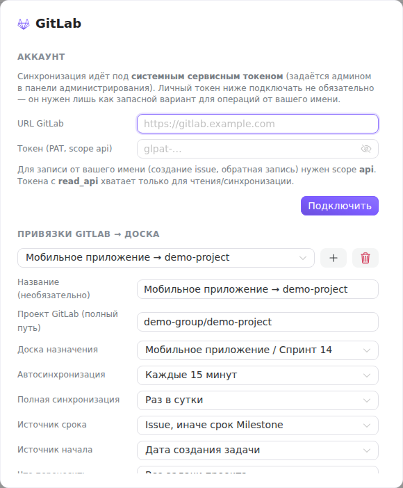
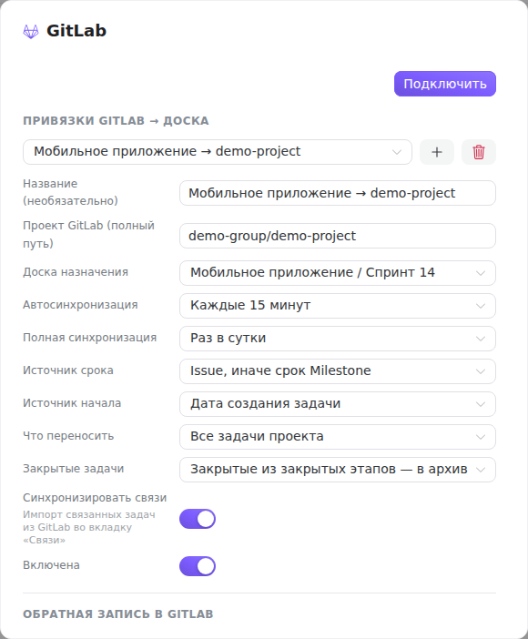

A binding ties **one GitLab project to one Tessera board**: the project's issues arrive on the board as tasks and are then kept up to date. A workspace can have several bindings — one per “project ↔ board” pair.

The window opens from the sidebar header: the **Integrations** button (the puzzle piece, in the row of tools to the right of the logo) → **GitLab**. Any workspace member can view it and start a sync, but only the instance administrator can change bindings.

## Account

The top section answers the question “who do we go to GitLab as”.

If the administrator set a **service token** in the [“Sign in with GitLab (OAuth)”](/help/admin-gitlab-oauth) card, the section says so: syncing runs under the system token, connecting a personal one is optional. This is the standard mode — one service account is enough for the instance.

A personal token serves as a fallback for operations on your behalf. It is connected with a pair of fields: **GitLab URL** and **Token (PAT)**. For writing — creating issues and write-back — the token needs the `api` scope; a `read_api` token is only enough for reading and syncing. A connected account is shown as `@login` next to the instance address and is disconnected with the **Disconnect** button and a confirmation.

When there are no credentials at all — neither a service token nor a personal one — the binding section shows a warning: syncing and write-back will not run. The bindings themselves are not lost meanwhile, and you can configure them ahead of time in peace.

## Choosing a binding

The row above the fields switches between the workspace's bindings. Two buttons sit next to it:

- **plus** — start a new binding (the fields are cleared, nothing is created until you save);
- **trash** — delete the current one. The confirmation warns you honestly: synced tasks stay on the board, only their link to GitLab is gone.

## Binding fields

**Name** — an optional label that makes the binding easy to recognize in the switcher when there are several (for example, “Scrum board”).

**GitLab project (full path)** — a path of the form `group/project`, exactly as in the project address. For a project in a nested group — with all the segments: `department/team/project`.

**Target board** — the Tessera board the issues will go to. The “project + board” pair is unique: trying to bind a second project to the board (or the same project to a second board) returns an error that the binding already exists.

**Auto sync** — how often the background worker pulls changes: manually, every 5 or 15 minutes, once an hour. “Manually” does not disable the integration — it just means the sync runs only from the button.

**Full sync** — how often, instead of the ordinary (incremental) pass, a full one is done. The incremental pass sees changes but does not notice what is no longer in GitLab; the full one reconciles the whole project and catches deletions and discrepancies. The options range from “every 6 hours” to “every week” or “do not force”: in the last case a full pass happens only on the very first sync and on command from the menu.

**Due date source** — where to take the task's deadline from: from the issue itself, and if it has no due date — from the milestone (the default); from the issue only; from the milestone only; do not sync at all.

**Start date source** — the issue creation date, the milestone start, or nothing.

**What to import** — all the project's tasks or only the ones assigned to you.

**Closed issues** — what to do with closed issues:

- *“Closed in a closed milestone — to the archive”* (the default) — the board does not fill up with history, but recently closed tasks stay visible;
- *“All closed — onto the board (into ‘Done’)”* — the full picture, including long-closed ones;
- *“Only the ones closed within a period”* — adds a **“Closed no earlier than”** field with a cut-off date.

**Sync relations** — whether to import linked GitLab issues into the task's “Relations” tab.

**Enabled** — the binding's working switch. A disabled binding keeps all its settings but does not sync — handier than deleting it and setting it up again.

Below comes the **“Write-back to GitLab”** section — that is, movement in the opposite direction, from Tessera into GitLab. It is off entirely by default and is covered separately.

## Saving and running

At the bottom of the window: on the left, the time of the last sync; on the right, the buttons.

**Sync** runs an ordinary pass right now. The arrow next to it opens a menu:

- **Full sync** — force a full pass without waiting for the schedule;
- **Sync journal** — what exactly the last run did;
- **Conflicts** — discrepancies the sync did not resolve on its own (the item is active only when there are any; their count also hangs as an orange badge on the sync button and on the “Integrations” icon in the sidebar header).

**Save** records the binding. For a non-administrator the button is disabled and explains why with a hint — viewing and running a sync are still available to them.

The first sync of a new binding is always full and takes a noticeable while on a large project; the following ones run incrementally and finish within seconds. The progress is visible in the [Background jobs](/help/admin-jobs) window — that is also where to look for the reason if a sync fails.

## Common mistakes

- **“No GitLab credentials available”** — no service token is set and no personal one is connected. Start with the [OAuth card](/help/admin-gitlab-oauth).
- **The binding saved, but there are no tasks** — check that the “Enabled” toggle is on and that “What to import” is not narrowed to “Only the ones assigned to me” with the service account token: a service account usually has no assigned issues.
- **The error “the board or project is already bound”** — another binding already points at this board; find it in the switcher instead of creating a second one.
- **The sync runs, but the assignees are empty** — people are recognized by GitLab OAuth identity. Until a person has signed in to Tessera through GitLab at least once, there is nothing to match them against.
