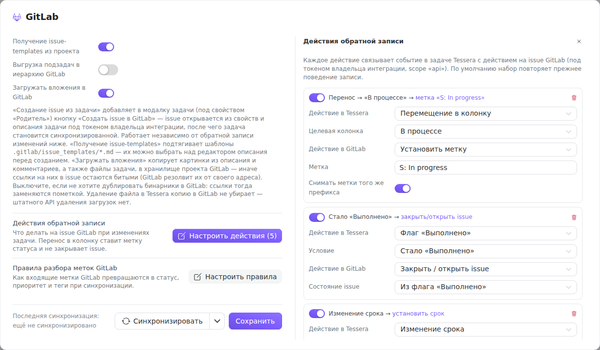
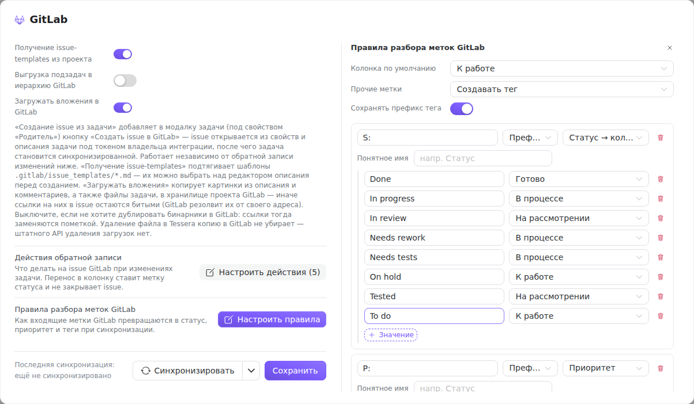

Когда [привязка проекта](/help/admin-gitlab-project) уже настроена, остаётся решить, что именно и в какую сторону ездит между Tessera и GitLab. Направлений два, и настраиваются они порознь:

- **из GitLab в Tessera** — синхронизация читает issue и превращает их метки в колонку, приоритет и теги. Этим управляют **правила разбора меток**;
- **из Tessera в GitLab** — изменения задачи возвращаются на issue. Это **обратная запись**, она выключена по умолчанию и включается по одному действию.

Когда обе стороны меняют одно и то же поле, изменение не затирается, а откладывается в **конфликт**. Что именно сделал каждый запуск, видно в **журнале синхронизации**.

Все настройки ниже живут в окне **«Интеграции» → GitLab** и относятся к выбранной привязке. Менять их может только администратор экземпляра.

## Обратная запись в GitLab

Раздел «Обратная запись в GitLab» находится под полями привязки. Верхний выключатель **«Включить запись»** — общий рубильник: пока он выключен, ни одно действие в GitLab не уходит, как бы ни были настроены остальные переключатели.

**Создание issue из задачи** добавляет в модалку задачи (под свойством «Родитель») кнопку **«Создать issue в GitLab»**. Issue открывается из заголовка, описания и свойств задачи, после чего задача становится синхронизированной. Это отдельная возможность: она работает, даже если обратная запись изменений не настроена ни на одно поле.

**Получение issue-templates из проекта** подтягивает шаблоны из `.gitlab/issue_templates/*.md` — при создании issue шаблон можно выбрать над редактором описания.

**Выгрузка подзадач в иерархию GitLab** создаёт подзадачи сгруппированной задачи дочерними элементами issue. Родителя помечает метка из поля **«Метка сгруппированной задачи»** (пусто — берётся `M: Сгруппированная задача`). Метку задают здесь, а не тегом: она должна читаться правилами разбора как группирующая, иначе сервер отклонит кнопку «Сделать сгруппированной». **«Помечать родителя автоматически»** по умолчанию выключено — иначе первая же подзадача молча поправит метки в GitLab; вместо этого в списке подзадач появляется подсказка с кнопкой.

**Загружать вложения в GitLab** копирует картинки из описания и комментариев, а также файлы задачи, в хранилище загрузок проекта GitLab. Без этого ссылки в issue остаются битыми — GitLab резолвит их от своего адреса. Выключают его тогда, когда не хотят дублировать бинарники: ссылки тогда заменяются пометкой. Учтите: удаление файла в Tessera копию в GitLab не убирает, штатного API удаления загрузок у GitLab нет.

### Действия обратной записи

Что именно происходит на issue, задаёт таблица действий — кнопка **«Настроить действия»** открывает её в правой части окна. Кнопка неактивна, пока не включена запись.

Каждая строка — пара «событие в Tessera → действие в GitLab», со своим выключателем: правило можно погасить, не удаляя. Записи уходят под токеном владельца интеграции, которому нужен scope `api`.

Событий в Tessera десять: перемещение в колонку, флаг «Выполнено», изменение приоритета, срока, исполнителей, оценки, этапа, заголовка или описания, тегов и новый комментарий. У части из них есть уточнение — конкретная колонка, конкретный уровень приоритета («Любой приоритет» = любое изменение), направление флага «Выполнено» («Стало выполнено» / «Снято» / любое изменение).

Действий в GitLab девять:

| Действие | Что делает |
|---|---|
| **Установить метку** | ставит на issue указанную метку. Переключатель **«Снимать метки того же префикса»** убирает соседей по префиксу — так `S: In progress` вытесняет `S: To do`, а не копится рядом с ней |
| **Закрыть / открыть issue** | закрывает или открывает; вариант «Из флага „Выполнено“» берёт направление из самой задачи |
| **Установить срок** | пишет `due_date`. Начало (start) у issue нет, этот вариант для них игнорируется |
| **Установить исполнителей** | переносит исполнителей задачи. Сопоставляются только те, кто входил в Tessera через GitLab |
| **Установить оценку** | пишет `timeEstimate`; имеет смысл, только когда доска считает оценку во времени |
| **Установить этап** | ставит milestone — если этап Tessera сам связан с GitLab |
| **Обновить заголовок/описание** | переносит текст задачи в issue |
| **Синхронизировать теги** | приводит метки issue в соответствие тегам задачи |
| **Написать комментарий** | публикует комментарий; **«Добавлять маркер Tessera»** дописывает в конец подпись, по которой читатель в GitLab понимает, откуда пришла запись |

Перенос в колонку намеренно **ставит метку статуса, а не закрывает issue**: закрытие — это отдельное событие «Выполнено», и смешивать их значило бы закрывать issue всякий раз, когда карточка доехала до правого края доски.

Пустая таблица не означает «ничего не делать»: если действия ни разу не настраивали, при открытии окна набор восстанавливается из прежних флагов записи, и его видно готовым к правке.

Тонкость про теги: действие «Синхронизировать теги» работает только тогда, когда имя тега можно превратить обратно в полное название метки, то есть при включённом **«Сохранять префикс тега»** в правилах разбора. Если префикс отбрасывается, восстановить `T: bug` из тега `bug` нечем — и такие записи не ставятся в очередь вовсе.

### Как уходят изменения

Обратная запись асинхронная: обработчик задачи только кладёт изменение в очередь, а фоновый воркер разбирает её пачками примерно раз в десять секунд. Поэтому недоступный GitLab не тормозит работу в Tessera — запись просто подождёт. Неудачная попытка повторяется с растущей паузой, до пяти раз, после чего запись помечается неудачной и остаётся в журнале. Серия правок одного и того же поля схлопывается в одну запись (побеждает последняя) — комментарии не схлопываются никогда.

## Правила разбора меток GitLab

Обратная дорога: как метки issue превращаются в состояние задачи. Кнопка **«Настроить правила»** открывает редактор — он доступен независимо от того, включена ли обратная запись.

Сверху — три общих параметра:

- **Колонка по умолчанию** — куда попадёт issue, если ни одно правило статуса не сработало;
- **Прочие метки** — что делать с метками, не подошедшими ни под одно правило: «Создавать тег» (по умолчанию) или «Игнорировать»;
- **Сохранять префикс тега** — оставлять ли в имени тега префикс метки (`T: bug`) или отбрасывать его (`bug`). От этого зависит и обратная запись тегов, см. выше.

Ниже — список правил. Каждое состоит из образца, типа сравнения и действия:

- **Префикс** — метка подходит, если начинается с образца (`S: `); значением считается остаток названия;
- **Regex** — метка подходит по регулярному выражению; значением считается всё название целиком.

Действий шесть:

- **Статус → колонка** и **Приоритет** и **Доска (роутинг)** — с таблицей соответствий «значение метки → колонка / уровень приоритета / доска». Роутинг по доске нужен, когда issue одного проекта раскладываются по разным доскам;
- **Тег** — метка становится тегом задачи (со своим переключателем префикса);
- **Группировка (подзадачи)** — метка помечает задачу сгруппированным родителем;
- **Игнорировать** — метка отбрасывается.

У правила с типом «Префикс» есть **понятное имя** — подпись, под которой префикс показывается в интерфейсе Tessera (например, «Статус» для `S: `). Она хранится у проекта, а не у правила, поэтому её видно и на других экранах с тегами.

Разбор идёт сверху вниз: каждая метка достаётся первому подошедшему правилу, а статус, приоритет и доска берутся из первого сработавшего совпадения. Значения в таблицах сверяются без учёта регистра — метка `S: In Progress` найдёт строку `In progress`.

Изначально правила заполнены принятой в проекте раскладкой: `S: ` — статус, `P: ` — приоритет, `M: ` — группировка, остальное превращается в теги с сохранением префикса. Если у команды другая система меток — разумнее переписать таблицы соответствий, чем переименовывать метки в GitLab.

## Конфликты

Синхронизация не решает за вас, кто прав. Если с момента последнего обмена **и вы, и GitLab** изменили одно и то же поле, запись не уходит, а откладывается в конфликт. Так ведут себя заголовок и описание, срок, оценка, статус «Выполнено» и приоритет — то есть поля, где потеря чужой правки заметна.

Неразрешённый конфликт видно сразу в трёх местах: оранжевая метка **«Конфликт»** на карточке задачи, счётчик на кнопке «Синхронизировать» и на иконке «Интеграции» в подвале, и пункт **«Конфликты»** в меню рядом с кнопкой синхронизации (он активен, только когда есть что разрешать).

Панель конфликтов показывает слева список задач, справа — разбор по полям в трёх колонках: **«Было (база)»** — значение на момент последней синхронизации, **«GitLab»** и **«Tessera»** — что стало с каждой стороны. Для заголовка и описания расхождения подсвечиваются построчно.

Решение принимается кнопками: оставить своё, оставить значение GitLab или **объединить вручную** — последнее доступно для текстовых и числовых полей (для статуса и приоритета выбор и так двоичный). После разрешения выбранное значение отправляется в GitLab обычной обратной записью, а базовый снимок обновляется, чтобы следующая правка не считалась расхождением снова.

## Журнал синхронизации

Пункт **«Журнал синхронизации»** в меню кнопки «Синхронизировать» открывает историю запусков. Слева — список: тип (**Pull** — чтение из GitLab, **Push** — доставка обратной записи), время старта, что запустило (вручную или авто), итог и длительность. Точка справа показывает состояние: выполняется, успех, частично, ошибка. Идущий прямо сейчас запуск виден живьём — счётчик времени тикает, и по окончании строка сама меняет статус, панель переоткрывать не нужно.

Счётчики у pull-запуска читаются так: `+N` — создано задач, `~N` — обновлено, «без изменений» — обход прошёл, расхождений не нашлось. У push-запуска считаются доставки.

Клик по запуску раскрывает список действий, клик по действию — подробности справа: какие поля изменились и на что, какие теги, комментарии и исполнители затронуты. Длинный запуск отдаётся страницами — внизу списка появляется **«Показать ещё»**. У неудачной доставки (только у push) есть кнопка **«Повторить»** — она ставит запись обратно в очередь.

## Если что-то идёт не так

- **Изменения не уезжают в GitLab.** Проверьте общий выключатель «Включить запись», затем — есть ли в таблице включённое действие на нужное событие. Событие без действия не ставится в очередь вообще, и в журнале от него не останется следа.
- **Задачи приходят не в ту колонку.** Смотрите правило статуса: скорее всего, значение метки отсутствует в таблице соответствий, и сработала колонка по умолчанию.
- **Метки приезжают тегами вместо статуса.** Ни одно правило не подошло, и метку подобрало «Прочие метки → Создавать тег». Чаще всего дело в префиксе: в правиле `S: ` с пробелом, а в GitLab метка `S:In progress`.
- **Теги не уходят обратно в GitLab.** Включите «Сохранять префикс тега» — без префикса имя тега не превращается обратно в название метки.
- **Исполнители не переносятся ни в ту, ни в другую сторону.** Люди сопоставляются по идентичности GitLab: пока человек не вошёл в Tessera через GitLab хотя бы раз, сопоставлять его не с чем.
- **Запись помечена неудачной.** Откройте её в журнале — там текст ошибки от GitLab. После устранения причины (права токена, удалённый issue, недоступный сервер) нажмите «Повторить».
- **Кнопка «Сделать сгруппированной» не срабатывает.** Метка сгруппированной задачи должна попадать под правило с действием «Группировка»; иначе Tessera поставила бы метку, которую сама же прочитала бы как обычный тег.
