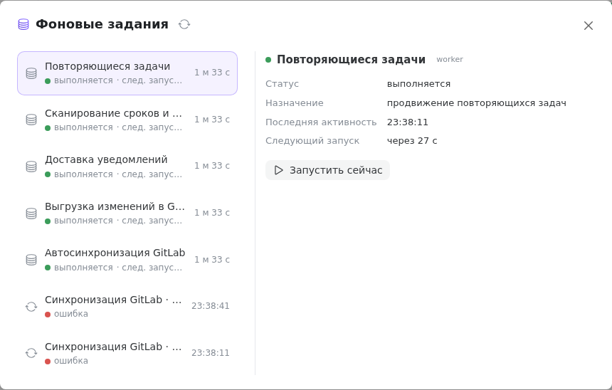

Some of Tessera's work happens on its own, out of the user's sight: it polls GitLab, pushes changes there, sends notifications, watches reminder due dates and creates recurring tasks. The **Background jobs** window shows what of this is running right now, when it will happen next, and what ended with an error.

It's opened with the server-icon button in the sidebar header (in the tools row to the right of the logo) — visible only to an instance admin.

## A worker and a sync are different things

There are two kinds of rows in the list, and they shouldn't be confused.

A **worker** is a permanent loop that lives for as long as the server runs and wakes up on its own interval. It's almost always “running”: that's the state of the loop itself, not a sign that heavy work is happening right now. For a worker the **Next run** line is what matters — how long until it wakes up.

A **sync** is a one-off pass with a beginning and an end: a specific run of the exchange with GitLab for a single integration. It has a duration, a mode, and counters of what was created and updated.

## The permanent workers

There are five of them, each with its own role:

| Worker                        | Interval | What it does                                                       |
| ----------------------------- | -------- | ------------------------------------------------------------------ |
| GitLab auto-sync              | 30 s     | checks which integrations are due for a sync and starts them       |
| GitLab write-back             | 10 s     | pushes the accumulated task changes to GitLab (write-back)         |
| Notification delivery         | 10 s     | works through the notification queue and sends them over channels  |
| Due dates and reminders scan  | 60 s     | looks for task due dates that have arrived and reminders that fired |
| Recurring tasks               | 60 s     | creates the next occurrence on schedule                            |

The intervals are fixed; you can't configure them from the interface.

## How to read the list

On the left are the job rows, each with a coloured status dot:

- **running** — green;
- **queued** — orange;
- **done** — grey;
- **error** — red.

Next to a worker's status comes “next run in …”; for a sync — the current step. On the right of the row is the running time for a job that's running and the finish time for a completed one. The list refreshes itself every few seconds; the arrows button in the heading refreshes it immediately.

Clicking a row opens the card on the right: status, for a worker — the last activity and the next run, for a sync — the mode (**incremental** or **full**), what started it (**manual** or **scheduled**), the start, the finish, the duration and the **Created / updated** counters. If the job failed, the error text is right here too.

## The “journal” badge

The **journal** badge by a name means the record was taken from the saved synchronization log, not from the process's memory: such rows survive a server restart. Everything else is live state, and after a restart the list of workers starts from a clean slate.

The window shows completed runs from the last hour. Older ones drop out of the window — this is a display of the current state, not the full history; you look up the history for a specific integration in its synchronization log in its settings.

## Run and stop

**Run now** does the worker's work immediately, without waiting for the next tick. It's what you need when a change has already been made and you don't want to wait a minute — for example, to check whether a notification goes out. The button is only on workers: a one-off sync of a specific integration is started from its own settings, not from here.

**Stop** appears on a running job that supports cancellation — right now that's the GitLab syncs. Cancellation isn't instant: the job stops at the nearest safe step, so the row stays in the “running” state for a while. Data already moved isn't rolled back on cancellation — the next pass simply continues from where the previous one got to.

## If a job ended with an error

The red dot and the error text in the card are the first thing to read: most often it names outright the unreachable GitLab address, an expired token or missing permissions. The usual order of action is:

1. read the error text in the job's card;
2. check the integration settings — the address, the service token, the token's permissions;
3. run the work again (“Run now” for a worker, a repeat sync — from the integration settings) and see whether the error recurs.

One failed attempt doesn't stop a worker: it keeps waking up on its interval and tries again.

## What's next

Who has access to this window and the other admin screens is covered in the [Instance users](/help/admin-users) article.
