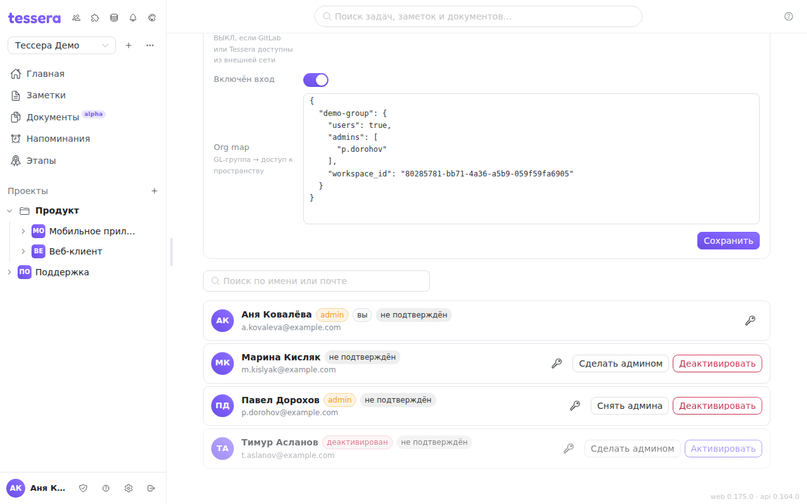

Экран **«Администрирование»** управляет учётными записями всего экземпляра Tessera: кто может войти, у кого есть права администратора, кому выдать ссылку для восстановления доступа. Это не настройки пространства — участников конкретного пространства приглашают и удаляют отдельно, а здесь речь об аккаунтах целиком.

## Кто такой администратор экземпляра

Администратором **автоматически становится первый зарегистрированный пользователь** — тот, кто поднял экземпляр. Дальше права выдаются вручную, с уже имеющегося админского аккаунта.

Администратор видит в подвале боковой панели кнопку **«Администрирование»** (щит) — она и открывает этот экран. У остальных пользователей кнопки нет, а прямой переход на адрес `/admin` вернёт их обратно: доступ проверяется и на сервере, поэтому «угадать ссылку» нельзя.

Права администратора экземпляра дают: этот экран, карточку **«Вход через GitLab (OAuth)»** на нём, окно **«Фоновые задания»** и управление интеграцией с GitLab. Обычная работа — доски, задачи, документы — от них не зависит.

## Список и поиск

Под карточкой OAuth идёт список всех аккаунтов; в заголовке экрана — их общее число. Поле **«Поиск по имени или почте»** фильтрует список по мере ввода, по обоим полям сразу.

Рядом с именем показываются метки состояния:

- **admin** — у аккаунта права администратора экземпляра;
- **вы** — это ваша собственная строка;
- **деактивирован** — вход запрещён, строка приглушена;
- **не подтверждён** — почта аккаунта ещё не подтверждена. Метка информационная: подтверждение почты не блокирует работу, но по неподтверждённому адресу не дойдут ни письмо о восстановлении доступа, ни уведомления по почте.

## Выдать и снять права

Кнопка **«Сделать админом»** выдаёт права одним нажатием. Обратное действие — **«Снять админа»** — спрашивает подтверждение: неосторожное нажатие не должно оставить экземпляр без администратора.

Свою собственную строку изменить нельзя — у неё этих кнопок нет, и сервер отклонит такую попытку. Так единственный администратор не сможет случайно разжаловать сам себя и закрыть себе доступ ко всем админским экранам.

## Деактивировать аккаунт

**«Деактивировать»** (с подтверждением) запрещает пользователю вход. Аккаунт при этом сохраняется целиком: задачи, комментарии, авторство и упоминания остаются на месте, человек просто больше не может войти. Это штатный способ проводить увольнение или закрывать доступ подрядчику — в отличие от удаления, он ничего не ломает в истории.

Строка деактивированного аккаунта становится приглушённой, а кнопка меняется на **«Активировать»** — доступ возвращается тем же одним нажатием. Свой собственный аккаунт деактивировать нельзя.

## Ссылка для восстановления доступа

Кнопка с ключом слева от остальных действий создаёт **ссылку для сброса пароля** и копирует её в буфер обмена. Ссылка действует **один час**.

Это выручает, когда пользователь забыл пароль, а почта на экземпляре не настроена или письма до него не доходят: администратор передаёт ссылку любым доступным каналом. Если SMTP настроен, письмо со ссылкой дополнительно уйдёт на адрес аккаунта.

Ссылка — это, по сути, временный доступ к аккаунту, поэтому передавайте её лично и не публикуйте в общих чатах.

## Что дальше

Что происходит на экземпляре в фоне — синхронизации, доставка уведомлений, повторяющиеся задачи — показывает окно [«Фоновые задания»](/help/admin-jobs).
