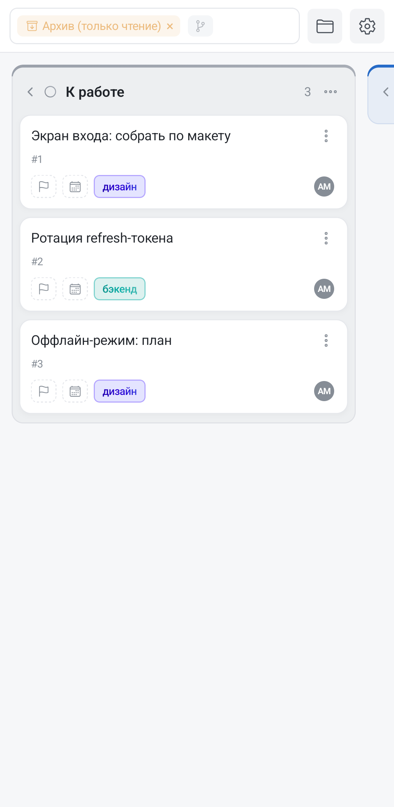

Архив — место, куда уезжают задачи, которые больше не нужны на доске, но которые жалко потерять. Это не корзина с отложенным удалением: из архива ничего не пропадает само.

Открывается архив из меню доски — три точки в правом верхнем углу, пункт **«Архив»**. Отдельной кнопки в шапке, как на компьютере, на телефоне нет: там же, под тремя точками, лежат теги и этапы.

## Архив — это та же доска, только для чтения

Открыв архив, вы не уходите на отдельный экран. Это **область** той же доски: те же колонки, та же группировка, те же фильтры — но показаны архивные задачи вместо живых. В [панели доски](/help/board-composer) появляется янтарный чип **«Архив (только чтение)»**; крестик на нём возвращает к обычной доске.

Чип встаёт первым в панели и в свёрнутом виде вытесняет поле поиска за пределы единственной видимой строки — панель от этого не перестаёт работать, коснитесь её, и она раскроется вместе с поиском и фильтрами.

Из этого следует главное правило: **в архиве ничего нельзя изменить**. Карточки не перетаскиваются, кнопки «завершить» и «добавить подзадачу» с них убраны, а плашки приоритета, срока и тегов перестают быть кнопками: касание по любой из них просто открывает задачу на просмотр. Создать задачу в архиве тоже нельзя.

Ищите в архиве теми же средствами, что и на доске: фильтр по тегу, по исполнителю, поиск по названию — всё работает и здесь.

При входе в архив снимается область этапа, если она была. И наоборот: выбор этапа в боковом меню сначала выводит из архива, а потом сужает доску — архивная выборка по этапам не разбирается, и чип, обещающий этап, был бы враньём. По той же причине выход из архива снимает и фильтр по этапу, если вы поставили его внутри архива.

## Как задача попадает в архив

Пункт **«В архив»** есть в двух местах:

- в меню карточки — три точки в правом верхнем углу карточки;
- в самой задаче — значок архива в строке действий внизу окна.

Оба спрашивают подтверждение. Подзадачи уезжают в архив **вместе с родителем**; выбора «отвязать подзадачи», как на компьютере, в приложении нет. Именно поэтому в архиве карточки показаны плоско: их дети уже лежат рядом, внутри того же архива.

## Восстановление и удаление навсегда

У архивной карточки своё меню — те же три точки, но с другим набором:

- **Открыть** — просмотр задачи со всей историей и комментариями.
- **Восстановить** — задача сразу возвращается на доску, в свою колонку, и исчезает из архивного списка. Подзадачи, уехавшие вместе с родителем, возвращаются вместе с ним.
- **Удалить навсегда** — задача стирается совсем, минуя доску. Действие необратимо, поэтому спрятано за подтверждением с названием задачи.

## Архив и удаление — не одно и то же

Разница важная, и её легко упустить:

- **В архив** — задача сохраняется со всей историей, комментариями и вложениями, её видно в архиве и можно вернуть.
- **Удалить** (в меню живой карточки) и **«Удалить навсегда»** (в архиве) — задача исчезает без возможности вернуть.
- **Удалить колонку** — колонка исчезает **вместе со своими задачами, минуя архив**. Прежде чем удалять колонку, перенесите нужные задачи в другую или отправьте их в архив.

Если сомневаетесь — отправляйте в архив. Он существует ровно для того, чтобы не выбирать между «мешает на доске» и «жалко потерять».
