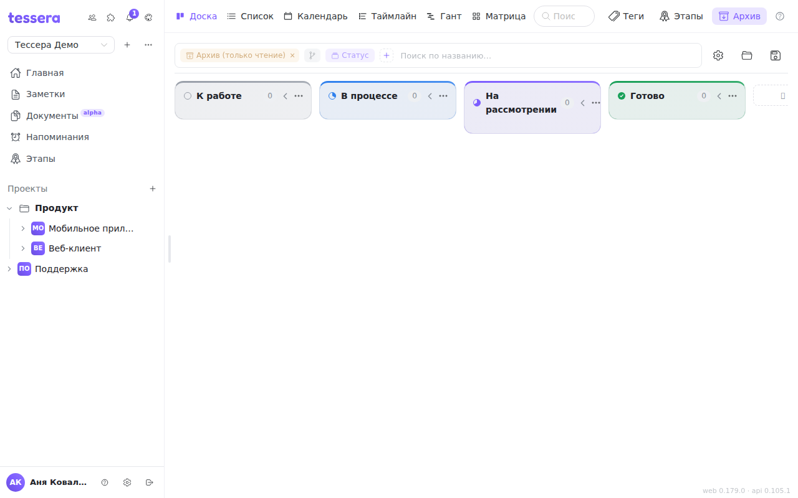

The archive is where tasks go that are no longer wanted on the board but would be a shame to lose. It isn't a bin with delayed deletion: nothing disappears from the archive on its own.

The **Archive** button sits in the board header, next to “Tags” and “Milestones”.

## The archive is the same board, read-only

Opening the archive doesn't take you to a separate screen. It is a **scope** of the same board: the same columns, the same grouping, the same filters — only archived tasks are shown instead of live ones. An amber **Archive (read-only)** chip appears in the [board bar](/help/board-composer); the cross on it returns you to the ordinary board.

The main rule follows from that: **nothing in the archive can be changed**. Cards don't drag, fields don't edit, tasks aren't created, and the task window opens for reading only. The single permitted action is restoring.

Search the archive with the same means as the board: filter by tag, by assignee, search by title — all of it works here too.

Entering the archive clears a milestone scope if one was set: the archived listing doesn't apply milestone scoping, and leaving a chip that affects nothing would be a lie.

## How a task gets into the archive

The **Archive** entry is in the card's context menu (right click) and in the task window itself.

If the task has subtasks, the question comes with a choice:

- **Archive together with the subtasks** — the whole tree goes to the archive at once and comes back at once.
- **Detach the subtasks** — the children stay on the board as tasks of their own, and only the parent is archived.

By default subtasks travel with their parent — which is exactly why cards are shown flat in the archive: their children are already lying next to them, inside the same archive.

## Restoring

An archived card carries one action instead of the usual ones — **restore**. The task returns to the board, to its column, right away, and a message reads “Task restored from the archive”. The card leaves the archived list: it isn't archived any more.

Subtasks that went to the archive with their parent come back with it.

## Archiving and deleting are not the same

The difference matters and is easy to miss:

- **Archive** — the task is kept with all of its history, comments and attachments, it's visible in the archive and it can be brought back.
- **Delete a column** — the column disappears **together with its tasks, bypassing the archive**. That is irreversible. Before deleting a column, move the tasks you need to another one or send them to the archive.

When in doubt, archive. That's exactly what it exists for — so you never have to choose between “it's in the way on the board” and “it would be a shame to lose it”.
