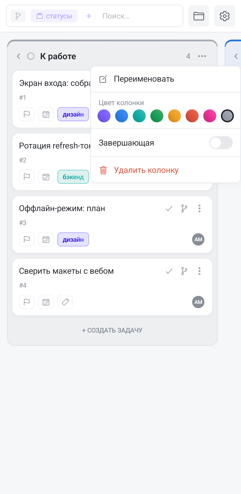

Колонка — это статус задачи. Новая доска заводится с четырьмя колонками, и на телефоне их можно менять ровно так же, как в браузере: переименовывать, красить, переставлять, добавлять и удалять.

## Четыре колонки по умолчанию

Каждая новая доска получает **«К работе» → «В процессе» → «На рассмотрении» → «Готово»**, каждая со своим цветом. Самая правая («Готово») сразу назначается завершающей.

У этих четырёх колонок есть особенность, которой нет у созданных вами: их названия **следуют языку интерфейса**. Переключите язык — и они переведутся сами. Как только вы переименуете такую колонку вручную, связь обрывается: дальше колонка называется так, как вы её назвали, на любом языке, и вернуть автоматический перевод переименованием обратно уже нельзя.

## Колонки правятся только в группировке по статусам

Всё, что описано ниже, доступно, когда доска сгруппирована **по статусам** — это её обычное состояние. Сгруппируйте доску по тегам или по этапам, и заголовки перестанут быть колонками: у них пропадут меню «⋯» и плитка «+ Колонка», а названия перестанут открываться на правку. Это не поломка — тег не переименовать «как колонку», у него своё [управление тегами](/help/tags).

В архиве колонки тоже не правятся: [архив](/help/archive) доступен только для чтения.

## Переименование — касанием по названию

На компьютере это двойной клик; на телефоне достаточно **одного касания по названию** колонки. Название превращается в поле ввода прямо в заголовке: правьте и подтверждайте. Пустое имя не сохраняется — колонка остаётся с прежним названием.

Осторожно с промахом: касание по названию попадает в правку, а не «в колонку», поэтому клавиатура может открыться неожиданно. Отмена возвращает всё как было.

## Меню колонки: цвет, завершающая, удаление

Три точки справа в заголовке открывают меню колонки.

В нём:

- **«Переименовать»** — то же поле ввода, что и по касанию названия;
- **палитра из восьми цветов** — фиолетовый, синий, бирюзовый, зелёный, янтарный, красный, розовый и серый; выбранный обведён рамкой. Касание красит колонку сразу и закрывает меню. Цвет уходит в тонкую полосу над заголовком, в иконку статуса и еле заметным оттенком — в фон и рамку колонки;
- **переключатель «Завершающая»** — см. ниже;
- **«Удалить колонку»** — с подтверждением.

Отдельной кнопки «убрать цвет» в меню нет: серая ячейка палитры — это именно серый цвет, а не сброс.

## Завершающая колонка

Завершающая колонка — та, попадание в которую означает «задача сделана»: карточка получает отметку о завершении, а в истории появляется запись. Это **свойство доски**, а не самой правой позиции: назначьте завершающей среднюю колонку и переставьте колонки местами — признак останется на ней.

Переключатель в меню работает как радиокнопка с отменой: включение назначает завершающей эту колонку (прежняя перестаёт ею быть), повторное касание по включённому переключателю снимает явное назначение — и доска возвращается к правилу по умолчанию, считая завершающей **самую правую** колонку.

## Перетаскивание колонок

Порядок колонок меняется **долгим нажатием на заголовок**: колонка «отрывается», за пальцем едет её копия, а исходная остаётся на месте приглушённой. Отпустите над нужным местом — соседние колонки разъедутся и встанут на новые позиции.

Тянуть нужно именно заголовок: долгое нажатие на карточке начинает перенос карточки, а не колонки.

## Сворачивание

Шеврон слева в заголовке сворачивает колонку в **узкую полосу** шириной с палец: в ней остаются счётчик карточек и повёрнутое на бок название. Освободившаяся ширина отдаётся остальным колонкам — на телефоне это главный способ выиграть место, поэтому сворачивайте всё, что сейчас не нужно.

Свёрнутая полоса остаётся полноценной колонкой: на неё можно **бросить карточку**, и задача сменит статус, не разворачивая колонку. Касание по полосе разворачивает её обратно.

Пустые колонки умеют сворачиваться сами — переключатель автосворачивания живёт в окне [настройки вида](/help/board-customize). Какие колонки свёрнуты, запоминается вместе с остальным видом доски и попадает в [сохранённое представление](/help/board-saved-views).

## Добавление и удаление

В конце ряда колонок стоит плитка **«+ Колонка»** с пунктирной рамкой. Касание превращает её в поле ввода: введите название — колонка появится в конце; пустой ввод возвращает плитку на место.

Удаление живёт в меню «⋯» и спрашивает подтверждение с названием колонки — и не зря: **колонка удаляется вместе со всеми своими задачами**, в архив они при этом не попадают. Если задачи нужны, сначала перенесите их в другую колонку: на телефоне быстрее всего бросить карточку на свёрнутую полосу соседней колонки.
