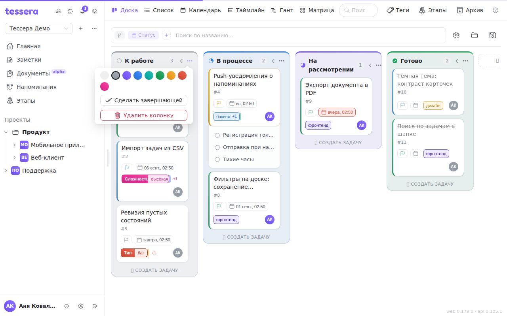

Колонка — это статус задачи. Новая доска заводится с четырьмя колонками, и их набор можно менять как угодно: переименовывать, красить, переставлять, добавлять и удалять.

## Четыре колонки по умолчанию

Каждая новая доска получает **«К работе» → «В процессе» → «На рассмотрении» → «Готово»**, каждая со своим цветом. Самая правая («Готово») сразу назначается завершающей.

У этих четырёх колонок есть особенность, которой нет у созданных вами: их названия **следуют языку интерфейса**. Переключите язык — и они переведутся сами. Как только вы переименуете такую колонку вручную, эта связь обрывается: дальше колонка называется так, как вы её назвали, на любом языке. Это осознанное поведение — ваше название важнее автоматического перевода, — но вернуть его переименованием обратно уже нельзя.

## Правка колонок — только в группировке по статусам

Всё, что описано ниже, работает, когда доска сгруппирована **по статусам**. При группировке по тегам, этапам или исполнителю колонки — это не колонки доски, а способ раскладки: их нельзя переименовать или удалить, потому что за ними стоят теги и этапы, а не статусы. Чтобы вернуться к правке, переключите группировку чипом в [панели доски](/help/board-composer).

## Перетаскивание

Колонка переносится **за заголовок**: возьмите её за название или за значок статуса слева от него (курсор меняется на «руку») и перетащите на новое место. Порядок колонок общий для всех, кто открывает доску.

## Переименование двойным кликом

**Двойной клик по названию** превращает заголовок в поле ввода. Enter сохраняет, клик мимо — тоже сохраняет (поле сохраняет по потере фокуса). Пустое имя или имя без изменений просто закрывает поле.

Тот же пункт есть в контекстном меню: **правый клик по заголовку** → «Переименовать».

## Цвет

Кнопка «…» в заголовке открывает настройки колонки. Верхняя строка — девять кружков: «По умолчанию» и восемь цветов. Цвет ложится на верхнюю кромку колонки полосой-градиентом, слегка подкрашивает её фон и рамку и тонирует значок статуса в заголовке. На самих карточках цвет колонки не отражается — карточка носит свои цвета (приоритет, теги).

## Завершающая колонка

**Задача считается выполненной ровно тогда, когда она попала в завершающую колонку.** Не «крайняя правая», не «называется Готово», а именно назначенная завершающей.

Назначается она в том же меню «…» кнопкой **«Сделать завершающей»** (или правым кликом по заголовку). Повторное нажатие — «Снять завершение». Завершающая колонка помечена сплошным закрашенным значком статуса в заголовке.

Когда задача попадает в завершающую колонку, ей проставляется дата завершения и в историю пишется событие «завершена»; вынесли обратно — отметка снимается, в историю пишется «возвращена в работу».

Если явная колонка не назначена, завершающей считается самая правая. Отсюда самая частая путаница: **колонку переставили — и «выполненными» стали считаться задачи в другой колонке**. Если задачи не отмечаются выполненными, хотя визуально стоят «в конце», проверьте в меню «…», у какой колонки стоит «Снять завершение» — она и есть завершающая.

Удаление завершающей колонки не ломает доску, но и не передаёт роль соседу: явное назначение просто снимается, и доска снова считает завершающей самую правую колонку.

## Сворачивание

Кнопка со стрелкой в заголовке (**«Свернуть колонку»**) схлопывает колонку в узкую вертикальную полоску — задачи из неё никуда не деваются, просто перестают занимать ширину. Клик по полоске («Развернуть колонку») возвращает её.

Свёрнутое состояние запоминается вместе с остальными настройками вида и сохраняется в представлении.

Рядом есть автоматический вариант: переключатель **«Сворачивать пустые колонки»** в панели [настройки вида](/help/board-customize) сам схлопывает все колонки без задач. Удобно на досках, где колонок много, а заняты в каждый момент две-три.

## Создание и удаление

Кнопка **«＋ Создать колонку»** справа от последней колонки просит название и добавляет колонку в конец. Внутри колонки есть своя кнопка **«＋ Создать задачу»**: введите название и нажмите Enter — задача создастся прямо в этой колонке, не открывая окно задачи.

Удаление — в меню «…», кнопка **«Удалить колонку»**. Она спрашивает подтверждение, и не зря: **колонка удаляется вместе со всеми своими задачами**, и в архив они при этом не попадают. Если задачи нужно сохранить, сначала перенесите их в другую колонку.

## Что ещё видно в заголовке

Рядом с названием всегда стоит **счётчик задач** в колонке — он считает то, что видно после фильтров, а не всё содержимое колонки. При группировке по этапам к нему добавляется **сумма оценок** задач колонки (`Σ 12 ч`) в единицах, выбранных в проекте.
