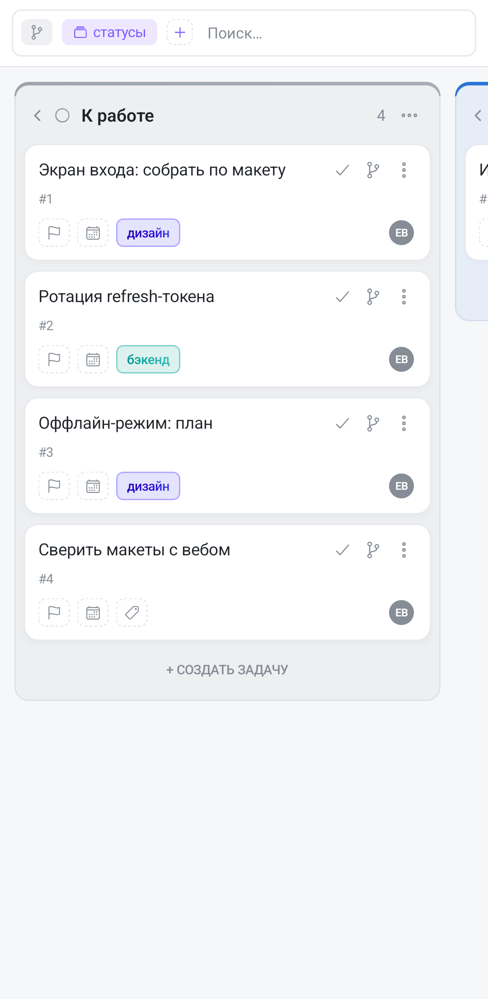

Панель доски — строка под шапкой, в которой собрано всё, что меняет вид задач, не меняя сами задачи: группировка, сортировка, фильтры и поиск. Каждое условие показано **чипом**; чипы читаются слева направо и вместе полностью описывают, что вы сейчас видите.

## Свёрнута и раскрыта — это два разных режима

На ширине телефона панель почти всегда длиннее одной строки, поэтому у неё два состояния, и с ними связана главная особенность мобильной панели.

**Свёрнутая** панель — ровно одна строка, остальные чипы обрезаны, содержимое приглушено. В этом состоянии **любое касание панели только раскрывает её**: тап по чипу, по кнопке `+` и по крестику работает так же, как тап по пустому месту. Это сделано намеренно — искать свободную точку в плотно набитой чипами строке было неудобно.

**Раскрытая** панель показывает все чипы, переносит их на несколько строк, и только тогда чипы начинают откликаться на касания сами. Одновременно уезжают кнопки справа — значки представлений и настройки вида: на ширине телефона чипам и кнопкам вместе места нет. Они вернутся, когда панель свернётся.

Свернуть панель обратно — касанием **за её пределами**, по доске. Отдельной кнопки «свернуть» нет.

Отсюда практическое правило: **на телефоне почти любое действие в панели — это два касания.** Первое раскрывает, второе делает то, что вы хотели.

## Группировка

Группировка решает, что такое колонка на этой доске. Чип группировки стоит сразу после значка подзадач и всегда виден — даже когда ничего не отфильтровано.

Касание чипа открывает меню; галочка в нём отмечает текущий вариант:

- **По статусам** — колонки-этапы, обычный канбан. Значение по умолчанию.
- **По тегам (все)** — колонка на каждый тег проекта. Это фирменная возможность Tessera: один и тот же набор задач вы смотрите то как поток по стадиям, то как раскладку по направлениям, командам или клиентам.
- **По тегам · «Префикс»** — только теги одного префикса. Если теги названы `Сложность::высокая`, `Сложность::низкая`, то группировка по префиксу «Сложность» даст доску ровно из этих колонок. Пункт появляется на каждый префикс, встреченный в тегах доски.
- **По этапам** — колонка на каждый этап проекта плюс «Без этапа». Пункт есть, только если у проекта заведены этапы.

На таймлайне и Ганте к списку добавляются **«По исполнителю»** и **«Без группировки»** — там колонки превращаются в дорожки, и обе раскладки имеют смысл.

> На компьютере чип группировки переключает статусы ⇄ теги одним кликом. В приложении он всегда открывает меню — так до раскладки по префиксу или по этапам можно добраться, не проходя через все промежуточные.

Задача с двумя тегами попадёт сразу в две колонки. Это не дубль, а одна и та же карточка, показанная в двух направлениях: измените её в одной колонке — изменится и в другой. Задачи без тегов собираются в колонку «Без тегов».

## Сортировка — и направление, и порядок

Сортировка многоуровневая. Кнопка `+` → **«Сортировка»** добавляет уровень; полей шесть: **Приоритет**, **Срок**, **Этап**, **Название**, **Номер** и — только на таймлайне и Ганте — **Статус**. Поле, которое уже добавлено, во второй раз в меню не предлагается.

С каждым уровнем можно сделать три вещи:

- **Касание чипа меняет направление** — стрелка `↑` (по возрастанию) переключается на `↓`.
- **Долгое нажатие с перетаскиванием меняет порядок уровней.** Левый чип — первичная сортировка, следующий разрешает совпадения в первой, и так далее.
- **Крестик на чипе** убирает уровень.

Перетаскивание устроено иначе, чем на компьютере, и это стоит знать заранее. Долгое нажатие отзывается вибрацией, чип приподнимается, и дальше он ездит **поверх остальных, а они не расступаются**. Место, куда чип встанет, показано обводкой на чипе-цели. Перестановка происходит один раз — в момент, когда вы отпускаете палец.

Пример: чипы «Приоритет ↓» и «Срок ↑» в этом порядке дают «сначала самые важные, а внутри одного приоритета — самые срочные». Поменяйте их местами — получите принципиально другой список: сначала ближайшие сроки, а приоритет только разрешает совпадения в один день.

Пока не добавлен ни один уровень, карточки лежат в **ручном порядке** — том, в котором вы их перетащили. Появился уровень — ручной порядок скрывается за ним, но не теряется: уберите чип сортировки, и порядок вернётся.

Задачи **без срока всегда в конце**, в какую бы сторону ни была направлена сортировка по сроку. Иначе при сортировке по убыванию всё бессрочное всплывало бы наверх.

## Фильтры

Кнопка `+` — дашированный квадрат с плюсом — открывает меню из двух уровней: сначала раздел, потом значение. Внутри раздела первой строкой стоит **«Назад»**, ею же возвращаются к списку разделов, не закрывая меню.

Разделы: **Приоритет**, **Исполнитель**, **Автор**, **Тег**, **Этап**, **Срок**, а на таймлайне и Ганте ещё и **Статус** (там колонок-статусов нет, и спрятать завершённые задачи больше нечем). Раздел не показывается, если фильтровать нечем: нет участников — нет «Исполнителя», нет тегов — нет «Тега».

Несколько значений одного фильтра складываются по «или»: два выбранных исполнителя показывают задачи обоих. Разные фильтры складываются по «и»: исполнитель **и** тег.

Отдельного упоминания стоят:

- **Срок** — не дата, а состояние: «Просроченные», «Сегодня», «Ближайшая неделя», «Со сроком», «Без срока».
- **Этап** — кроме самих этапов, есть явный пункт «Без этапа».
- **Тег** — меню сгруппировано по префиксам; заголовки появляются, только когда групп больше одной.
- **Исполнитель** и **Автор** — на досках, связанных с GitLab, под заголовком «GitLab» перечислены люди из GitLab, у которых нет учётной записи в Tessera. В фильтре по автору вдобавок появляются авторы, встреченные прямо в задачах доски: issue может завести кто-то, кого нет в списке участников.

Каждое выбранное значение превращается в чип, крестик на чипе снимает именно его.

## Сброс

Крестик у правого края панели — **«Сбросить всё»**. Он убирает разом сортировки, фильтры, текст поиска и область этапа, но **не трогает группировку**: раскладка доски остаётся той, которую вы выбрали.

Крестик появляется, только когда есть что сбрасывать. В архиве его нет — там область снимается своим чипом.

## Поиск по названию

Поле поиска — в конце панели, и **вводить в него можно только в раскрытом состоянии**. Пока панель свёрнута, на его месте стоит обычная подпись: либо ваш текущий запрос, либо «Поиск…». Это не сломанное поле — раскройте панель, и оно станет полем.

Поиск работает вместе с фильтрами, а не вместо них: он сужает уже отфильтрованный набор. Поэтому пустой результат при активных чипах чаще означает «ничего не подошло под все условия сразу», а не «такой задачи нет».

## Раскрытие подзадач

Значок ветки — квадратный чип без подписи, слева, сразу после чипа области. Он раскрывает подзадачи прямо в карточках: каждая карточка показывает своих детей списком, не открывая задачу. Пока подзадачи раскрыты, значок подсвечен акцентным цветом — подписи, как на компьютере, здесь нет, состояние читается по подсветке.

Раскрытие уважает фильтры: если фильтр спрятал часть подзадач, карточка честно сообщает, сколько детей скрыто.

## Область: этап и архив

Кроме фильтров у доски есть **область** — то, что доска вообще загрузила с сервера. Область показывается чипом в самом начале панели и снимается крестиком на нём.

- **Этап.** В боковом меню под доской можно показать её этапы; выбор этапа открывает доску, суженную до одного этапа, и в панели появляется акцентный чип с его названием. Отдельный пункт **«Бэклог»** показывает задачи, не привязанные ни к одному этапу. Это именно область, а не фильтр: большой проект не грузит все карточки разом.
- **Архив.** Открывается из меню доски; в панели встаёт янтарный чип «Архив» — см. [Архив](/help/archive).

Оба чипа одновременно не показываются: архив — режим только для чтения на всю доску, и сужение по этапу в нём не действует.

Область и фильтр по этапу — разные вещи, и они не складываются. Если, находясь в области одного этапа, вы добавите **фильтр** по этапу, область снимется сама: фильтр по нескольким этапам требует, чтобы доска была загружена целиком.

## Что панель запоминает

Состояние панели хранится **отдельно для каждого представления** одной доски. Фильтр по статусу, поставленный на Ганте, не протечёт на канбан — там такого фильтра и не предлагают.

Текущее (безымянное) состояние панели запоминается на этом устройстве. Чтобы набор условий открывался одним касанием и на других устройствах, сохраните его как представление — см. [Сохранённые представления](/help/board-saved-views).
