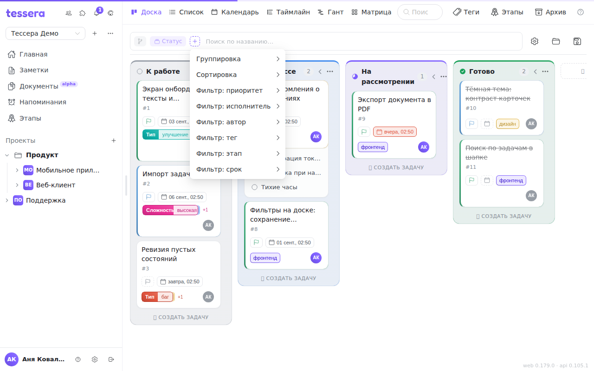

Панель доски — узкая строка под шапкой, в которой собрано всё, что меняет вид задач, не меняя сами задачи: группировка, сортировка, фильтры и поиск. Каждое условие показано **чипом**; чипы читаются слева направо, и вместе они полностью описывают, что вы сейчас видите.

Порядок элементов в панели всегда один и тот же:

1. **Чип области** — архив или этап, если вы вошли в них (см. ниже).
2. **Значок ветки** — раскрытие подзадач.
3. **Чип группировки** — по чему разложены колонки.
4. **Чипы сортировки** — по одному на уровень.
5. **Чипы фильтров** — по одному на условие.
6. **Кнопка `+`** — добавить группировку, сортировку или фильтр.
7. **Поиск по названию** и, если есть что сбрасывать, крестик **«Сбросить всё»**.

Когда чипов становится много, панель занимает всю строку, а кнопки справа (настройка вида, представления) временно уезжают — это не ошибка, они вернутся, как только вы снимете лишние условия.

## Группировка

Группировка решает, что такое колонка на этой доске. Меню `+` → **«Группировка»** предлагает:

- **По статусам** — колонки-этапы, обычный канбан. Значение по умолчанию.
- **По тегам (все)** — колонка на каждый тег проекта. Это фирменная возможность Tessera: один и тот же набор задач вы смотрите то как поток по стадиям, то как раскладку по направлениям, командам или клиентам, не пересобирая доску.
- **По тегам · «Префикс»** — только теги одного префикса. Если теги названы `Сложность::высокая`, `Сложность::низкая`, то группировка по префиксу «Сложность» даст доску ровно из этих колонок, а остальные теги в раскладке не участвуют.
- **По этапам** — колонка на каждый этап проекта плюс колонка «Без этапа». В заголовке такой колонки дополнительно показывается сумма оценок её задач (`Σ`).

На таймлайне и Ганте к списку добавляются **«По исполнителю»** и **«Без группировки»** — там колонки превращаются в дорожки, и обе раскладки имеют смысл.

Чип группировки — не только индикатор: **клик по нему переключает статусы ⇄ теги**. Это самый быстрый способ сравнить два взгляда на доску.

Задача с двумя тегами попадёт сразу в две колонки. Это не дубль, а одна и та же карточка, показанная в двух направлениях: измените её в одной колонке — изменится и в другой. Задачи без тегов собираются в колонку **«Без тегов»**.

## Сортировка — и направление, и порядок

Сортировка в Tessera **многоуровневая**. Меню `+` → **«Сортировка»** добавляет уровень; полей шесть: **Приоритет**, **Срок**, **Этап**, **Название**, **Номер** и — только на таймлайне и Ганте — **Статус**.

С каждым уровнем можно сделать две вещи, и их легко перепутать:

- **Клик по чипу меняет направление** — стрелка `↑` (по возрастанию) переключается на `↓` (по убыванию).
- **Перетаскивание чипа меняет порядок уровней.** Левый чип — первичная сортировка, следующий разрешает совпадения в первой, и так далее.

Подсказка на самом чипе говорит об этом же: «Клик — направление · перетащите для порядка». Крестик на чипе убирает уровень.

Пример: чипы «Приоритет ↓» и «Срок ↑» в этом порядке дают «сначала самые важные, а внутри одного приоритета — самые срочные». Поменяйте их местами перетаскиванием — получите принципиально другой список: сначала ближайшие сроки, а приоритет только разрешает совпадения в один день.

Пока не добавлен ни один уровень сортировки, карточки лежат в **ручном порядке** — том, в котором вы их перетащили. Как только уровень появился, ручной порядок скрывается за ним (он не теряется: уберите чип сортировки — и порядок вернётся). Подзадачи, раскрытые на карточках, сортируются тем же правилом, что и родители.

Сроки обрабатываются отдельно от направления: **задачи без срока всегда в конце**, независимо от того, `↑` сортировка или `↓`. Иначе при сортировке по убыванию всё бессрочное всплывало бы наверх.

## Фильтры

Меню `+` содержит по разделу на каждый фильтр: **Приоритет**, **Исполнитель**, **Автор**, **Тег**, **Этап**, **Срок**, а на таймлайне и Ганте ещё и **Статус** (там колонок-статусов нет, и спрятать завершённые задачи больше нечем).

Несколько значений одного фильтра складываются по «или»: два выбранных исполнителя показывают задачи обоих. Разные фильтры складываются по «и»: исполнитель **и** тег.

Отдельного упоминания стоят:

- **Срок** — не дата, а состояние: «Просроченные», «Сегодня», «Ближайшая неделя», «Со сроком», «Без срока».
- **Этап** — кроме самих этапов, есть явный пункт «Без этапа».
- **Тег** — меню сгруппировано по префиксам, чтобы длинный список тегов оставался читаемым.
- **Исполнитель** и **Автор** — на досках, связанных с GitLab, под отдельным заголовком «GitLab» перечислены люди из GitLab, у которых нет учётной записи в Tessera. В фильтре по автору вдобавок появляются авторы, встреченные прямо в задачах доски: issue может завести кто-то, кого нет в списке участников проекта.

Каждый выбранный фильтр превращается в чип, крестик на чипе снимает именно его. Крестик в самом конце панели (**«Сбросить всё»**) убирает разом все сортировки и фильтры, но **не трогает группировку** — она остаётся выбранной.

## Поиск по названию

Поле справа в панели ищет по названию задачи и работает вместе с фильтрами, а не вместо них. Поиск сужает уже отфильтрованный набор, поэтому пустой результат при активных чипах чаще означает «ничего не подошло под все условия сразу», а не «такой задачи нет». Если сомневаетесь — сбросьте фильтры крестиком и повторите поиск.

## Раскрытие подзадач

Значок ветки слева в панели раскрывает подзадачи прямо в карточках: каждая карточка показывает своих детей списком, не открывая окно задачи. Подсказка на значке говорит текущее состояние — «Раскрыть подзадачи» или «Подзадачи раскрыты».

Раскрытие уважает фильтры: если фильтр спрятал часть подзадач, карточка честно сообщает, сколько детей скрыто.

## Область: этап и архив

Кроме фильтров у доски есть **область** — то, что доска вообще загрузила с сервера. Область показывается чипом в самом начале панели и снимается крестиком на нём.

- **Этап.** В дереве проектов слева под доской можно показать её этапы; клик по этапу открывает доску, суженную до одного этапа. В панели появляется акцентный чип с названием этапа. Отдельный пункт **«Бэклог»** показывает задачи, не привязанные ни к одному этапу. Это именно область, а не фильтр: большой проект не грузит все карточки разом.
- **Архив.** Кнопка «Архив» в шапке доски открывает её архив — см. [Архив](/help/archive).

Область и фильтр по этапу — разные вещи, и они не складываются. Если, находясь в области одного этапа, вы добавите **фильтр** по этапу, область снимется сама: фильтр по нескольким этапам требует, чтобы доска была загружена целиком.

## Что панель запоминает

Состояние панели хранится **отдельно для каждого представления** одной доски. Фильтр по статусу, поставленный на Ганте, не протечёт на канбан — там такого фильтра и не предлагают. Переключились на список и обратно — каждое представление вернётся к своим условиям.

Текущее (безымянное) состояние панели запоминается **на этом устройстве**. Чтобы набор условий переезжал между устройствами и открывался одним кликом, сохраните его как представление — см. [Сохранённые представления](/help/board-saved-views).
