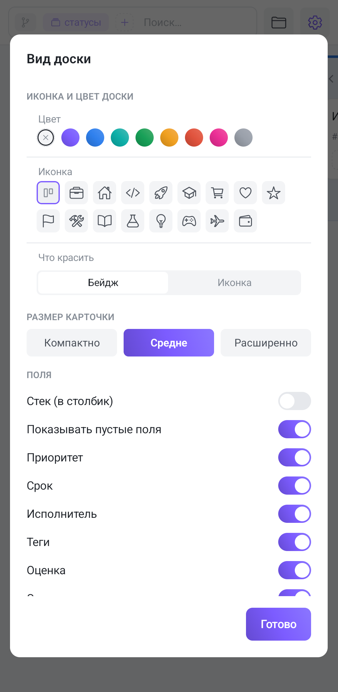

The gear icon on the right of the board bar opens the **Board view** dialog. It holds everything about how the board and its cards look: how the board is marked in the project tree, how dense the cards are and which fields to show on them.

The gear is only visible while the board bar is collapsed to a single line. Expand the bar to work through the filters and the icon leaves along with its neighbours: at phone width there is no room for both the chips and the buttons. Collapse the bar again and it comes back.

The dialog opens almost full-screen and scrolls; **Done** at the bottom closes it. There is no separate “Cancel” — every toggle applies the moment you touch it.

## Board icon and colour

The first section is the icon and colour picker, the same one projects and groups use. The icon comes from a set, and the mode switch decides whether to draw it as a badge or plain. With no icon chosen, the board shows the first two letters of its name.

The icon and colour are what you see in the project tree — a way to tell a dozen boards of one project apart by look rather than by name.

**The board name is not here** — unlike the web, where the name field sits in this same section. To rename a board from a phone, use the project tree.

## Card size

Three chips in a row: **Compact**, **Medium** (the default) and **Large**. The chosen one is filled with the accent gradient.

The choice matters more on a phone than on a wide screen: a column takes up nearly the full width, so card density decides directly how many tasks you see without scrolling. Compact when you need reach, Large when the cards carry many fields and you want to read them without opening the task.

## Fields

This is where you decide what appears on a card at all. Two general switches first:

- **Stack (in a column)** — lay the fields out vertically one under another instead of in a wrapping row.
- **Show empty fields** — whether to draw a placeholder for a field that isn't filled in. On, and you can see that a task has no due date; off, and the card is cleaner but the absence goes unnoticed.

Then one switch per field: **Priority**, **Due date**, **Assignee**, **Tags**, **Estimate**, **Milestone**, **Description**, **Number (#)** and **GitLab**. Turning a field off only removes it from the cards: inside the task it stays, and it keeps taking part in filters and sorting.

A practical trick: on a board grouped by tags, turn the **Tags** field off. The tag is already written in the column header, and on the cards it is just noise.

## Columns and subtasks

Two switches:

- **Collapse empty columns** — columns with no tasks shrink to narrow strips. This shows on a phone more than on a wide screen: every empty column is one more sideways swipe.
- **Expand subtasks** — the same toggle as the branch chip on the board bar, only spelled out.

## What this dialog does not have

On the web, the customize panel carries two more sections — the grouping/sort/filter list and view autosave. They aren't here on a phone, and that isn't a gap: conditions are set with chips right on the [board bar](/help/board-composer), and saved views live in their own menu under the folder icon — see [Saved views](/help/board-saved-views).

## What ends up in a view

Everything set in this dialog — card size, stacking, empty fields, the visibility of each field, column collapsing — is kept in the board's view settings along with the grouping and the filters, **shared with the web**. Change the card size from a phone and the board opens the same way on a computer.

The board icon and colour are the exception: those are properties of the board itself, the same for every member and independent of the view.
