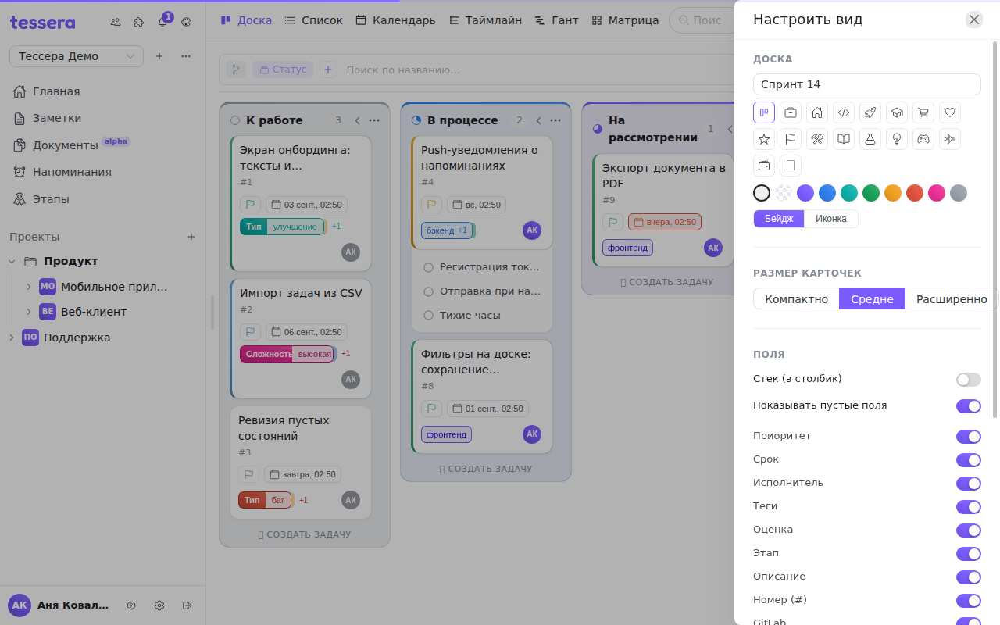

Кнопка с шестерёнкой в панели доски открывает справа панель **«Настроить вид»**. В ней собрано то, что относится к внешнему виду доски и карточек: как выглядит сама доска, насколько крупные карточки и какие поля на них показывать.

Панель доступна на канбане, списке, календаре и матрице. На таймлайне и Ганте её нет: там карточек в привычном смысле не существует, а размер и поля настраивать не на чем.

Разделы идут сверху вниз в том же порядке, что и ниже.

## Доска

Поле с названием доски правит его прямо здесь: Enter или клик мимо поля сохраняют.

Под ним — выбор **значка и цвета доски**, тот же, что у проектов и групп. Значок можно взять из набора или загрузить свой; переключатель режима определяет, рисовать значок плашкой-бейджем или без неё. Если значок не выбран, доска показывается двумя первыми буквами названия.

Значок и цвет видны в дереве проектов слева — это способ различать десяток досок одного проекта не по названию, а по виду.

## Размер карточек

Три варианта: **«Компактно»**, **«Средне»** (по умолчанию) и **«Расширенно»**. Размер меняет плотность карточки — сколько её займёт заголовок и сколько останется полям.

Компактный размер имеет смысл, когда важнее охват (большая доска целиком на экране); расширенный — когда на карточках много полей и их нужно читать, не открывая задачу.

## Поля

Здесь решается, что вообще показывать на карточке. Сначала два общих переключателя:

- **«Стек (в столбик)»** — выкладывать поля вертикально одно под другим, а не в строку с переносом. Помогает, когда полей много и строчная раскладка рвётся в неудобных местах.
- **«Показывать пустые поля»** — рисовать ли плашку-заглушку у незаполненного поля. Включено — видно, что у задачи не проставлен срок; выключено — карточка чище, но отсутствие поля незаметно.

Дальше — по переключателю на каждое поле: **Приоритет**, **Срок**, **Исполнитель**, **Теги**, **Оценка**, **Этап**, **Описание**, **Номер (#)** и **GitLab**. Выключенное поле исчезает только с карточек: в самой задаче оно остаётся и продолжает участвовать в фильтрах и сортировке.

Практический приём: на доске, сгруппированной по тегам, выключите поле «Теги». Тег уже написан в заголовке колонки, и на карточках он только шумит.

## Колонки

Один переключатель — **«Сворачивать пустые колонки»**. Колонки без задач схлопываются в узкие полоски автоматически, по мере того как задачи из них уходят. Ручное сворачивание отдельных колонок никуда не девается, они работают вместе: см. [Колонки доски](/help/board-columns).

## Группировка · сортировка · фильтр

Этот раздел — не вторая настройка, а **то же самое, что чипы в панели доски**, показанное списком. Здесь удобнее разбирать длинный набор условий: чипы написаны словами целиком («Приоритет: высокий»), а не значком плюс значение. Кнопка `+` открывает то же меню добавления, крестик на чипе снимает условие, клик по чипу группировки так же переключает статусы ⇄ теги.

Подробно про сами условия — в статье [Панель доски](/help/board-composer).

Здесь же лежит переключатель **«Раскрыть подзадачи»** — дубликат значка ветки в панели.

## Представления

**«Автосохранение»** дописывает изменения панели в текущее сохранённое представление, не заставляя каждый раз нажимать «Сохранить».

Переключатель неактивен, пока никакое представление не загружено, — и это важная деталь, а не недоработка: автосохранению нужно, во что сохранять. Загрузите представление кнопкой-папкой, и подпись переключателя сменится на «Автосохранение: <название>».

Сами кнопки сохранения и загрузки живут в панели доски, а не здесь; подсказка внизу раздела об этом и напоминает. Подробности — в статье [Сохранённые представления](/help/board-saved-views).

## Что из этого попадает в представление

Всё, что настроено в этой панели — размер карточек, стек, пустые поля, видимость каждого поля, сворачивание колонок, — сохраняется вместе с группировкой и фильтрами в представление доски. Название, значок и цвет доски — нет: это свойства самой доски, они одинаковы для всех участников и от представления не зависят.
