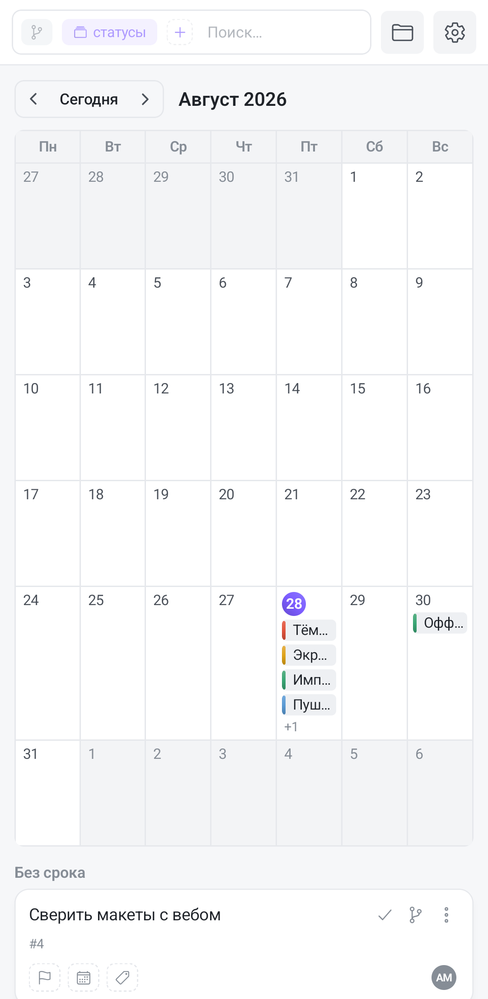

All six ways of looking at a board are in the app too: **Board, List, Calendar, Timeline, Gantt, Matrix**. These are not different boards and not copies of the tasks — it is one set of cards shown differently.

## Where to switch

On the phone the switch hides behind the **board name**: tap the title or the chevron next to it and a popup opens with a row of six tiles — an icon and a small caption each. The active tile is filled with the accent gradient. Below, in the same popup, the project's other boards are listed, so one tap can both change the visualization and jump to a neighbouring board.

Each visualization has **its own memory** for grouping, sorting and filters: set a filter on the Gantt and the kanban won't have it; come back and the filter is still there. That memory lives as long as the app is running; the board's chosen visualization is remembered for good. Saved views are tied to a visualization too — see [Saved views](/help/board-saved-views).

## List

A flat feed: a group header (colour dot, column name, counter) with the board's ordinary cards underneath. This is the calmest mode on a phone — cards run top to bottom in a single column, with nothing to scroll sideways.

The cards are the full ones, with the same «⋮» menu as on the kanban. Only dragging is missing: list group headers are not drop targets, so change the status from the card menu or inside the task.

## Calendar

A month grid, weeks starting on Monday. A task lands in the cell of **its due date**; today is marked with an accent-gradient circle. Top left is the `‹ Today ›` navigation block: the arrows page through months, the «Today» caption between them returns to the current one, and the open month is written next to the block.

A cell fits **up to four** tasks — short chips with a priority-coloured bar on the left; the rest collapse into a «+3» counter. To see them, open the tasks from the list below or narrow the filter: there is no expand-the-cell gesture on the phone.

Tasks **with no due date** are gathered in a «No due date» block under the grid — as ordinary cards, with their «⋮» menu.

There is no dragging between cells here, and there is none in the browser either: the layout follows the due date rather than setting it. Change the date inside the task.

## Timeline

A horizontal time axis where a task is a bar from its start date to its due date. Bars are laid out in **swimlanes**, and the lanes are the board's current grouping (by status, tag, milestone, assignee, or none).

The toolbar above the chart:

- **«Today»** — bring the axis back to the current date (the vertical "today" line is always visible);
- **`−` and `+`** — axis zoom;
- **the arrow** — collapse the left column of task names and give the chart the full width; on a phone this is the main way to see more than a couple of weeks at once;
- on the right — counters of overdue and undated tasks.

On the phone the zoom is easier to change by **pinching with two fingers** right on the chart — it converges on the point between your fingers, so the week you care about doesn't slide off the edge. One finger scrolls the chart as usual.

**The bars don't move under your finger.** This is a deliberate difference from the browser: the chart scrolls horizontally itself, and dragging a bar would fight that scroll. Dates are changed inside the task — tap a bar to open it, and its due-date editor covers both the start and the due date.

Undated tasks are collected in an «Undated» strip under the chart. Dashed verticals mark milestone dates. Subtasks with their own dates are drawn as thin bars under the parent's bar, which makes the parent's row taller.

## Gantt

The Gantt is the same timeline plus **dependency arrows** ("blocks → blocked by"). The axis, zoom, pinch, «Today», the collapsible left column and the milestone markers all work identically; the counters on the right gain the number of links.

**You cannot create a link by dragging from bar to bar on the phone** — for the same reason bars don't move. Links are created and removed on the **«Links»** tab inside the task: tap a bar to open it.

The **«Auto»** button (the graph icon in the board bar, shown only on the Gantt) orders the rows by the dependency graph: a blocking task always sits above the one it blocks. That only makes sense with no grouping and no sorting, so turning «Auto» on clears them. Turn it off and the ordinary layout returns, but you'll have to set the cleared conditions again.

## Eisenhower matrix

A 2×2 square: columns are «Urgent» and «Not urgent», rows are «Important» and «Not important».

| Quadrant | What it means |
|---|---|
| Urgent and important | Do it now |
| Important, not urgent | Schedule it |
| Urgent, not important | Delegate it |
| Neither urgent nor important | It can wait |

Tasks sort themselves: important means high or urgent priority, urgent means a due date within about a week or already past. **Completed tasks never enter the matrix.**

Four quadrants are cramped on a phone screen, so each one has a **full-screen expand** button in its header — the quadrant opens with an animation and collapses back via «×» or the system back button. Next to it is **«＋»**: the task is created in the board's first column and pinned to that quadrant right away.

Matrix cards are **compact** (not the kanban ones): a priority bar, a two-line title and a short meta line.

**A task can't be moved to another quadrant by dragging** — instead, the card's «⋮» menu lists the four quadrants with a tick on the current one. The quadrant you pick is pinned manually, and the menu gains **«Back to auto»** to release it. The card then glides across into its new quadrant.
