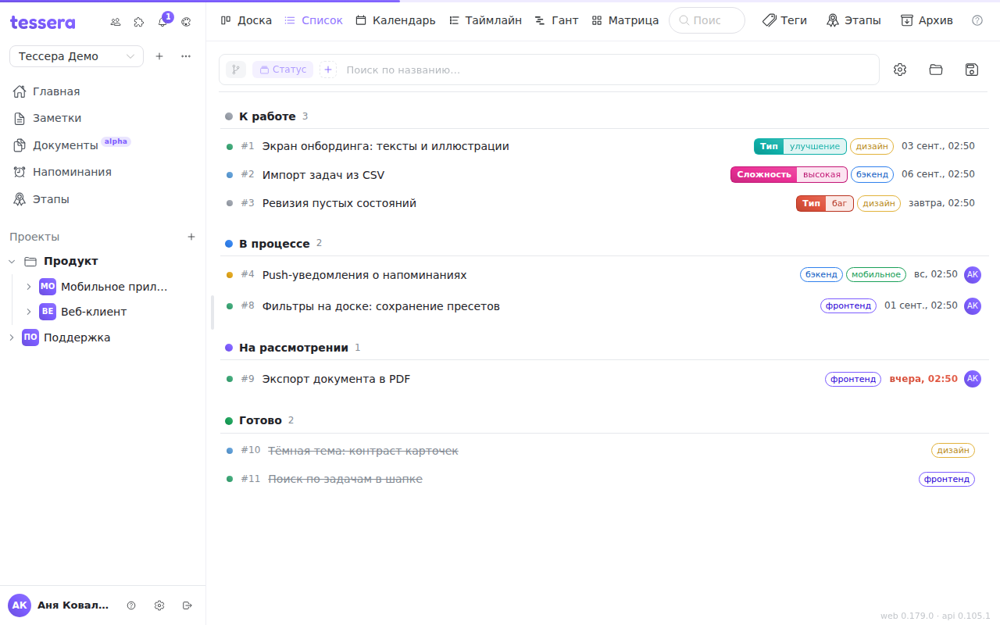
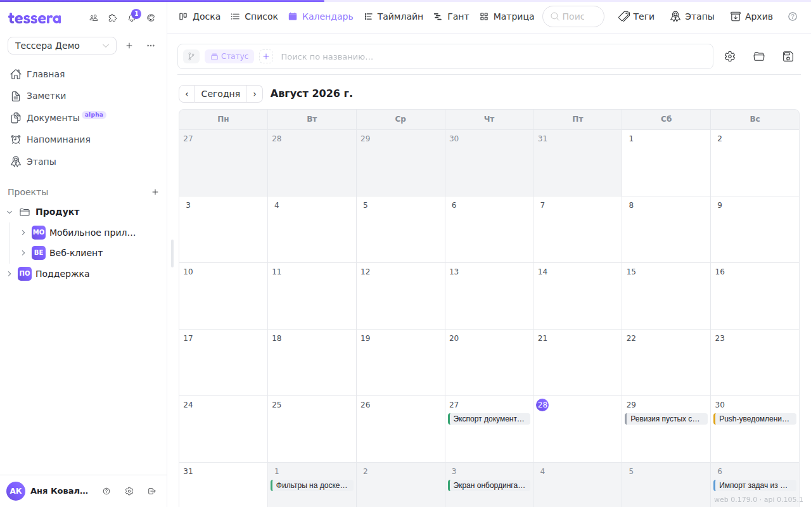
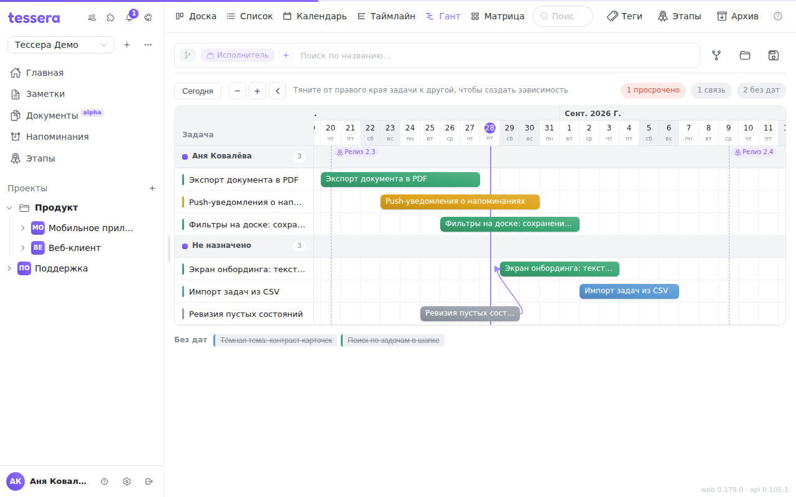
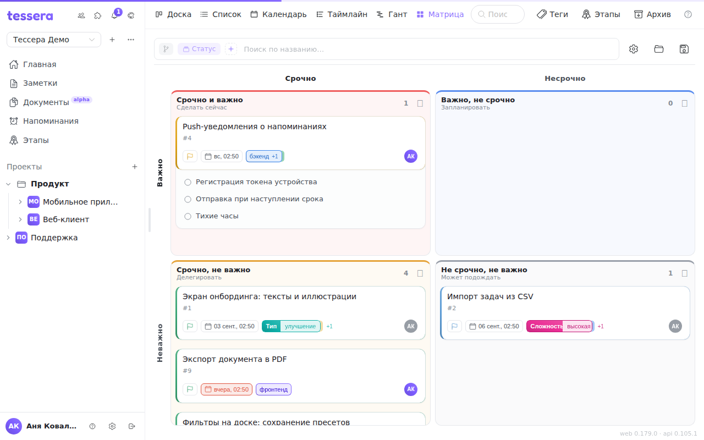

The same board tasks can be looked at in six ways. The visualization switcher sits in the board header; the chosen one is remembered for that board.

It's important to understand that these are **not different boards and not copies of the tasks**. It's one set of cards shown differently: move a task in the calendar and it moves on the Kanban too.

Each visualization has its own memory: grouping, sorts and filters are kept separately for each. A filter set on the Gantt won't turn up on the Kanban. Saved views are tied to a visualization as well — see [Saved views](/help/board-saved-views).

## Board

The Kanban — columns and cards, the default layout. It's covered by [The board: basics](/help/boards-and-tasks) and [Board columns](/help/board-columns).

## List

A flat table: group headers (the same ones the Kanban shows as columns, with a coloured dot and a counter) and rows of tasks under each.

A row carries the title, the priority, the due date, the assignees and the tags. An overdue date is highlighted, completed tasks are dimmed. An empty group is marked “— empty —”.

Clicking a row opens the task; right-clicking gives the same context menu the card has (change column, priority, due date, archive).

The list is good for bulk triage: three times as many tasks fit on a screen as on the Kanban, and comparing due dates of neighbouring rows by eye is easy.

## Calendar

A month grid, the week starting on Monday. A task lands in the cell of **its due date**; today is highlighted, arrows page through the months, and the “Today” button returns to the current one.

Tasks **without a due date** gather in a separate block under the grid — the quickest way to see what you haven't scheduled yet.

Clicking a task opens it, right-clicking gives the context menu. The due date is changed in the task itself: dragging cards between calendar cells isn't provided — the layout follows the due date rather than setting it.

Month and weekday names come from the interface language, while the first day of the week is Monday regardless of language.

## Timeline

A horizontal time axis, with a task as a bar from its start date to its due date. The bars are laid out in **swimlanes**, and the lanes are the same grouping as on the board bar: by status, tag, milestone, assignee, or no grouping at all.

The controls above the chart:

- **Today** — bring the axis back to the current date; the vertical “today” line is always visible.
- **`−` and `+`** — the axis zoom, from dense to detailed.
- **The arrow** — collapse the left column of task names, giving the whole width to the chart.
- On the right — counters: how many tasks are overdue and how many have no dates.

A bar can be **dragged along the axis** — that changes the task's dates — and stretched by either edge (the left one sets the start, the right one the due date). Dashed verticals mark the **milestone due dates** of the project: you see at once which tasks won't make a milestone.

Tasks with no dates aren't thrown away: they gather in an “Unscheduled” block beside the chart. Give a task a due or start date and it appears on the axis. Expanded subtasks are drawn as thin bars inside their parent's row.

## Gantt

The Gantt is the timeline plus **dependencies between tasks**. The axis, the zoom, dragging bars and the milestone markers all work the same; blocking arrows are added.

To **create a dependency**, drag from the right edge of one bar to another — the hint above the chart says as much. A “blocks → blocked” arrow appears. The counters on the right gain a number of links.

Every task on the Gantt occupies **its own row** — otherwise an arrow would have nowhere to land. That's why the Gantt looks longer than the timeline on the same data.

The **Auto** button on the board bar (Gantt only) lays the rows out **by the dependency graph**: a blocking task always sits above the one it blocks. Bear in mind this is only meaningful with grouping and sorting empty, so turning “Auto” on clears them. Turn it off and you're back to the ordinary layout, but the conditions it cleared have to be set again.

The link types themselves are covered in the article on task links.

## The Eisenhower matrix

A 2×2 square: the columns are “Urgent” and “Not urgent”, the rows “Important” and “Not important”. Hence four quadrants, each with a hint:

| Quadrant | What it means |
|---|---|
| Urgent and important | Do it now |
| Important, not urgent | Schedule it |
| Urgent, not important | Delegate it |
| Neither urgent nor important | It can wait |

**Tasks place themselves.** A task counts as important when its priority is high or urgent; as urgent when its due date falls roughly within the coming week or has already passed. That is, the matrix doesn't ask you to fill in two more fields: it reads the priority and the due date the tasks already have.

The automatic placement can be overruled: **drag a card into another quadrant** and it is pinned there. Such a task gets a “by hand” mark; clicking the mark returns it to its automatic place.

Each quadrant has a **＋** button for quickly creating a task: it is created in the board's first column and pinned to that quadrant right away.

**Completed tasks don't reach the matrix** — it's a tool for triaging what's still ahead, not a report on what's done.
