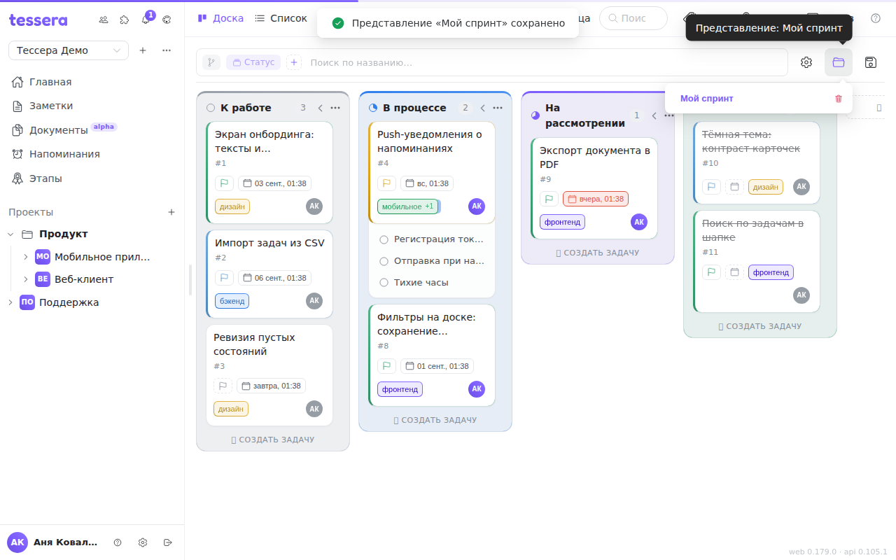

The combination of grouping, sorts, filters and card settings you've assembled is a **view**. It can be named and saved, so you come back to it in a single click instead of collecting the chips all over again.

Two buttons on the board bar: the **folder** loads a view, the **disk** saves the current one.

## What gets saved

A view remembers the whole of what you see:

- the visualization (board, list, calendar, timeline, Gantt, matrix);
- the grouping, and the tag prefix if the grouping is by prefix;
- every sort level — with its order and direction;
- every filter, **including the text in the search box**, and the subtask expansion;
- which columns are collapsed and whether empty ones auto-collapse;
- card size, field stacking, showing empty fields and the visibility of each field;
- the state of autosave.

What is *not* saved is the **scope** — a milestone or the archive: that is where you are right now, not how you are looking. The search query, on the other hand, goes into the view together with the filters, so clear the box before saving unless you want it back every time.

## Views belong to a visualization

The list in the folder shows only the views of the **current visualization**. A view saved on the Kanban won't appear in the list on the Gantt — and the other way round.

Hence the most common complaint: “my views are gone”. Almost always it means you're standing on a different visualization. Switch back with the view button in the header and the list returns.

## Saving and overwriting

The disk opens a name field. Type a name and press Enter or “Save” — a message reads “View “…” saved”.

To **overwrite** an existing one, don't retype the name: under the field there's an “Overwrite:” row with buttons for the names you already have. Clicking a name puts it in the field, and “Save” overwrites it. Saving under a name you already own always overwrites rather than creating a second view with the same name.

## Loading, switching, deleting

The folder shows the list; clicking a name applies the view immediately, and the name is highlighted as current and moves into the button's tooltip — “View: <name>”.

The bin next to a name deletes it after a confirmation. Deleting the one currently loaded doesn't change the board — it just stops counting as being inside a named view.

When there are no saved views for this visualization, the list reads “No saved views”.

## Autosave

The **Autosave** switch lives in the [customize panel](/help/board-customize). While it's on and a named view is loaded, every change on the bar is written into that view by itself.

The switch is disabled until a view is loaded: autosave needs something to write to. Load a view with the folder first, then turn autosave on.

Mind the flip side: with autosave on, a filter you removed by accident is saved too. If a view is your “working baseline” that you return to after experiments, autosave is better left off.

## Views are personal and travel with you

Views are stored **on the server and separately per user**. Both of these follow from that:

- Your views are **available on all of your devices** — in the browser and in the app alike, under the same account.
- Your views are **invisible to everyone else**. Two people on one board can each have their own “My tasks this week” without getting in each other's way. A view can't be shared with a colleague — agree on the set of filters in words.

Apart from that stands the **unnamed** current state of the bar: the one you simply clicked together and never saved. It is remembered per board and per visualization, but **on this device only** — no server record stands behind it. If a set of conditions has to survive a change of device, save it as a view.
