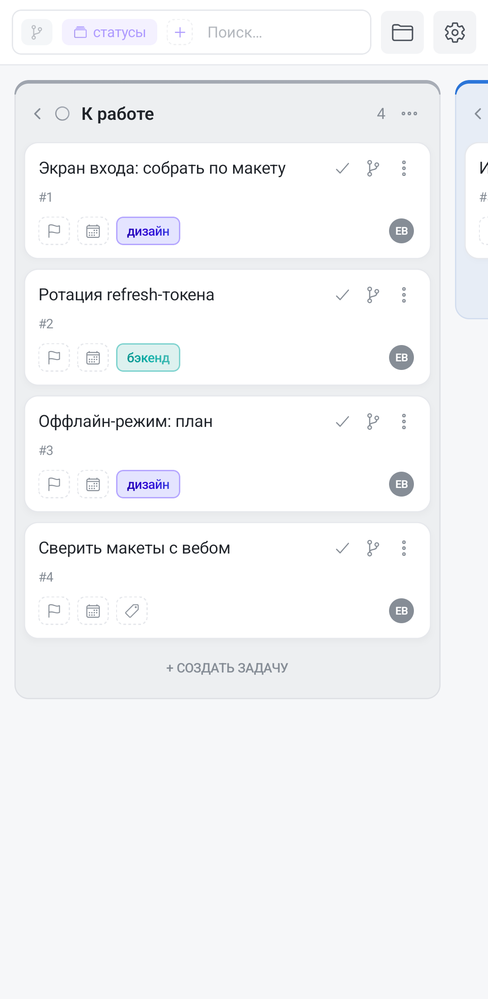
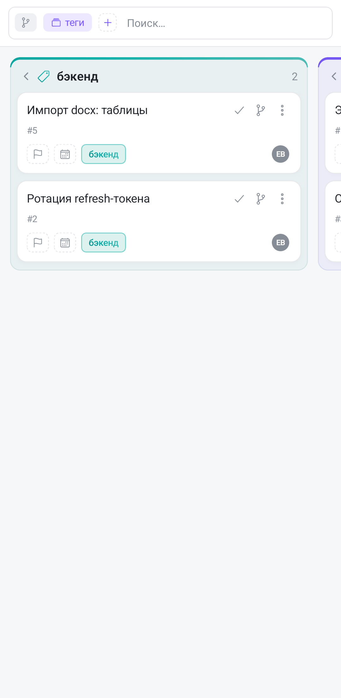
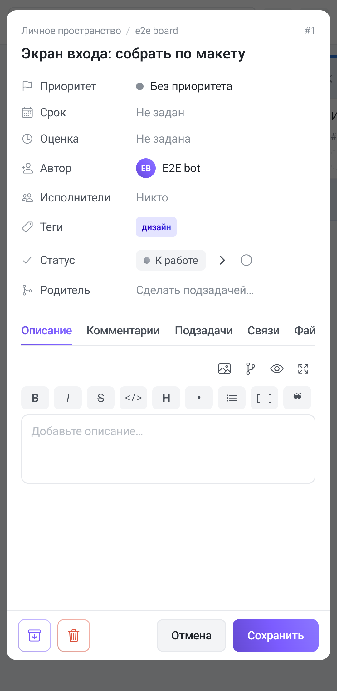

Доска — основной экран работы. Колонки задают этапы, карточки — задачи. На телефоне колонки листаются вбок: одна занимает почти всю ширину, соседние видны краем.

## Как перенести задачу

Способа два, и на телефоне они не равноценны:

- **Задержать палец на карточке** и перетащить её в соседнюю колонку. Пока карточка «в руке», доска подкручивается к краям сама. Удобно для короткого переноса в соседнюю колонку.
- **Открыть задачу и сменить колонку** чипом статуса. Через три колонки от текущей это быстрее, чем тянуть карточку через полдоски.

В экране задачи рядом со статусом есть кнопка «›» — она двигает задачу на колонку вправо, и «✓» — она отправляет её сразу в завершающую колонку.

## Группировка по тегам

Колонки доски не обязаны быть этапами. На панели над доской есть **чип группировки** (значок стопки): тап открывает список — «По статусам», «По тегам», «По этапам». Выбрали теги — колонка стала тегом, а не этапом. Один и тот же набор задач можно смотреть то как поток по стадиям, то как раскладку по направлениям — не пересобирая доску.

Если панель свёрнута в одну строку, тапните по ней — она раскроется и покажет чипы сортировки и фильтров. Выбранные условия висят чипами, лишний снимается крестиком.

Одна задача с двумя тегами попадёт сразу в две колонки — это не дубль, а одна и та же карточка, показанная в обоих направлениях. Задачи без тегов собираются в колонку «Без тега» в конце.

## Представления

Кроме канбана доска умеет показывать те же задачи иначе — переключатель представления на панели доски:

- **Список** — плоская таблица, удобно для массового разбора.
- **Календарь** — по срокам.
- **Таймлайн** и **Гант** — протяжённость и зависимости. Оба тянутся и масштабируются щипком; пока вы на них, свайп от левого края не открывает меню — иначе он конфликтовал бы с горизонтальной прокруткой.
- **Матрица** — раскладка по важности и срочности.

Настройки представления общие с веб-версией: сменили группировку с телефона — на компьютере доска откроется такой же.

## Экран задачи

Тап по карточке открывает задачу на весь экран. Сверху — название и свойства (приоритет, срок, исполнители, теги, этап, статус), ниже — описание в Markdown, а под ним вкладки: **Комментарии**, **Подзадачи**, **Связи**, **Файлы**, **История**.

Свойства применяются сразу, как только вы их меняете. Название и описание сохраняются кнопкой **«Сохранить»** — уход назад без неё правки не запишет.

Подзадачи — дерево любой глубины; на доске их можно раскрывать прямо в карточках.

## Когда задача считается выполненной

Задача завершена, когда она попала в **завершающую колонку** доски. Тогда же проставляется дата завершения и в журнал пишется событие; вынесли обратно — отметка снимается. Если задача не считается выполненной, хотя визуально «в конце» — проверьте, какая колонка назначена завершающей: по умолчанию это самая правая. Назначить другую можно из веб-версии.

## Пустые колонки

Чтобы не листать доску через пустое, включите **сворачивание пустых колонок** в настройках доски — они схлопываются в узкие полоски. На телефоне это заметнее, чем на широком экране: каждая пустая колонка — лишний свайп.
