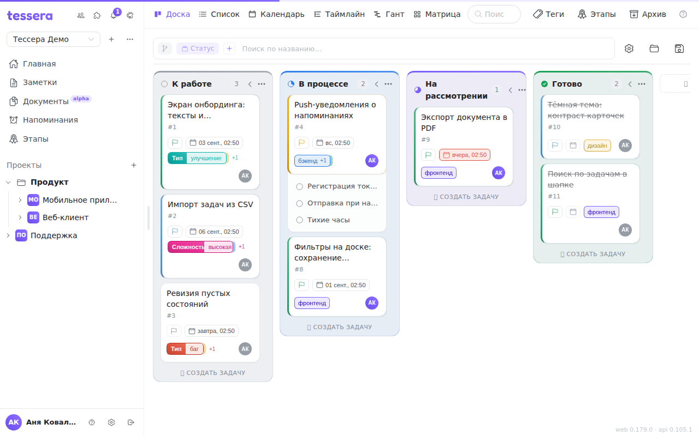
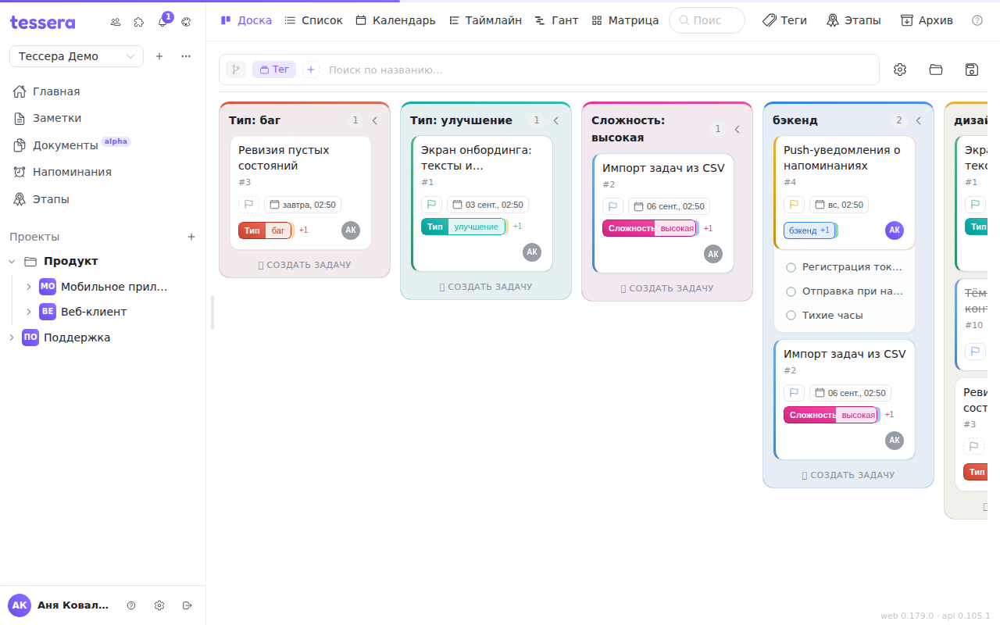

Доска — основной экран работы. Колонки задают этапы, карточки — задачи, перенос карточки мышью меняет её состояние.

Эта статья — обзор: что где лежит и как всё связано. Подробности каждой части вынесены в соседние статьи раздела, ссылки стоят по тексту.

## Из чего состоит экран

- **Шапка доски** — переключатель визуализации и кнопки «Теги», «Этапы», «Архив».
- **Панель доски** под шапкой — чипы группировки, сортировки и фильтров, поиск по названию, а справа шестерёнка настройки вида и кнопки представлений. См. [Панель доски](/help/board-composer).
- **Колонки и карточки** — собственно доска. См. [Колонки доски](/help/board-columns).

## Группировка по тегам

Колонки доски не обязаны быть этапами. Смените группировку на теги — и колонка станет тегом, а не этапом. Один и тот же набор задач можно смотреть то как поток по стадиям, то как раскладку по направлениям, командам или клиентам, не пересобирая доску.

Быстрее всего переключаться самим чипом группировки в панели доски — клик по нему меняет «Статус» на «Тег» и обратно.

Одна задача с двумя тегами попадёт сразу в две колонки — это не дубль, а одна и та же карточка, показанная в обоих направлениях. Задачи без тегов собираются в колонку «Без тегов» в конце.

Группировать можно ещё по этапам, а на таймлайне и Ганте — по исполнителю. Все варианты разобраны в статье [Панель доски](/help/board-composer).

## Визуализации

Кроме канбана доска умеет показывать те же задачи иначе — переключатель в шапке:

- **Список** — плоская таблица, удобно для массового разбора.
- **Календарь** — по срокам.
- **Таймлайн** и **Гант** — протяжённость и зависимости.
- **Матрица** — важность против срочности.

Это один и тот же набор задач, показанный по-разному: изменили задачу в календаре — изменилась и на канбане. Подробно каждая раскладка описана в статье [Визуализации](/help/board-layouts).

Собранную комбинацию визуализации, группировки, фильтров и сортировки можно сохранить и открывать одним кликом — см. [Сохранённые представления](/help/board-saved-views). Что показывать на карточках и насколько они крупные, настраивается в панели [«Настроить вид»](/help/board-customize).

## Карточка задачи

Окно задачи открывается кликом по карточке и содержит:

- **Описание** в Markdown — с панелью форматирования, режимом просмотра и упоминаниями через `@`.
- **Подзадачи** — дерево любой глубины; на доске их можно раскрывать прямо в карточках.
- **Теги**, **исполнителей**, **приоритет**, **срок**, **оценку** и **этап**.
- **Комментарии** — тоже Markdown, с упоминаниями участников.

## Когда задача считается выполненной

Задача завершена, когда она попала в **завершающую колонку** доски. Тогда же проставляется дата завершения и в журнал пишется событие; вынесли обратно — отметка снимается.

Если задача не считается выполненной, хотя визуально «в конце», — проверьте, какая колонка назначена завершающей: по умолчанию это самая правая, но её можно указать явно. Разбор — в статье [Колонки доски](/help/board-columns).

## Что делать с задачей, которая больше не нужна

Отправьте её в [архив](/help/archive): она пропадёт с доски, но сохранится со всей историей и в любой момент вернётся обратно.
