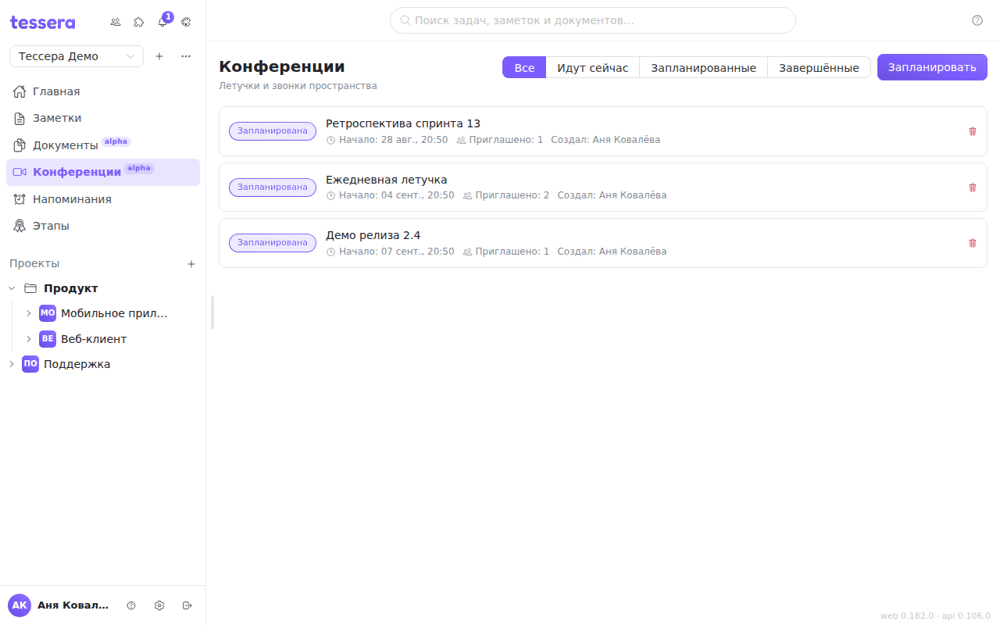
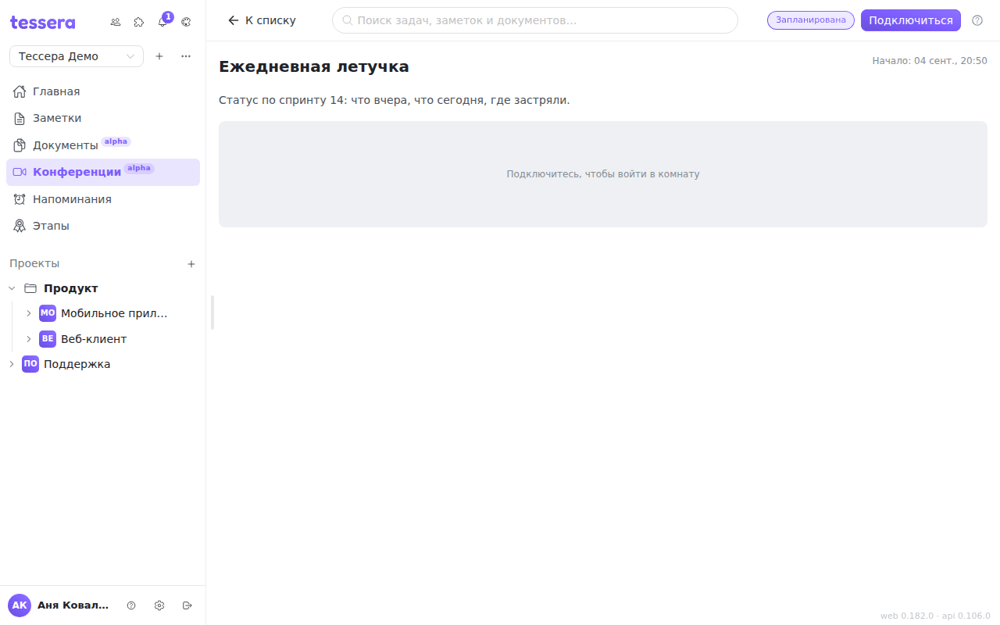

The **Conferences** section is audio and video calling inside Tessera: daily stand-ups, walking through a task, demos. A call does not take you out of the tracker — a conference can be pinned to a task, and the discussion stays in the room's chat next to the work rather than in a separate messenger. The section works **in the browser**; it is not in the mobile client yet.

## The list

**Conferences** sits in the sidebar. The list is split by a filter into **Live now**, **Scheduled** and **Finished**, so a call in progress is visible at once and one click joins it.

**Schedule** creates a conference: a title, an optional description, a start time and — if it helps — the **task** the call is about. The start time is a hint for the participants, not a lock: a conference can be opened earlier.

A conference is **not single-use**. When the last participant leaves it goes back to *Scheduled* and can be entered again — one room is a convenient home for a standing daily meeting. Only deletion is irreversible.

## In the room

An open conference starts at the **lobby**: you can see who is already in the room, and your microphone and camera are still off. **Join** opens the devices and puts you into the call.

The browser will ask for microphone and camera permission — without it the call cannot happen. Permission is granted to the site once; if you dismissed it by accident, you can restore access in the site settings in the address bar.

The main tile **follows whoever is speaking**: the loudest voice takes the stage, and a screen share takes it instead while one is running. In silence the stage keeps the last person who spoke, so the tiles do not jump on every breath. Anyone without a camera is shown as a round avatar, the way they are everywhere in Tessera.

**The bottom toolbar:**

- **microphone** — on and off. The button fills with the level of your own voice: it is a self-check, and it shows that you are audible before anybody has to tell you that you are not;
- **camera** — video on and off;
- **screen share** — see below;
- **raise hand** — a visible mark on your tile, so you do not have to cut in;
- **devices** — which microphone, which camera, which speakers;
- **fullscreen** — on the stage tile; you want it most while watching somebody else's screen;
- **leave**, and for the creator, **end**.

A **connection icon** appears on a participant's tile when their link is poor: before anyone asks "are you breaking up?", it is clear whose side the trouble is on.

## Screen sharing

Screen sharing runs **as a queue**, and the queue is kept by the server rather than by a browser: two people cannot start sharing at once and cut each other off. If a screen is already being shown, the button puts you in the queue and shows your place in it; when your turn comes, the room tells you that you can start.

The person sharing always sees a sharper picture than everybody else, and that is not a fault: they are looking at their **own raw capture**, while the others get an encoded stream that went through the server. The share is published at high resolution with sharpness prioritised, so under load the viewers lose smoothness rather than the legibility of the text.

## People, chat and invitations

On the right is a rail with two tabs: **In the room** and **Chat**.

**In the room** lists who is in the call right now, and, as a separate list, **Invited** — the people who were asked but have not arrived. The **Invite** button is right there by the tabs: an invitee gets a notification with a link straight into the conference.

Each participant's volume is adjusted **on your side** and only there — it does not change how anybody else hears them.

**Chat** is this conference's conversation: the links people drop mid-call, and attachments. An image can be opened large **without leaving the call**. The chat history stays with the conference, so what was said can be revisited afterwards.

## Host and moderation

The host is the **creator of the conference**. They cannot be removed from the call, and they have priority in the screen-sharing queue.

Moderation — **removing** a participant or **muting them for everyone** — is available to the host, and also to the owner and admins of the workspace. An admin is still shown as an ordinary participant: they moderate without taking the host role, and can be removed themselves.

Every permission check happens **on the server**, which is what makes "mute for everyone" actual enforcement rather than a polite request to somebody else's browser.

## Minimised mode

You can go off to tasks or documents **without leaving the call**: the room folds into a floating window.

The window shows the current speaker, or a thumbnail of the screen being shared; hovering brings up a small toolbar along the bottom (microphone, camera, raise hand, leave) and an **expand** button in the middle that takes you back to the full room. The window can be dragged with the mouse and resized from any edge; its position and size are remembered.

A minimised call **survives a page reload**: the active conference is remembered and the client returns to it by itself after a refresh. The connection is rebuilt from scratch in the process, so a second of silence there is normal.

You leave a call only with **Leave** (in the room or in the mini window) or by closing the tab. Moving to another section does not drop the call — and it does not mislead the others either: if the tab closes, you disappear from the list on your own.

## Recording

A call can be recorded whole — a single video file with every participant and the screen share in it. The **server** does the recording, not your browser: the quality does not depend on your uplink, and you can close the tab.

Recording is started and stopped by the **host or a moderator**, with a button in the room toolbar. While it runs, **every participant sees a red dot**: a call cannot be recorded unnoticed, and that is deliberate.

Finished recordings sit in a list **under the room**: download, size and duration. A file appears there a few seconds after you stop — that is how long muxing the video takes.

**Retention is chosen up front**, when the conference is scheduled: by default a recording lives for 30 days and is then deleted by itself. It is decided before the meeting rather than after, so nobody has to rule on a file's fate while watching a countdown.

Recording is an **optional instance feature**: the administrator enables it separately. If it is not enabled, the button answers with an error — a question for your administrator, not a fault on your side.

## Worth knowing

- Conferences need a **secure connection** (`https://`). Over a plain address the browser will not hand over the microphone and camera at all, and the room says so plainly instead of quietly failing.
- If your administrator has not configured the media server, joining a call returns an error — that is a question for the instance administrator, not a fault on your side.
- Recording is **not a substitute for minutes**: there is no transcript or auto-summary yet, so decisions made along the way are still best dropped into the conference chat or into the description of the linked task.
