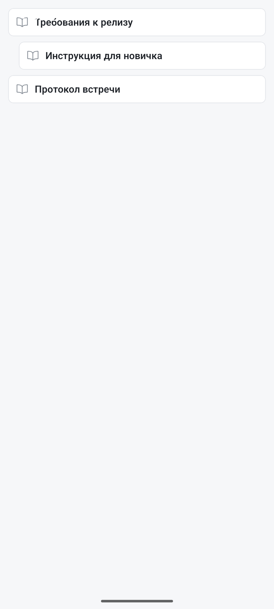

Раздел **«Документы»** — совместный редактор для того, что не помещается в описание задачи: требования, протоколы встреч, инструкции. Раздел открывается пунктом «Документы» в боковом меню («☰» слева в верхней панели).

**В приложении документы доступны для чтения.** Это осознанное решение, а не недоделка: блочный редактор с перетаскиванием блоков, комментариями к абзацам и разбором конфликтов — отдельный проект, и наспех сделанный на телефоне он делал бы больше вреда, чем пользы. Читать документ, найти нужный абзац и открыть ссылку с телефона можно; писать — из веб-версии.

## Структура

Документы складываются в дерево — у документа могут быть вложенные, так что раздел ведёт себя как небольшая вики. На телефоне сначала показывается список, а тап по документу выдвигает **читалку поверх него**; кнопка «‹» слева сверху возвращает к списку, системная «Назад» — тоже.

## Что видно при чтении

Текст показывается с полным форматированием: заголовки, списки, таблицы, изображения, блоки кода, выравнивание. Документ, импортированный из Word, читается со своими цветами и рамками — в том числе в тёмной теме.

## Что делается только в веб-версии

- Правка текста и структуры документа.
- Комментарии к блокам.
- Импорт `.docx` и просмотр PDF.
- История версий и откат к предыдущей редакции.
- Шаблоны и связывание документа с задачами.

Связи, созданные в вебе, с телефона видны — на вкладке «Связи» в экране задачи.

## Документ или заметка

Если запись нужна только вам и на пару дней — это [заметка](/help/notes), и её с телефона можно и писать, и править. Документ — для длинного материала, который читают другие.
