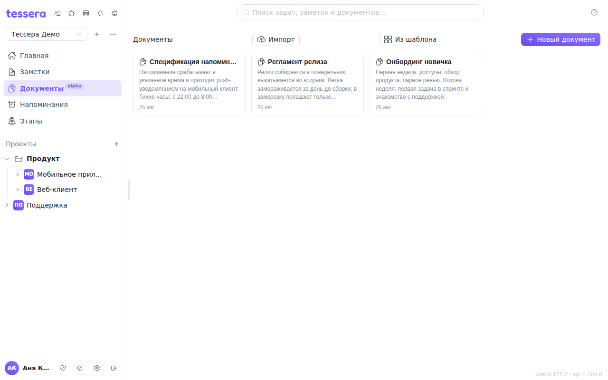

**Documents** is a collaborative editor for everything that outgrows a task description: requirements, meeting minutes, policies, how-tos. Unlike a task description, a document stands on its own — it has versions, a table of contents, per-paragraph discussion and an approval route. The section is marked `alpha`: it is still developing, and details do change.

## The document tree

The list of the workspace's documents is on the left, the open document on the right. A document can have **nested documents**: **Nested document** in the actions menu creates a child, and **Show nested (N)** expands the branch. That makes the section behave like a small wiki rather than a flat folder of files.

Deleting is honest about the consequences: if the document has children, the confirmation says it **will be deleted together with its nested documents**, and how many there are.

## The editor

Text is written in a block editor — every paragraph, heading, list and table is a block of its own.

**The toolbar** above the document: undo and redo (Ctrl+Z / Ctrl+Shift+Z), heading levels, bold (Ctrl+B), italic (Ctrl+I), underline (Ctrl+U), strikethrough, monospace; lists — bulleted, numbered and a **task list** with checkboxes; increase and decrease indent; a 3×3 table with a header row; image, link, code block, quote, divider; align left, centre, right and justify. To the right sit three pickers: **font** (system, serif, monospace), **size** and **line height**. The «default» value in each of them drops the manual setting and hands the styling back to the theme.

**The `/` key opens the insert menu** right in the text — the same thing without a trip to the toolbar, grouped into Text, Lists, Insert and Upload: paragraph, three heading levels, quote, lists, table, divider, code block, image and PDF.

**The handle to the left of a block** (it appears on hover) offers three actions: **insert a block below**, **discuss the block** and **drag the block** somewhere else.

A link does not have to point outwards: besides `https://…`, the address field lets you pick **a section of this document**, which produces an internal link to that heading.

## Table of contents

**Table of contents** opens a pane built from the document's headings; clicking a line scrolls to that section. While there are no headings, the pane says so outright — the contents are not assembled by hand and need no special markup.

## Saving and working together

The document saves itself. The status line above the text says what is going on: **Saving…**, **Unsaved changes** or **All changes saved**.

While several people have the document open, the names next to the title show who is **editing** and who is **viewing**. A block a colleague is editing right now is locked for everyone else — typing into it answers with «*name* is editing this block». Work in the neighbouring paragraph is unaffected.

If the document was changed elsewhere anyway (in another tab, say), you get the warning **«The document was changed elsewhere — your latest edits were not saved»** and a **Load the current version** button. Nobody's text is overwritten silently.

## Discussions

Comments in a document are **anchored to a block** rather than piling up in one list. Select a block and click the icon in the left gutter (**Discuss the block**) — the thread opens in the discussion pane beside the paragraph. A comment can also be left **on the whole document**; those threads are collected under «On the document».

A thread can be marked **resolved** and later **reopened**. The anchor can be dropped with **Unpin** — the thread stays, it just stops holding on to a paragraph. If the block with a thread is deleted, the thread does not disappear: it moves to the **Block deleted** section, where it stays readable.

Deleting a root comment warns how many replies go with it.

## Version history

**Version history** opens the list of revisions. A version is taken with **Save version**; you can attach a label to it — «approved wording», for instance — so you don't have to hunt for the right one by date later.

The selected version is shown as a **comparison against the current state**: how many blocks were added, removed, changed and moved, with a marker on each. If there are no differences, it says so — «The versions are identical».

**Restore** takes the document back to the chosen revision. The current state is **not lost — it goes into the history itself**, so the rollback is reversible.

## Task links and approval

**Links and approval** opens a pane with two halves.

**Links.** A document is linked to tasks either whole (**Link a task**) or **by fragment**: a selected block is linked separately (**Link the block to a task**), and the list labels such a link accordingly — «document fragment». Tasks are searched by number or title. The link is visible from both sides and is removed with **Remove**; the task side of it is covered in [Task documents](/help/task-documents).

**Approval.** **Send for approval** opens a route: a title (what is being approved), the list of approvers and the mode — **Sequentially** (the next person sees the request once the previous one has signed) or **In parallel** (everyone is asked at once). While a route is open, a second one cannot be started.

An approver **signs** or **rejects**, optionally with a comment. The route line shows the progress — «*signed* of *total*» — and each participant is marked as waiting, signed or rejected. A route can be **withdrawn**; signatures already given stay in the record.

Finished routes are collected under **Approval records** with their status (pending, approved, rejected, withdrawn) and a caption of «revision N · author · date»: **a record is bound to a specific revision**, so later edits cannot pass themselves off as approved text.

## Import

**Import** accepts `.docx`, `.doc`, `.odt`, `.rtf`, `.fodt`, `.html`, `.txt`, and also `.pdf`, `.md` and `.json` (Tessera's own export). The limit is **20 MB per file**.

Formatting comes across: text colours and sizes, horizontal rules, code blocks, table fills and borders. Colours from Word stay readable in the dark theme too. If some images could not be brought over, the app says so in the notification and names the count instead of pretending everything went smoothly.

Office formats are converted by a separate service. If it is not deployed, the button says so and leaves what works without it: **PDF, Markdown and JSON**. PDF is never converted — it is stored as a file and opened by the built-in viewer: page navigation, zoom in and out, download. No need to switch to another program.

## Export

**Export document** offers PDF, **Word (.docx)**, **OpenDocument (.odt)** and **HTML**. HTML is rendered by the server itself and is always available; the other three need the same conversion service as import — without it, only HTML remains in the list.

Unsaved edits are written out before the export runs, so the file always matches what is on screen rather than the state of a second ago.

## Templates

**From a template** creates a document from a blueprint. Three are built in: **meeting minutes** (attendees, agenda, decisions, follow-up tasks), **a specification** (statement, scope, acceptance criteria, risks) and **a retrospective** (what worked, what got in the way, what we change).

Your own templates come from two places: **Save as template** turns the current document into a blueprint, and the **Upload** button in the templates dialog takes a file. Built-in templates are marked as such and cannot be deleted; deleting one of your own warns that **documents already created from it stay** where they are.
