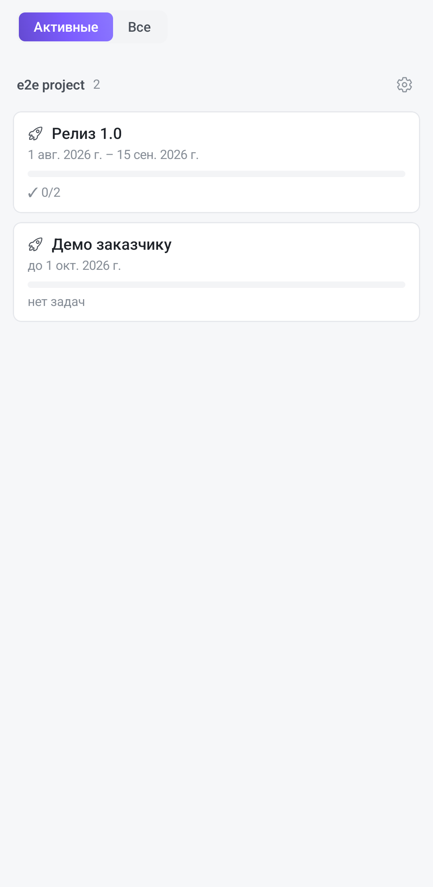

Этап (веха, milestone) — точка, к которой должен быть готов набор задач: релиз, демо, сдача заказчику. Раздел открывается пунктом **«Этапы»** в боковом меню («☰» слева в верхней панели) и показывает этапы всех проектов пространства сразу.

## Что видно в списке

Этапы сгруппированы по проектам. В строке этапа — название, даты начала и завершения, полоса прогресса и счётчик выполненных задач (например, `3/6`). Пока к этапу не привязана ни одна задача, вместо прогресса написано «нет задач».

Переключатель сверху выбирает, что показывать: **«Активные»** — только незакрытые этапы, **«Все»** — вместе с завершёнными. Тап по строке открывает доску проекта, отфильтрованную по этому этапу, — сразу видно, что осталось.

Шестерёнка у названия проекта открывает управление его этапами: создание, переименование, даты, закрытие.

## Как задача попадает в этап

Этап выбирается в экране задачи, в поле **«Этап»**. Одна задача принадлежит одному этапу; сняли выбор — задача из этапа выпала, прогресс пересчитался.

На доске по этапам можно группировать и фильтровать так же, как по тегам, — чипом группировки над доской, пункт «По этапам». Подробнее — [Доски и задачи](/help/boards-and-tasks).

## Связь с GitLab

Если проект связан с GitLab, этап синхронизируется с одноимённой вехой репозитория: рядом с названием появляется значок GitLab. Тап по нему открывает веху в браузере телефона. Синхронизация не обязательна — этапы полностью работают и без неё.
