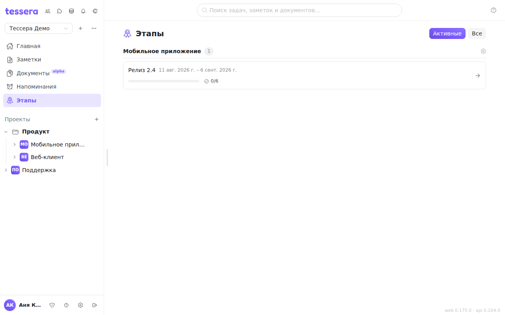
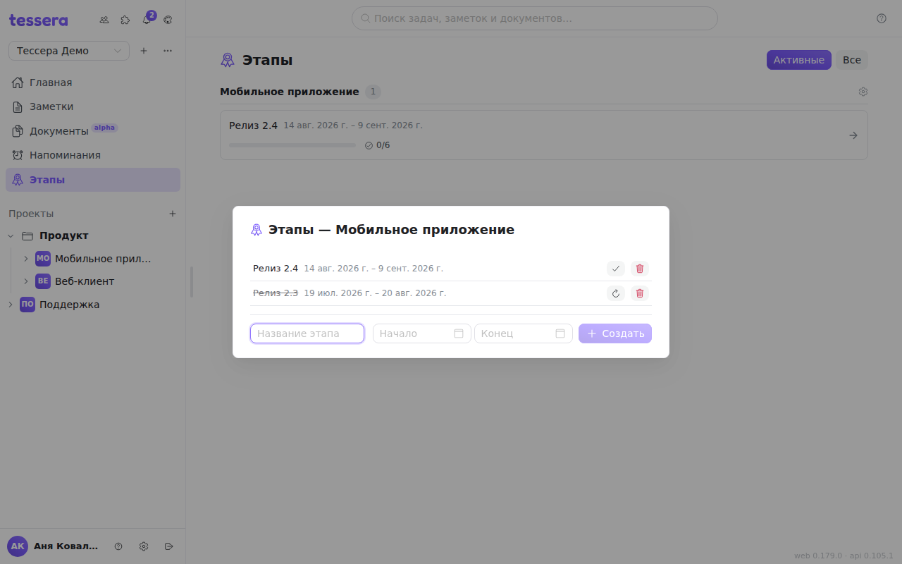

A milestone is a point by which a set of tasks has to be ready: a release, a demo, a sprint, a handover. The section opens from **Milestones** in the sidebar and shows the milestones of every project in the workspace at once.

## What the list shows

Milestones are grouped by project. A row carries the name, the dates (`from 1 September`, `until 15 September`, or both), a progress bar and a counter of completed tasks (`3/6`, say). While no task is attached, the progress reads «no tasks» instead.

The switch in the top right chooses what to show: **Active** — open milestones only, **All** — closed ones as well. If there are no active ones, the section suggests switching to «All» outright, so an empty screen doesn't look like a fault.

Clicking a row opens the project's board **filtered by that milestone** — what is left is visible at once.

## Managing a project's milestones

Milestones are created in a dialog of their own: the **gear** next to the project name in the Milestones section, or **Milestones…** in the project's context menu in the tree on the left.

### Create

The bottom row of the dialog is the creation form: a **name**, an optional **start** and **end**, and the **Create** button. While the name is empty the button is disabled; **Enter** in the name field does the same thing as the button.

Both dates are optional. A milestone without dates is perfectly normal — it just won't show a range in the list.

### Rename and move the dates

**Clicking the name** turns the row into an edit form: a name field and two date pickers. The tick saves, **Cancel** leaves it as it was. Dates are cleared by the small cross in the field itself, which strips a milestone of its deadline without touching its tasks.

### Close and reopen

The tick button **closes** a milestone: it keeps all its tasks and history but leaves the active set — it shows up in the section only under «All», and it hides from the project tree until closed ones are turned on. The arrows button **reopens** it. A closed row is dimmed, so an open milestone is hard to mistake for a closed one.

These are the «archived» milestones: there is no separate archive for them, the state is toggled right here and is reversible.

### Delete

The bin deletes a milestone after a confirmation, which says the thing that matters: **the tasks stay, they just lose their milestone**. Nothing is lost but the attachment.

## How a task joins a milestone

The milestone is picked in the task window, in the **Milestone** field. It can also be **created on the spot** — the «New milestone…» row in the list creates one in the project and attaches it to the task straight away.

A task belongs to one milestone; clear the choice and it leaves, and the progress is recounted. If the task sits in a closed milestone, the value says so — «closed».

A board can be **grouped** by milestone (columns become milestones, plus a «No milestone» column) and **filtered** by it, exactly as by tags and assignees — see [The board bar](/help/board-composer). When a board is opened scoped to a single milestone, a «One milestone shown» chip appears on top with a «Clear milestone» button.

## Milestones in the project tree

By default a project in the sidebar lists its boards. That is configurable: the project's context menu → **Show in the tree** → **Boards**, **Milestones** or **Boards and milestones**.

In the modes that include milestones, milestone rows appear under the project along with a **Backlog** row — the tasks with no milestone. Clicking any of them opens the project's board with the matching filter. The order: open milestones above closed ones, and within each group by date, the nearest one further down.

Closed milestones are hidden in the tree by default. Once milestones are shown there, the same menu grows a **Show closed milestones** toggle.

One limitation: milestone rows are navigation over the project's board, so **a project without a single board cannot open a milestone from the tree** — the app says so.

## GitLab

If the project is linked to GitLab, a milestone syncs with the repository milestone of the same name. Such a milestone carries a GitLab icon next to its name that leads to the milestone in GitLab itself, and it **cannot be edited in Tessera** — not the name, not the dates, not the state: GitLab is the source of truth, and the hint on the name says exactly that.

The other direction is available: a native Tessera milestone has a **To GitLab** button that creates a milestone of the same name in the linked repository and links the two.

Deleting a linked milestone warns separately: **the GitLab milestone stays**, only the link is dropped.

Syncing is not required — milestones work perfectly well without it. How the link itself is set up is described in [GitLab sync](/help/admin-gitlab-sync).
