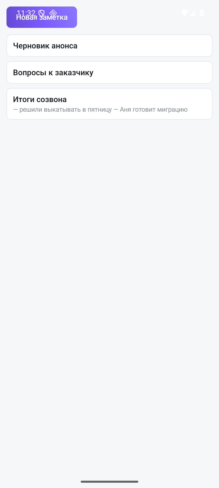

Заметка — короткая запись, которой не нужна задача: итоги созвона, список вопросов, черновик формулировки. Раздел открывается пунктом **«Заметки»** в боковом меню («☰» слева в верхней панели).

## Как устроено

Сначала — список заметок пространства. Тап по заметке выдвигает **редактор поверх списка**: заголовок и текст. Кнопка **«Новая заметка»** создаёт пустую и сразу открывает её.

Изменения записываются кнопкой **«Сохранить»**: ушли назад без неё — правки не сохранятся. Удаление подтверждается отдельно, чтобы не потерять запись случайным касанием.

Текст — обычный Markdown, тот же, что в вебе: заметка, начатая на телефоне, откроется на компьютере как есть.

Заметки принадлежат пространству: переключили пространство в шапке бокового меню — увидели его заметки.

## Заметка или документ

Правило простое: заметка — для себя и на скорую руку, [документ](/help/documents) — для совместной работы. Разница на телефоне ещё заметнее: заметки здесь можно писать и править, а документы — только читать.

## Поиск

Заметки участвуют в общем поиске приложения — там же, где задачи, документы и статьи справки. Ищите по слову из заголовка или текста, заходить в раздел для этого не нужно.
