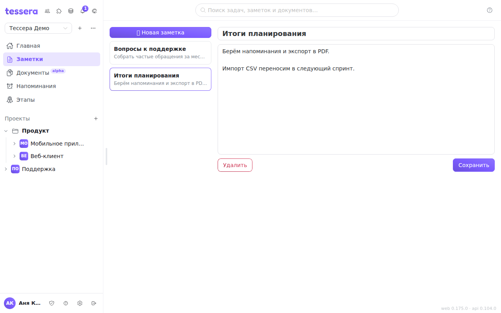

A note is a short record that doesn't need a task: the outcome of a call, a list of questions, a draft of some wording. The section opens from the **“Notes”** item in the sidebar.

## How it works

On the left is the list of the workspace's notes, on the right the open note: a title and text. The **“＋ New note”** button creates an empty one; changes are saved with the “Save” button, and deletion is confirmed separately so you don't lose a record with a stray click.

Notes belong to a workspace: switch the workspace in the sidebar header and you see its notes.

## A note or a document

The rule is simple: a note is for yourself and off the cuff, a [document](/help/documents) is for working together. A document has a tree, a block editor, comments on paragraphs, version history and templates; a note does none of this — and shouldn't — it opens and closes in seconds.

If a note has outgrown itself, move the text into a document: the Documents section is built for long material that others read.

## Search

Notes take part in the global search in the app header — the same place as tasks and documents. Search by a word from the title or the text; there's no need to switch to the section for it.
