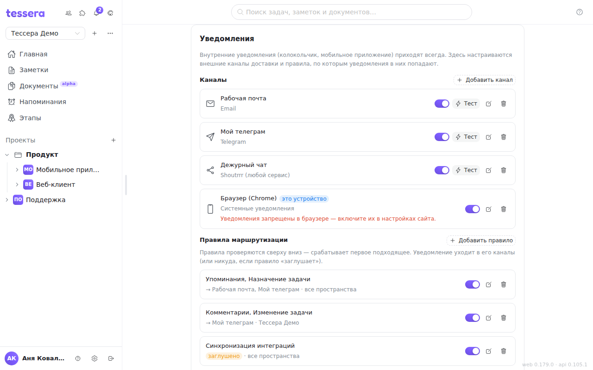
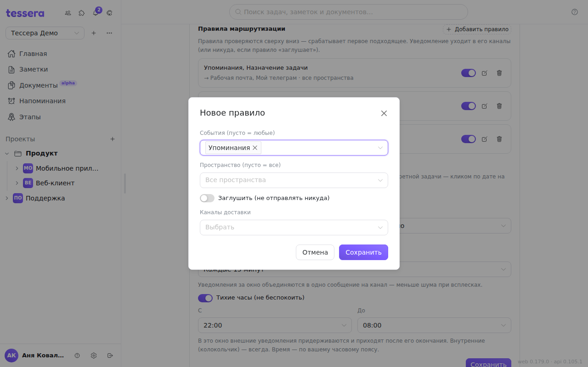

Уведомления в Tessera бывают двух видов, и настраивается только второй.

**Внутренние** — колокольчик на нижней панели: назначили задачу, ответили в комментарии, упомянули. Они приходят всегда, отключить их нельзя, счётчик у колокольчика показывает непрочитанные.

**Внешние** — то же событие, доставленное наружу: письмом, в Telegram, вебхуком в свой сервис. По умолчанию наружу не уходит ничего: сначала заводится **канал** (куда доставлять), потом **правило** (что именно в него отправлять).

Всё это живёт в **«Настройках»** (шестерёнка в нижней панели) в разделе **«Уведомления»**.

## Каналы доставки

Канал — один адрес получателя. Их может быть сколько угодно, каждый включается и выключается своим переключателем; выключенный остаётся в списке, но ничего не получает.

**«Добавить канал»** открывает форму. Тип выбирается один раз при создании — потом его не сменить, канал нужного типа заводится заново.

| Тип                          | Что заполняется                                                             |
| ---------------------------- | --------------------------------------------------------------------------- |
| **Email**                    | адрес (по умолчанию подставляется адрес аккаунта)                            |
| **Telegram**                 | Chat ID и токен бота                                                         |
| **Webhook**                  | URL, метод (по умолчанию `POST`) и, если нужно, заголовок `Authorization`     |
| **Shoutrrr (любой сервис)**  | одна строка Service URL — `slack://…`, `discord://…`, `ntfy://…` и ещё десяток |
| **Системные уведомления**    | ничего: канал заводит сам клиент                                              |

**Telegram.** Бот создаётся через `@BotFather`, он же выдаёт токен. Chat ID — это ваш собственный идентификатор в Telegram (или `@имя_канала`, если бот в нём администратор); боту нужно один раз написать самому, иначе он не имеет права отвечать первым.

**Webhook** — запасной выход для всего остального: в указанный адрес уходит небольшой JSON с полями `kind`, `title`, `text` и `link`, а дальше принимающая сторона делает с ним что хочет. Адрес должен быть внешним: по умолчанию сервер отказывается стучаться на локальные и внутренние адреса, чтобы канал нельзя было направить внутрь чужой сети.

**Shoutrrr** — тот же принцип, но без своего обработчика: один URL описывает и сервис, и учётные данные, поддерживаются Slack, Discord, ntfy, Gotify, Matrix, Pushover, Teams и другие. Формат URL для каждого сервиса — в документации самого shoutrrr.

**Системные уведомления** — это устройство или браузер, с которого вы вошли. Такой канал появляется в списке сам и помечается **«это устройство»**, если открыт именно с него; добавить его вручную нельзя, а переименовать, выключить и удалить — можно. В браузере он показывает всплывающее уведомление операционной системы, пока вкладка с Tessera открыта, и требует разрешения — если оно ещё не выдано, под названием канала появится кнопка **«Разрешить»**. Мобильное приложение с этим каналом получает уведомления и когда закрыто.

### Секреты, проверка и удаление

Токен бота, Service URL и заголовок `Authorization` хранятся зашифрованными и обратно не показываются. При редактировании канала поле секрета пустое: оставьте его пустым — сохранится прежнее значение, введите новое — заменится. Стереть секрет совсем можно ластиком рядом с полем.

**«Тест»** отправляет в канал пробное сообщение прямо сейчас, мимо очереди. Успех отмечает канал меткой **«проверен»** и это лучший способ убедиться, что токен верный — ошибка приходит текстом от самого сервиса. У почты возможен ответ «SMTP на сервере не настроен»: письмо тогда только записано в журнал сервера, и это вопрос к администратору экземпляра, а не к настройкам канала.

При удалении канала Tessera предупредит, если он используется в правилах: сами правила остаются, но перестают куда-либо доставлять.

## Шаблон сообщения

У каждого канала (кроме системного) есть свой шаблон текста. Пустой шаблон — текст по умолчанию: суть уведомления плюс ссылка на приложение.

Кнопка **«Изменить»** открывает редактор: слева поле шаблона и живой предпросмотр на демонстрационных данных, справа — список полей, каждое вставляется кликом в место курсора.

| Поле             | Что подставит                          |
| ---------------- | -------------------------------------- |
| `{{.Text}}`      | готовый текст уведомления              |
| `{{.Title}}`     | заголовок по типу события              |
| `{{.Kind}}`      | тип события (`assigned`, `comment`, …) |
| `{{.TaskNumber}}` | номер задачи                          |
| `{{.TaskTitle}}` | заголовок задачи                       |
| `{{.Actor}}`     | кто инициировал                        |
| `{{.Workspace}}` | название пространства                  |
| `{{.Link}}`      | ссылка на приложение                   |

Синтаксис — Go-шаблоны, доступны и условия: `{{if .TaskNumber}}#{{.TaskNumber}} {{end}}{{.Text}}`. Сломанный шаблон не сохранится: ошибка появляется в предпросмотре сразу, а при попытке сохранить — под формой канала.

## Правила маршрутизации

Правила решают, какое событие в какие каналы уходит. Они проверяются **сверху вниз, и срабатывает первое подходящее** — остальные уже не рассматриваются. Пока правил нет, внешние каналы молчат, сколько бы их ни было заведено.

У правила три настройки:

- **События** — какие типы уведомлений оно ловит. Пусто = любые.
- **Пространство** — ограничить одним пространством. Пусто = все.
- **Каналы доставки** — куда отправлять; можно выбрать несколько.

Отдельный переключатель **«Заглушить»** превращает правило в глушитель: подходящее уведомление никуда не уходит и до следующих правил не доходит. Это способ вырезать шумный тип событий, не трогая остальные — например, поставить первым правилом «Синхронизация интеграций → заглушить», а ниже общее «любые события → почта».

Типов событий девять: назначение задачи, комментарии, упоминания, изменение задачи, перемещение задачи, архивирование, скоро дедлайн, напоминания, синхронизация интеграций.

Порядок правил задаётся порядком в списке — правило-исключение должно стоять **выше** общего, иначе общее сработает первым и исключение никогда не отработает.

## Дедлайны и напоминания

Нижний блок раздела — про уведомления, которые Tessera присылает сама, по времени.

**«Уведомлять о приближении дедлайна»** и два выбора под ним: **«Напоминать»** — за сколько до срока (от «в момент дедлайна» до «за 2 дня») и **«Повтор»** — повторять ли потом (однократно, каждый час, каждые 3 или 6 часов, раз в день). Уведомление о сроке получают исполнители задачи и её автор.

Эти же три настройки есть у каждой задачи отдельно — кликом по дате на карточке, в блоке «Уведомления». Значение «По умолчанию» означает «как в настройках», любое другое перебивает общее правило для этой задачи. Если срок передвинули, уведомление взводится заново.

**«Доставлять напоминания во внешние каналы»** — про раздел «Напоминания»: когда напоминание срабатывает, отправлять ли его в каналы. Выключатель действует только на будущие: включив его, старые напоминания вы не получите.

**Группировать в сводку (дайджест)** — окно в 5, 15, 30 или 60 минут. Уведомления, накопившиеся за окно, приходят одним сообщением на канал («Сводка — N уведомлений») вместо череды отдельных. Системных уведомлений это не касается: push, пришедший на полчаса позже, бесполезен.

**Тихие часы** — окно «не беспокоить», может переходить через полночь (например, 22:00–08:00). Внешние уведомления в это окно **придерживаются** и приходят разом после его окончания; системные уведомления на устройство в тихие часы просто не показываются — отложить всплывающее окно не получится. Внутренние уведомления у колокольчика приходят как обычно. Время считается по вашему часовому поясу — он берётся из настроек локализации.

Изменения в этом блоке применяются кнопкой **«Сохранить»** — в отличие от каналов и правил, которые сохраняются сразу.

## Как доставка работает на самом деле

Внешние уведомления не отправляются в момент события: они попадают в очередь, которую сервер разбирает раз в десять секунд. Поэтому нормальная задержка письма или сообщения в Telegram — до нескольких десятков секунд, а не мгновение.

Если доставка не удалась, Tessera повторяет её до пяти раз с растущей паузой (примерно через 1, 4, 9 и 16 минут). Ошибки, которые сами не пройдут — неверный токен, несуществующий адрес, отвергнутый запрос, — повторов не получают: такое чинится только правкой канала.

## Если уведомления не приходят

1. **Есть ли правило.** Каналы без правил не получают ничего — это самая частая причина.
2. **Правило выше по списку.** Первое подходящее правило забирает событие себе; проверьте, не перехватывает ли его правило-глушитель.
3. **Канал и правило включены.** Выключенный канал в списке блёклый; выключенное правило — тоже.
4. **Канал проверен.** Нажмите **«Тест»**: он покажет настоящую ошибку сервиса.
5. **Тихие часы.** Если сейчас окно тишины, внешние уведомления придут после его конца, а системные не придут вовсе.
6. **Дайджест.** С включённой сводкой сообщение ждёт конца окна и приходит вместе с остальными.
7. **Разрешение браузера** — для системных уведомлений; кнопка **«Разрешить»** под каналом появится, если его нет.
8. **Почта не уходит совсем** — возможно, на сервере не настроен SMTP: об этом скажет тест канала.

## Что дальше

- Как устроены сроки и напоминания сами по себе — [«Напоминания»](/help/reminders).
- Что происходит с очередью доставки на стороне сервера — [«Фоновые задания»](/help/admin-jobs) (для администратора экземпляра).
