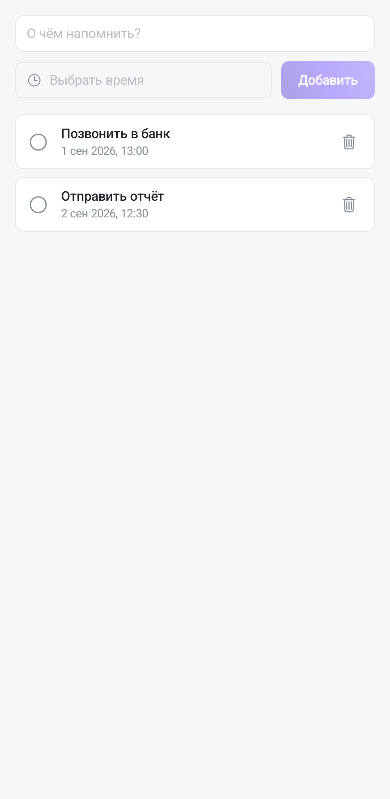

Напоминание — разовая заметка о времени: текст плюс момент, когда о нём нужно вспомнить. Раздел открывается пунктом **«Напоминания»** в боковом меню («☰» слева в верхней панели).

**Приложение и есть доставка.** Веб-версия показывает напоминание в списке, но системного уведомления не шлёт — сигнал в нужную минуту приходит именно отсюда. Если вы завели напоминание на компьютере, а телефон с приложением рядом, сработает оно на телефоне.

## Создать и закрыть

В строке сверху: текст в поле «О чём напомнить?», время — в выборе даты, затем **«Добавить»**. Без текста или без времени напоминание не создастся — приложение попросит заполнить оба поля.

Сработавшее напоминание отмечается галочкой слева: оно остаётся в списке как выполненное, снять отметку можно тем же касанием. Ненужное удаляется корзиной справа.

## Чтобы сигнал пришёл вовремя

Уведомление ставится будильником на самом устройстве, поэтому от системных разрешений зависит, прозвенит ли оно:

- **Разрешение на уведомления.** Android 13 и новее спрашивает его отдельно; отказали — напоминания будут копиться в списке молча. Включается в системных настройках приложения, раздел «Уведомления».
- **Экономия батареи.** Если система «усыпила» приложение, будильник может сработать позже назначенного. На телефонах с агрессивной экономией стоит разрешить Tessera работать в фоне.

Разрешение на уведомления приложение просит при первом запуске; отказ не ломает остальное — перестают приходить только сигналы, и разрешение всегда можно выдать позже в системных настройках. Напоминание переживает перезагрузку телефона: будильники переставляются заново при следующем старте.

## Чем отличается от срока задачи

**Срок** живёт на задаче: он показывается на карточке, по нему фильтруют и сортируют доску, по нему строятся календарь, таймлайн и Гант. Срок отвечает на вопрос «когда это должно быть сделано».

**Напоминание** — самостоятельная запись, оно ни к чему не привязано и отвечает на вопрос «когда мне об этом вспомнить». Созвон, письмо, обещание перезвонить — всё это напоминания, а не задачи со сроком.
