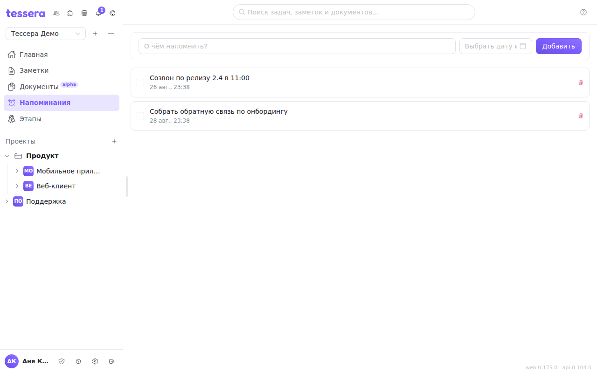

A reminder is a one-off note about a time: some text plus the moment when you need to be reminded of it. The section opens from the **Reminders** item in the sidebar.

## Creating and closing

In the row at the top: the text in the “What should we remind you about?” field, the time in the date picker, then **Add**. Without the text or the time a reminder won't be created — the app will ask you to fill in both fields.

A reminder that has fired is marked with a checkmark on the left: it stays in the list as done, and you can clear the mark with the same click. An unwanted one is removed with the trash icon on the right.

## How it differs from a task's due date

A **due date** lives on a task: it shows on the card, the board is filtered and sorted by it, and the calendar, timeline and Gantt are built from it. A due date answers the question “when does this need to be done”.

A **reminder** is a standalone record, tied to nothing, and it answers the question “when should I be reminded of this”. A call, an email, a promise to ring back — those are all reminders, not tasks with a due date.

## Delivery

The notification for a time that has come arrives as a **push notification in the Tessera mobile app** for Android — that is what handles delivery. In the web version a reminder is visible in the list, but there won't be a separate system notification: keep the mobile app installed and allow it notifications if you want to get the signal on time.
