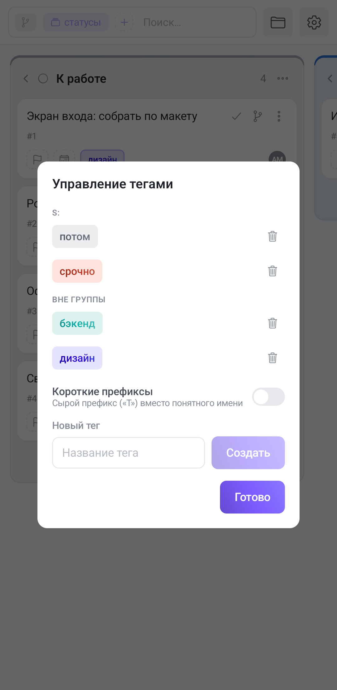

Тег в Tessera — не просто цветная метка. Колонки доски можно разложить **по тегам**, и тогда тег превращается в направление работы: команда, компонент, клиент, стадия проработки. В приложении теги устроены так же, как в браузере, — расходятся только жесты и одна настройка, которой на телефоне нет.

## Теги живут в проекте, а не в задаче

Набор тегов принадлежит **проекту**: все доски одного проекта видят один список, а соседний проект — свой собственный. Тег, снятый со всех задач, из списка не исчезает: он остаётся заготовкой, и колонка по нему на доске просто будет пустой.

## Где ими управлять

Кнопки «Теги» в шапке на телефоне нет — управление лежит в **меню доски**: «⋮» в правом верхнем углу → **«Управление тегами»**. Откроется модальное окно со всем списком тегов проекта.

Если в проекте есть теги с префиксами, список разбит на группы: над каждой — заголовок капсом с именем префикса. Когда группа одна, заголовки не рисуются вовсе.

### Создать

Внизу окна — поле **«Название тега»** и кнопка **«Создать»** рядом. В отличие от браузера, Enter здесь не нужен: кнопка есть и она гаснет, пока поле пустое. Новый тег получает первый цвет палитры (фиолетовый) — цвет меняется отдельно, при переименовании.

### Переименование — одним касанием

На компьютере правка открывается двойным кликом. На телефоне двойной тап неудобен, поэтому **достаточно одного касания по тегу**: вместо чипа появляется поле с именем, а справа — кнопка **«✓»**, которая сохраняет и закрывает правку. Касание по пустому месту окна закрывает правку, ничего не сохраняя.

### Цвет — только в режиме правки

Палитра из восьми цветов появляется **под тегом, который вы правите**, и больше нигде. То есть ответ на «где поменять цвет тега» — коснуться тега в этом окне и выбрать кружок под ним. Цвет применяется сразу.

Цвет — не только украшение: из него собираются градиент чипа на карточке, цвет колонки при группировке по тегам и заливка в фильтрах.

### Удалить

Корзина справа от тега спрашивает подтверждение — «Удалить тег? Он снимется со всех задач». Так и есть: тег снимается **со всех задач проекта разом**, и отмены нет. Если тег просто перестал быть нужен, надёжнее переименовать его (например, добавить «архив») и не использовать дальше.

## Префиксы: как из тегов получается система

Тег с двоеточием в имени Tessera читает как **префикс и значение**:

- `Сложность::высокая` — разделитель `::`;
- `Статус: в ревью` — разделитель `: ` (двоеточие с пробелом).

Обе записи равноправны. Всё, что до разделителя, — **префикс** (пространство имён), всё после — значение. Регистр и пробелы вокруг префикса не важны.

Что это даёт на телефоне:

1. **Двухсегментный чип.** Слева залитый сегмент с именем префикса, справа — значение. На узкой карточке это экономит место лучше длинного имени.
2. **Группировку списков.** И окно управления тегами, и выбор тегов у задачи собирают теги в группы по префиксу с заголовком у каждой — иначе список из сорока тегов на телефоне не пролистать.
3. **Колонки по одному префиксу.** В панели доски группировка «По тегам» умеет брать не все теги, а **конкретный префикс** — тогда колонками станут только его значения. Подробнее — [Панель доски](/help/board-composer).

## Имена префиксов задаются в браузере

Понятное имя для короткого префикса (`T:` → «Тип») — настройка **проекта**, и приложение её честно показывает: имена подставляются в чипы, заголовки групп и фильтры. А вот **редактора имён префиксов в приложении нет** — раздел «Имена префиксов» живёт только в веб-версии. Если на телефоне вместо понятного имени видно голое `T`, значит имя для этого префикса ещё не задано в браузере (или включён переключатель ниже).

## Короткие префиксы — переключатель для себя

Внизу списка тегов стоит переключатель **«Короткие префиксы»** с подписью «Сырой префикс („T“) вместо понятного имени». Он делает обратное именам: показывает префикс как есть.

Это личная настройка **этого устройства**: она не меняется у коллег и не переезжает с телефона в браузер и обратно. Переключатель показывается, только если в проекте действительно есть теги с префиксами.

## Теги на задаче

В окне задачи и в быстром меню карточки теги выбираются из того же списка, сгруппированного по префиксам: касание по тегу вешает его, повторное — снимает. Навешенный тег залит цветом, ненавешенный — бледный.

**Создать тег прямо отсюда можно только с клавиатуры.** Внизу выбора есть поле, подписанное «Новый тег, Enter», и подпись не преувеличивает: **кнопки рядом с ним нет**, тег создаётся кнопкой подтверждения на экранной клавиатуре. Введённое и не подтверждённое имя не сохранится, а выбор закроется как ни в чём не бывало. Созданный так тег сразу вешается на задачу и получает **случайный** цвет из палитры — если цвет важен, поправьте его потом в окне управления тегами.

Одна задача может нести сколько угодно тегов. При группировке доски по тегам она покажется **в каждой соответствующей колонке** — это одна и та же карточка, а не копии.

## Теги и GitLab

На доске, связанной с GitLab, метки приезжают из репозитория тегами. Часть из них разбирается правилами в поля задачи: метка `S: done` может означать колонку, `P: high` — приоритет. Такие теги **не предлагаются в выборе у задачи**: повесить их вручную значило бы разойтись с полем, которым они управляют. В окне управления тегами они видны и правятся как обычные — там вы смотрите на список меток проекта, а не назначаете их.

Как настраиваются сами правила разбора — в статье [GitLab: синхронизация](/help/admin-gitlab-sync).
