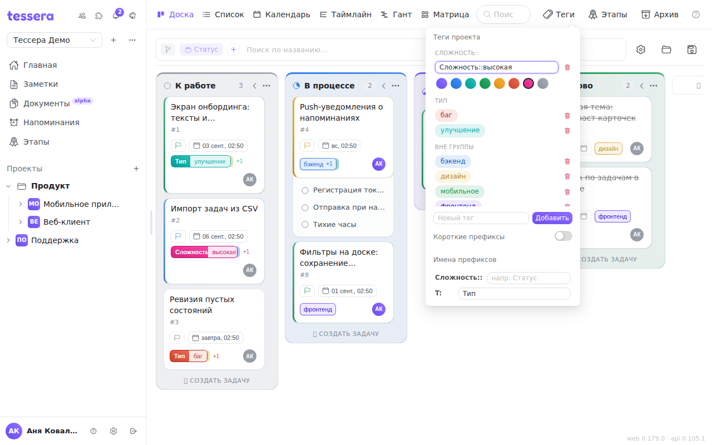

Тег в Tessera — не просто цветная метка. Колонки доски можно разложить **по тегам**, и тогда тег превращается в направление работы: команда, компонент, клиент, стадия проработки. Поэтому теги стоит заводить осознанно и называть по системе — на них держится второй взгляд на доску.

## Теги живут в проекте, а не в задаче

Набор тегов принадлежит **проекту**: все доски одного проекта видят один список, а соседний проект — свой собственный. Тег, снятый со всех задач, из списка не исчезает: он остаётся заготовкой, и колонка по нему на доске просто будет пустой.

## Где ими управлять

Кнопка **«Теги»** в шапке доски открывает поповер со всем списком тегов проекта. На узком экране она же лежит в меню доски (значок с тремя точками). В поповере видно всё сразу: какие теги есть, какого они цвета и как разложены по префиксам.

### Создать

Внизу поповера — поле **«Новый тег»**. Введите имя и нажмите **«Добавить»** или **Enter**. Новый тег получает первый цвет палитры (фиолетовый) — цвет меняется отдельно, при переименовании.

### Переименовать — двойным кликом

Одиночный клик по тегу в поповере ничего не делает: это не кнопка, а образец того, как тег выглядит на карточке. **Переименование открывается двойным кликом** — подсказка при наведении говорит то же самое («*имя* · двойной клик — переименовать»). Тег превращается в поле ввода; **Enter** или клик мимо сохраняют, имя без изменений просто закрывает поле.

### Цвет — только в режиме правки

Палитра из восьми цветов появляется **под тегом, который вы правите**, и больше нигде. Это и есть ответ на частый вопрос «где поменять цвет тега»: двойной клик по тегу → ряд кружков под ним → клик по нужному. Цвет применяется сразу, поле имени при этом не закрывается.

Цвет — не только украшение: из него собираются градиент чипа на карточке, цвет колонки при группировке по тегам и заливка в фильтрах.

### Удалить

Корзина справа от тега удаляет его **со всех задач проекта разом** — об этом честно предупреждает подтверждение. Отмены нет: восстановить тег означает завести его заново и расставить руками. Если тег просто перестал быть нужен, но историю ломать не хочется, надёжнее переименовать его (например, добавить «архив») и не использовать дальше.

## Префиксы: как из тегов получается система

Тег с двоеточием в имени Tessera читает как **префикс и значение**:

- `Сложность::высокая` — разделитель `::`;
- `Статус: в ревью` — разделитель `: ` (двоеточие с пробелом).

Обе записи равноправны. Всё, что до разделителя, — **префикс** (пространство имён), всё после — значение.

Что это даёт:

1. **Двухсегментный чип.** Такой тег рисуется как в GitLab: слева залитый сегмент с именем префикса, справа — значение. Один взгляд на карточку, и понятно, что «высокая» — это про сложность, а не про приоритет.
2. **Группировку списков.** В поповере тегов, в выборе тегов у задачи и в фильтре доски теги собираются в группы по префиксу, с заголовком у каждой. Список из сорока тегов остаётся читаемым.
3. **Колонки по одному префиксу.** На доске можно сгруппировать не «по всем тегам», а **по конкретному префиксу** — тогда колонками станут только его значения, а остальные теги в раскладке не участвуют. Подробнее — [Панель доски](/help/board-composer).

Регистр и пробелы вокруг префикса не важны: `Сложность::` и `сложность ::` — один и тот же префикс.

## Имена префиксов

Префикс в имени тега бывает коротким — `T: bug`, `S: doing`. Читать такое на карточке неудобно, и для этого есть **«Имена префиксов»** внизу поповера: рядом с каждым найденным префиксом — поле для понятного названия. Написали у `T:` имя «Тип» — и во всех чипах, заголовках групп и фильтрах вместо `T` появится «Тип». Сохраняется по **Enter** или по клику мимо поля.

Имена префиксов — настройка **проекта**: их видят все участники. Пустое поле снимает имя, и префикс снова показывается как есть.

Раздел появляется только тогда, когда в проекте есть хотя бы один тег с префиксом, — иначе имени неоткуда взяться.

## Короткие префиксы — переключатель для себя

Рядом стоит переключатель **«Короткие префиксы»**. Он делает обратное: показывает сырой префикс (`T`) вместо понятного имени («Тип»). Это личная настройка **этого устройства** — она не меняется у коллег и не переезжает на телефон. Полезно, когда чипов на карточке много и место дороже слов.

## Теги на задаче

В окне задачи и в быстром меню карточки теги выбираются из того же списка, сгруппированного по префиксам: клик по тегу вешает его, повторный — снимает.

**Главная спотыкалка при переходе из ClickUp — создание тега прямо отсюда.** Внизу выбора есть поле, подписанное «Новый тег, Enter», и подпись не преувеличивает: **кнопки рядом с ним нет, тег создаётся только по Enter**. Введённое и не подтверждённое имя не сохранится, а поповер закроется как ни в чём не бывало. Созданный так тег сразу вешается на задачу и получает случайный цвет из палитры — если цвет важен, поправьте его потом в поповере тегов доски.

Одна задача может нести сколько угодно тегов. При группировке доски по тегам она покажется **в каждой соответствующей колонке** — это одна и та же карточка, а не копии.

## Теги и GitLab

На доске, связанной с GitLab, метки приезжают из репозитория тегами. Часть из них разбирается правилами в поля задачи: метка `S: done` может означать колонку, `P: high` — приоритет. Такие теги **не предлагаются в выборе у задачи**: повесить их вручную значило бы разойтись с полем, которым они управляют. В поповере доски они видны и правятся как обычные — там вы смотрите на список меток проекта, а не назначаете их.

Как настраиваются сами правила разбора — в статье [GitLab: синхронизация](/help/admin-gitlab-sync).
