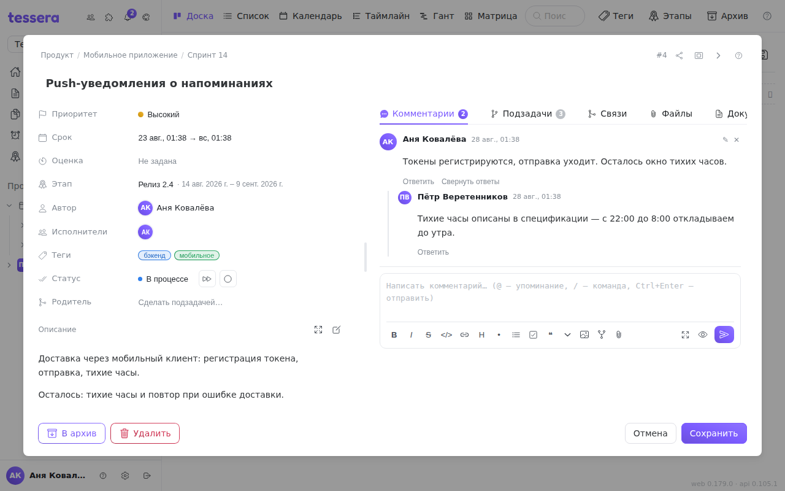

The **Comments** tab is the discussion of a task. Comments are written with the same [Markdown editor](/help/markdown-editor) as the description, so formatting, images, attachments and diagrams all work in them. On top of that come three things the description doesn't have: reply threads, mentions that notify, and commands.

## Sending

The input is pinned to the bottom of the tab and doesn't scroll away. Send it with the button or with **Ctrl+Enter**.

If the server is unreachable the comment **isn't lost**: “No connection — retrying (1/3)…” appears under the field and the editor tries three more times with a growing pause. Your text stays in the field the whole time, and Cancel stops the wait. Retries only happen when the network is gone: if the server answered with an error, resending is pointless and no retry is made.

Your own comments can be **edited and deleted** — the actions appear on the comment's row on hover.

## Reply threads

A reply starts a **thread**: the root message with the replies indented under it. The Reply button is on the root and on every reply inside the thread; the author of the message you are answering is **pre-inserted as a mention**, so the reply reads as a reply straight away.

Threads are **exactly two levels deep**: replying to a reply lands in the same thread rather than nesting further. That keeps a discussion from crawling off to the right by the fifth message.

A long thread can be collapsed — the replies are replaced by a “3 replies” line that expands again on click. Collapsing lives only in your window and is invisible to everyone else.

A reply notifies not only the task's participants but **everyone who has already written in that thread**. The author of the root message is frequently neither the assignee nor the reporter — without that rule they would simply never learn a discussion had started under their text.

## Mentions

`@` opens the list of members. You can keep typing a name, and whoever you pick from the list is marked as mentioned and **gets a notification**.

Hence a subtlety: **only the person you picked from the list is notified**. Type `@Ivan` by hand without choosing a row in the popup and the text will be highlighted, but no notification is sent — Tessera doesn't guess which Ivan you meant.

On boards linked to GitLab the list also holds members **with no Tessera account**. Mentioning them — `@login` — travels to GitLab with the comment and fires there; a Tessera notification for such a person can't exist, there is simply nowhere for it to arrive.

## Task links with `#`

`#123` in a finished comment becomes a **link to a task**. Clicking it opens the board with that task — even if it lives in another project of the same workspace.

Worth knowing:

- The link is resolved **at the moment of the click**, not when the comment is sent. So write `#123` freely: if the task appears later, the link starts working on its own.
- An unknown number says so honestly: “Task #123 not found”.
- Inside code blocks `#123` **stays text**: a number in a diff is not a link.
- Numbers of up to seven digits are recognised, so long figures don't turn into links.

## Commands

A comment can not only talk about a task but **change it**. A command is a line starting with `/`. Type `/` at the start of a line and a list appears: every command comes with a description and an example.

What a command can do:

| Area | Commands |
|---|---|
| Assignees | `/assign @msdnna`, `/unassign` (with no argument — remove everyone) |
| Dates and estimate | `/due 2026-08-14`, `/start tomorrow`, `/remove_due`, `/remove_start`, `/estimate 2h30m`, `/remove_estimate` |
| Fields | `/priority high`, `/title A new title` |
| Tags and milestone | `/tag backend, urgent`, `/untag backend`, `/milestone Release 1.0`, `/remove_milestone` |
| Column and lifecycle | `/move In progress`, `/close`, `/reopen`, `/archive` |
| [Relations](/help/task-links) | `/relate #2591`, `/blocks #2591`, `/blocked_by #2591`, `/duplicates #2591`, `/unlink #2591` |
| Hierarchy | `/subtask Write the tests`, `/parent #2591`, `/unparent` |

Rules that save time:

- **A command takes a whole line and starts it.** `cd /home` and `src/utils` are ordinary text, not commands.
- **There can be several commands** — one per line; they run top to bottom.
- **Executed lines don't stay in the comment.** A comment must not repeat what has already been done; if there was nothing but commands in it, all that remains is the entry in the [history](/help/task-history).
- **Inside a code block a command is not executed** — command examples are safe to write out.
- Dates understand human phrasing: `tomorrow`, `on friday`, `2026-08-14`.

### The hint before you send

While you type, Tessera shows under the field **what exactly will happen**: “assigned @msdnna”, “moved to ‘In progress’” — or an error if there is no member with that login. The check is run by the very parser that will later execute the command, so the hint can't disagree with the result.

Partial success is still success: `/assign @known @unknown` assigns whoever was found and separately says who wasn't.

## Workspace commands

Besides the built-in ones, a workspace may define **its own commands** — `/approve` for a bot, say. Tessera **recognises but does not execute** them: such a line stays in the comment's text (the hint says so — “will stay as text”), and it is parsed by whoever it is addressed to.
