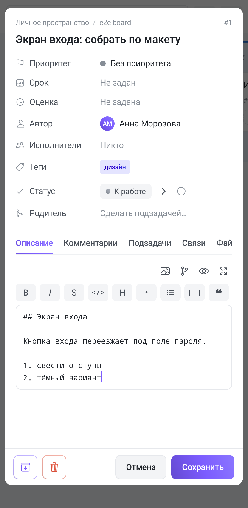

Тот же редактор, что и в браузере: хранит **Markdown**, а не «свою» разметку. Но в приложении он живёт ровно в двух местах — **описание задачи** и **комментарии** (включая правку уже отправленного и ответ в ветке).

**Заметки на телефоне редактируются обычным полем ввода** — без тулбара, предпросмотра и упоминаний. Markdown в них сохранится и в браузере отрисуется как надо, но набирать разметку придётся руками.

## Две строки над полем

Сверху справа — ряд круглых кнопок, ниже — полоса форматирования.

**Верхний ряд** (в режиме правки):

| Кнопка | Что делает |
|---|---|
| Картинка | выбор изображения из галереи или файлов |
| Узлы графа | вставляет заготовку диаграммы Mermaid |
| Глаз / карандаш | переключает правку ⇄ предпросмотр |
| Стрелки в стороны | открывает полноэкранный редактор |

У **комментариев глаза в этом ряду нет**: переключатель вынесен вниз, к кнопкам «Отправить» / «Отмена». Так он не уезжает вверх, когда комментарий разросся.

**Полоса форматирования** прокручивается вбок — кнопок больше, чем помещается в ширину телефона: **B**, *I*, ~~S~~, `</>`, **H** (`## `), **•** (`- `), нумерованный список, `[ ]`, **❝** (`> `), спойлер, ссылка, а в конце — **два шеврона: влево и вправо**.

Шевроны — это **уменьшить и увеличить отступ**. Они есть только в приложении: на экранной клавиатуре нет Tab, а на аппаратную рассчитывать нельзя. Отступ считается **по два пробела** — столько же, сколько нужно Markdown для вложенного пункта списка.

Кнопки работают по выделению: есть выделение — оборачивают его, нет — вставляют заготовку и ставят курсор туда, где писать.

**Скрепки в приложении нет.** Файл прикладывается на вкладке **«Файлы»** кнопкой «Прикрепить файл»; ссылка на него в текст не вставляется — на него смотрят на самой вкладке.

## Что редактор делает за вас, пока вы печатаете

Это не тулбар, а поведение самого поля — то, чего в веб-редакторе на телефоне не получить.

**Списки продолжаются сами.** Enter в конце пункта заводит следующий с тем же маркером: `- ` даёт `- `, `3. ` даёт `4. `, `- [ ] ` даёт пустой чекбокс. Отступ сохраняется. **Enter на пустом пункте выходит из списка** — маркер убирается, а лишней пустой строки не остаётся.

**Скобки и кавычки закрываются парой.** `(`, `[`, `{`, `"`, `'` и `` ` `` сразу вставляют закрывающий символ, а курсор встаёт между ними. Набранная закрывающая скобка не дублируется — курсор просто перешагивает уже стоящую. Backspace между парой сносит **оба** символа.

**Символ поверх выделения оборачивает его, а не стирает.** Выделите слово и наберите `*` — получится `*слово*`, выделение сохранится. Так же работают `_`, `~`, `` ` ``, `(`, `[`, `{`, `<`, `"` и `'`.

Пары `*`, `_`, `~` **сознательно не закрываются сами** при обычном наборе: иначе «а * б» превращалось бы в «а ** б». `<` тоже не закрывается — из-за него ломался бы `
`.

Правило одно, и оно важное: **пока работает предиктивный ввод (слово подчёркнуто), редактор в текст не лезет**. Переписывать буквы под клавиатурой, которая считает их своими, — верный способ получить кашу.

## Поле ввода

Моноширинный шрифт: отступы вложенных списков выстраиваются в столбик, и видно, где какой уровень. Поле **растёт под текст** — своей полосы прокрутки у него нет, длинное описание листается вместе со вкладкой.

Когда клавиатура поднимается, приложение подтягивает **низ** блока — поле и, если вы набираете `@` или `/`, список подсказок под ним. Прокрутка догоняет клавиатуру, пока та выезжает: одного рывка не хватило бы, подсказки остались бы под ней.

## Предпросмотр и полный экран

Глаз показывает то, что увидят остальные. **Чекбоксы в предпросмотре нажимаются** — `- [ ]` становится `- [x]` прямо в Markdown, и это сохраняется. В готовом комментарии чекбоксы нажимаются **только в вашем собственном**: чужой текст правит его автор.

Кнопка со стрелками открывает **полноэкранный редактор** с двумя панелями:

- **телефон в портрете** — текст сверху, живой предпросмотр снизу;
- **альбом и планшет** — панели рядом, как в браузере.

Панели **прокручиваются синхронно**: тянете одну — вторая идёт следом пропорционально своей высоте. Внутри полноэкранного окна глаза нет — предпросмотр и так перед глазами. Закрытие окна сохраняет текст, это то же самое, что увести из поля фокус.

Выбранный режим (правка или предпросмотр) **переживает переключение вкладок и поворот экрана**: вкладка задачи выходит из композиции, когда вы уходите на «Комментарии», и без этого вы бы каждый раз возвращались в режим правки.

## Диаграммы, подсветка кода и интернет

Готовый текст рисует **WebView** — иначе диаграммы Mermaid и подсветку кода на телефоне не воспроизвести. Разметку он разбирает библиотекой из самого приложения, а вот **Mermaid и подсветку подтягивает из сети**.

Отсюда единственная существенная разница с браузером: **без интернета диаграмма останется блоком кода, а код — неподсвеченным**. Текст, списки, таблицы, картинки и ссылки при этом отрисуются как обычно. Появится связь — при следующем открытии всё встанет на место.

Внутри блока кода **ничего не подменяется**: `#2550` не станет ссылкой, `@root` — упоминанием, а `/close` не выполнится.

## Картинки

В приложении путь один: **кнопка с картинкой**. Вставки из буфера обмена и перетаскивания файла, как в браузере, здесь нет — соответствующих жестов у поля ввода нет.

Выбранный файл загружается, и `` дописывается **в конец текста**, а не на место курсора. Пока идёт загрузка, кнопка гаснет и повторное нажатие не сработает.

## Упоминания и ссылки на задачи

`@` открывает список участников: аватар, имя, пометка «GitLab» у тех, у кого учётной записи в Tessera нет. `#123` в готовом тексте — ссылка, по касанию открывается та задача.

Разница та же, что и в браузере: **уведомление об упоминании отправляет только комментарий**. В описании `@Имя` подсветится, но человек ничего не получит. Подробнее — в статье про [комментарии](/help/comments).

## Чего в приложении нет

- **Всплывающей панели над выделением** — форматирование только через полосу кнопок.
- **Скрепки и вложений прямо из текста** — через вкладку «Файлы».
- **Вставки картинки из буфера и перетаскивания файла.**
- **Ctrl+Enter** — комментарий отправляется кнопкой «Отправить».
