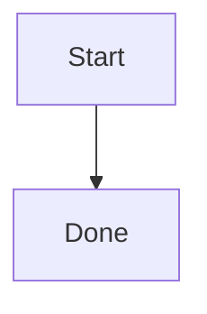

A task description, a comment, a note and the text in a document are all edited by the same editor. It stores **Markdown** — not a house format and not HTML — so the text survives being copied into any other tool.


## The toolbar

Buttons apply to the selected text; with nothing selected they insert a stub and put the caret where you have to type.

| Button | What it inserts |
|---|---|
| **B** | `**bold**` |
| *I* | `*italic*` |
| ~~S~~ | `~~strikethrough~~` |
| `</>` | `` `code` `` |
| Link | `[text](address)` |
| Heading | `## ` at the start of the line |
| Bullet list | `- ` at the start of the line |
| Numbered list | `1. ` at the start of the line |
| Checkbox | `- [ ] ` at the start of the line |
| Quote | `> ` at the start of the line |
| Spoiler | a `<details>` block — collapsed text under a caption |

You don't have to look at the toolbar at all: **select some text and a compact bar floats above the selection** with the same bold, italic, strikethrough, code and link.

## Checkboxes work in finished text

A `- [ ]` checkbox isn't just a glyph. In a rendered description or comment you **can click it**, and the change is written back into the Markdown itself: `- [ ]` becomes `- [x]`. That turns a description into a live checklist you don't have to create subtasks for.

## Images: the button, the clipboard and drag-and-drop

An image gets into the text three ways, all of them equal:

1. **The image button** in the toolbar — opens a file picker.
2. **Ctrl+V** — paste an image straight from the clipboard (no need to save a screenshot to disk first).
3. **Dropping a file** onto the input.

The editor uploads the file and inserts `` in its place. PNG, JPEG, GIF, WebP and BMP are accepted. **SVG is deliberately refused**: such a file would run as active content on our own origin.

## Task attachments: the paperclip

The paperclip only appears where the text belongs to a task. It does two things:

- **uploads a file** into that task's “Files” tab and immediately inserts a download link into the text;
- **lists the files already attached**, so you can point at an existing one without uploading anything again.

Hence the drag-and-drop rule: **an image becomes an image in the text, any other file becomes a task attachment** with a link to it. There is no need to visit the “Files” tab separately.

## Mermaid diagrams

The graph-node button inserts a stub:

````

````

In the preview and in the finished description that block is drawn as a diagram. Inside it, ordinary [Mermaid](https://mermaid.js.org/) syntax applies: `flowchart`, `sequenceDiagram`, `gantt`, `stateDiagram` and the rest.

If a diagram stayed text instead of being drawn, Mermaid could not parse it. Check the indentation and the arrows: the block is either drawn whole or not at all.

## Code highlighting

Fences with a language are highlighted: JavaScript, TypeScript, JSON, YAML, Python, Bash, Go, SQL, XML/HTML, CSS, Markdown, Dockerfile, INI.

````
```go
func main() { fmt.Println("hello") }
```
````

Inside code **nothing is substituted**: `#2550` in a code sample doesn't become a task link, and `@root` in a shell snippet doesn't become a mention. The same goes for commands: `/close` inside a code block is not executed, so command examples are safe to write out.

## Preview and full screen

The eye button switches **editing ⇄ preview**: you see exactly what everyone else will.

The button with diverging arrows opens the **full-screen editor**. Its presentation is different — **two panes side by side: text on the left, a live preview on the right** that redraws as you type. For a long description that beats toggling back and forth. Closing the full-screen window saves the text — it is the same moment as moving the focus out of the field.

## Mentions and task links

`@` opens the list of members, and `#123` in finished text becomes a link to a task — see [Comments](/help/comments) for the details.

One difference is worth keeping in mind: **only a comment sends a mention notification**. In a task description `@Name` will be highlighted and will resolve to the person, but no mail and no bell reaches them — a description is edited many times over, and notifying on every save would be noise. To call a colleague in, write a comment.

## What the editor saves, and when

A description is saved when you move the focus out of the field — there is no separate Save button. A comment is sent with the button or with **Ctrl+Enter**.
