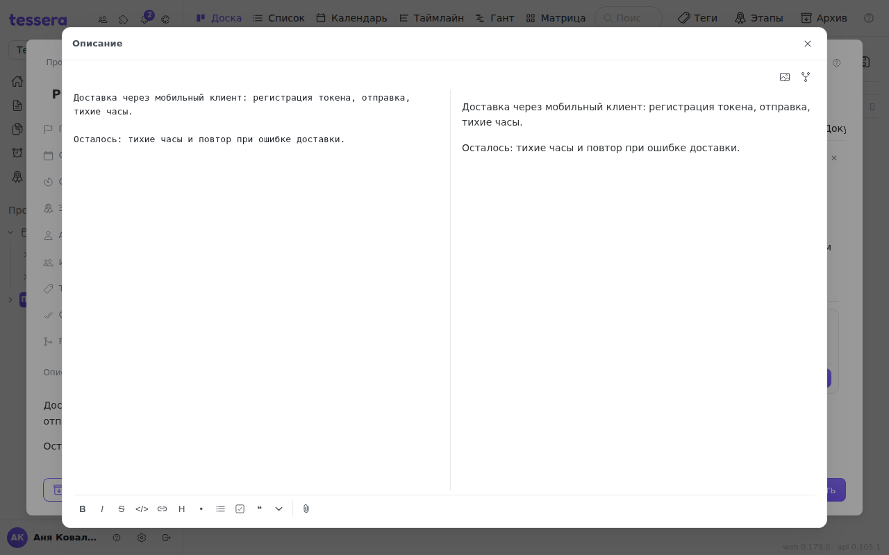
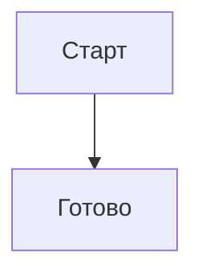

Описание задачи, комментарий, заметка и текст в документе редактируются одним и тем же редактором. Он хранит **Markdown** — не «свою» разметку и не HTML, поэтому текст переживает копирование в любой другой инструмент.



## Тулбар

Кнопки применяются к выделенному тексту, а если ничего не выделено — вставляют заготовку и ставят курсор туда, где нужно писать.

| Кнопка | Что вставляет |
|---|---|
| **Ж** | `**жирный**` |
| *К* | `*курсив*` |
| ~~З~~ | `~~зачёркнутый~~` |
| `</>` | `` `код` `` |
| Ссылка | `[текст](адрес)` |
| Заголовок | `## ` в начало строки |
| Маркированный список | `- ` в начало строки |
| Нумерованный список | `1. ` в начало строки |
| Чекбокс | `- [ ] ` в начало строки |
| Цитата | `> ` в начало строки |
| Спойлер | блок `<details>` — свёрнутый текст с подписью «Подробнее» |

Форматирование можно применить и не глядя на тулбар: **выделите текст — и над выделением всплывёт компактная панель** с теми же жирным, курсивом, зачёркиванием, кодом и ссылкой.

## Чекбоксы работают в готовом тексте

Чекбокс `- [ ]` — не просто значок. В отрендеренном описании или комментарии по нему **можно кликнуть**, и правка запишется в сам Markdown: `- [ ]` станет `- [x]`. Так из описания получается живой чек-лист, для которого не нужно заводить подзадачи.

## Картинки: кнопка, буфер обмена и перетаскивание

Изображение попадает в текст тремя способами, и все три равноправны:

1. **Кнопка с картинкой** в тулбаре — открывает выбор файла.
2. **Ctrl+V** — вставка картинки прямо из буфера обмена (скриншот не нужно сохранять на диск).
3. **Перетаскивание файла** в поле ввода.

Редактор загружает файл и вставляет на его место ``. Принимаются PNG, JPEG, GIF, WebP и BMP. **SVG сознательно не принимается**: такой файл исполнялся бы как активное содержимое на нашем же домене.

## Вложения задачи: скрепка

Скрепка появляется в тулбаре только там, где текст принадлежит задаче. Она делает две вещи:

- **загружает файл** во вкладку «Файлы» этой задачи и сразу вставляет в текст ссылку на скачивание;
- **показывает уже приложенные файлы**, чтобы сослаться на существующий, ничего не загружая заново.

Отсюда же правило перетаскивания: **картинка становится картинкой в тексте, а любой другой файл — вложением задачи** со ссылкой на него. Отдельно ходить на вкладку «Файлы» не нужно.

## Диаграммы Mermaid

Кнопка с узлами графа вставляет заготовку:

````

````

В предпросмотре и в готовом описании этот блок рисуется как диаграмма. Внутри работает обычный синтаксис [Mermaid](https://mermaid.js.org/): `flowchart`, `sequenceDiagram`, `gantt`, `stateDiagram` и остальные.

Если диаграмма не нарисовалась, а осталась текстом — значит Mermaid не смог разобрать её синтаксис. Проверьте отступы и стрелки: блок рисуется целиком или не рисуется вовсе.

## Подсветка кода

Фенсы с указанием языка подсвечиваются: JavaScript, TypeScript, JSON, YAML, Python, Bash, Go, SQL, XML/HTML, CSS, Markdown, Dockerfile, INI.

````
```go
func main() { fmt.Println("привет") }
```
````

Внутри кода **ничего не подменяется**: `#2550` в примере кода не станет ссылкой на задачу, а `@root` в команде оболочки — упоминанием. Это касается и команд: `/close` внутри блока кода не выполнится, поэтому примеры команд можно спокойно приводить в тексте.

## Предпросмотр и полный экран

Кнопка с глазом переключает **редактирование ⇄ предпросмотр**: видно ровно то, что увидят остальные.

Кнопка с расходящимися стрелками открывает **полноэкранный редактор**. Там подача другая — **две панели рядом: слева текст, справа живой предпросмотр**, который перерисовывается по мере набора. Для длинного описания это удобнее переключения туда-сюда. Закрытие полноэкранного окна сохраняет текст — это то же самое, что увести из поля фокус.

## Упоминания и ссылки на задачи

`@` открывает список участников, `#123` в готовом тексте превращается в ссылку на задачу — подробнее об этом в статье про [комментарии](/help/comments).

Одну разницу стоит держать в голове: **уведомление об упоминании отправляет только комментарий**. В описании задачи `@Имя` подсветится и будет ссылаться на человека, но письма и колокольчика он не получит — описание правится помногу раз, и уведомлять на каждое сохранение было бы шумом. Хотите позвать коллегу — напишите комментарий.

## Что редактор сохраняет и когда

Описание сохраняется, когда вы уводите из поля фокус, — отдельной кнопки «Сохранить» нет. Комментарий отправляется кнопкой или **Ctrl+Enter**.
