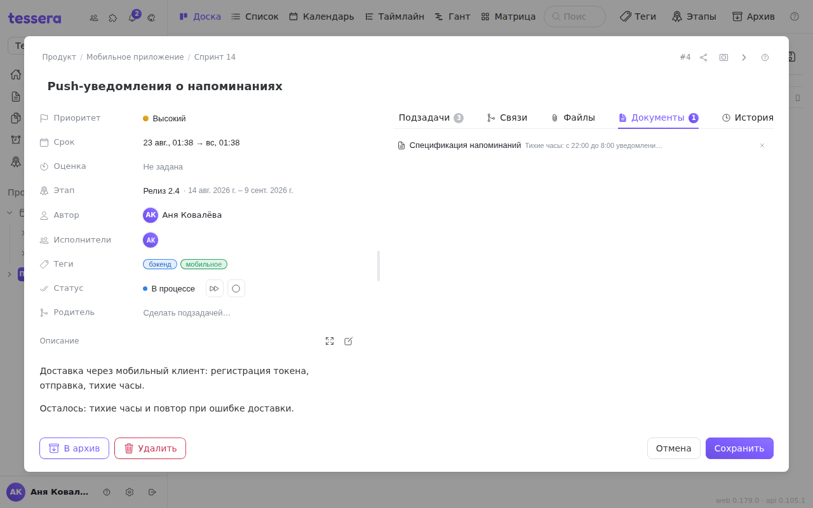

Вкладка **«Документы»** в окне задачи отвечает на один вопрос: **какие документы говорят об этой задаче**. Техническое задание, протокол встречи, регламент — всё, откуда задача выросла или чем она регулируется.

## Связь ставится со стороны документа

Это главное, что нужно знать: **во вкладке «Документы» нет кнопки «добавить»**. Связь создаётся в самом документе — в панели **«Связи и согласование»** (значок цепочки в шапке документа), кнопкой **«Связать задачу»**.

Так сделано намеренно. Связь имеет смысл там, где есть контекст: вы читаете абзац про импорт данных и ставите рядом задачу про импорт. Из окна задачи не видно, к какому именно месту документа она относится, — а это и есть самое ценное в такой связи.

Вкладка задачи — второй конец той же связи. Здесь можно **открыть документ** и **снять связь**; и то и другое работает с любой стороны, строка связи одна.

## Связь на весь документ или на один блок

В документе связь можно поставить двумя способами:

- **На весь документ** — если ничего не выбрано. Обычный случай: «эта задача про этот регламент».
- **На конкретный блок** — если в документе выбран абзац, пункт списка или заголовок. Такая связь отвечает на вопрос «про какой именно пункт задача».

У связи, привязанной к блоку, во вкладке задачи рядом с названием документа стоит **серая цитата** — короткий фрагмент того самого абзаца.

Цитата снимается **в момент создания связи** и дальше не меняется. Это не недоработка: абзац потом правят, и текст, ради которого связь была поставлена, исчезает. Сохранённая цитата — единственное, что через полгода объяснит, о чём шла речь. Если фрагмент переписали целиком, связь стоит переставить.

## Что видно во вкладке

Каждая строка — значок или эмодзи документа, его название и (для связи с блоком) цитата. Клик по строке **закрывает задачу и открывает документ**. Открывается он с начала: цитата в строке — это то, что подскажет, какой абзац искать.

Уже связанные задачи **не предлагаются в выборе** на стороне документа — повторная связь ничего не изменила бы, и кнопка, которая как будто не работает, только сбивала бы с толку.

## Связи и согласование — одна панель

В документе связи с задачами лежат в одной панели с **протоколами согласования**, и это не случайность: маршрут согласования поднимается по документу, а задачи — причина, по которой документ вообще существует. Подробнее о самих документах — импорте и экспорте, истории версий, согласованиях, оглавлении и обсуждениях — в разделе [Документы](/help/documents).
