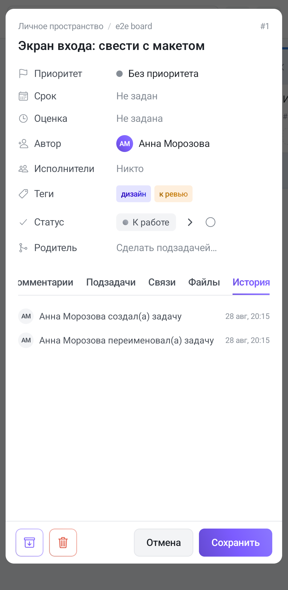

The **History** tab is the task's journal: who did what to it, and when. It is kept automatically — nothing has to be switched on. It is the last tab in the row, so you have to scroll the tabs to the right to get to it.

Each row is a circle with initials, a short sentence about what happened, and a date with a time on the right. Entries run **top to bottom in time**: the first line is the task being created, the last is whatever just happened. An empty journal reads «No history yet».

## Shorter sentences than in the browser

This is the app's main difference: a row names the **event but not its value**.

| In the browser | In the app |
|---|---|
| renamed → “a new title” | renamed the task |
| changed the priority → high | changed the priority |
| moved it → “In progress” | moved the task |
| added a relation to #2591 | added a relation |
| attached the file “report.pdf” | attached a file |

So on a phone the journal tells you **that the task was moved and by whom**, but not where to. If you need that detail, open the task in the browser — the same entry is shown there with its target.

The avatar in the journal is drawn from **initials** rather than a photo: photos are loaded elsewhere in the app, but this row is deliberately narrow.

## What goes into the journal

Creation, renames, description edits, priority changes, due-date changes, completing and reopening, a rescheduled repeat, moves between columns, added and removed assignees, comments, relations, attachments, archiving and restoring.

## What the journal does not keep

Understanding this matters as much as knowing what it does keep:

- **It doesn't keep former values.** A row says “edited the description”, but not what it looked like before. A task's history is not a version history; versions belong to [documents](/help/documents), not to tasks.
- **It doesn't keep the text of a comment.** The journal holds “left a comment”; the text itself lives in the [Comments](/help/comments) tab — and if the comment was deleted, the journal will not bring it back.
- **It is neither deleted nor edited.** Entries are only ever appended.

## Relations leave a trace on both sides

[Relations](/help/task-links) have a quirk that explains some of the entries. The relation itself is stored on the task it was created from, but **it is written into both journals**: “added a relation” appears on both tasks.

So if the Relations tab is empty while the history mentions a relation, everything is fine. The relation exists — it was simply created from the other end. On a phone this is more noticeable than in the browser: the other task's number isn't shown in the row, and the only way to tell which relation is meant is its own tab.

## Commands count as one entry

A comment with [commands](/help/comments) doesn't file a row per command: five commands in one comment produce **one entry** about what was applied. Otherwise a single comment could push the rest of a task's history out of sight.
