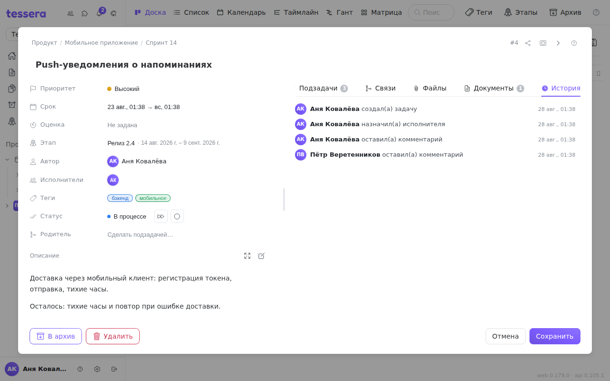

Вкладка **«История»** — журнал задачи: кто, что и когда с ней сделал. Он ведётся сам, ничего включать не нужно.

Каждая строка — это аватар и имя человека, короткая фраза о том, что произошло, и время. Записи идут **сверху вниз по времени**: первая строка — создание задачи, последняя — то, что случилось только что.

## Что попадает в журнал

| Событие | Как выглядит |
|---|---|
| Создание | создал(а) задачу |
| Переименование | переименовал(а) → «новое название» |
| Правка описания | изменил(а) описание |
| Приоритет | изменил(а) приоритет → высокий |
| Срок | установил(а) срок · убрал(а) срок |
| Завершение | отметил(а) выполненной · вернул(а) в работу |
| Повтор | перенёс(ла) повтор задачи |
| Колонка | переместил(а) → «В процессе» |
| Исполнители | назначил(а) исполнителя · снял(а) исполнителя |
| Архив | отправил(а) в архив · восстановил(а) из архива |
| Комментарий | оставил(а) комментарий |
| [Связь](/help/task-links) | добавил(а) связь с #2591 |
| Вложение | прикрепил(а) файл «отчёт.pdf» |

## Что журнал не хранит

Понимать это так же важно, как и то, что он хранит:

- **Не хранит прежние значения.** Строка говорит «изменил(а) описание», но не показывает, что было до правки. История задачи — не история версий; версии есть у [документов](/help/documents), не у задач.
- **Не хранит текст комментария.** В журнале останется «оставил(а) комментарий», сам текст живёт во вкладке [«Комментарии»](/help/comments) — и если комментарий удалили, из журнала он не восстановится.
- **Не удаляется и не правится.** Записи в журнал только дописываются.

## Связи оставляют след с двух сторон

У [связей](/help/task-links) есть особенность, которая объясняет часть записей. Сама связь хранится у той задачи, из которой её поставили, а вот **в журнал она пишется обеим**: у #10 появится «добавил(а) связь с #20», у #20 — «добавил(а) связь с #10».

Поэтому, если во вкладке «Связи» пусто, а в истории есть запись о связи, — всё в порядке. Связь существует, просто она заведена с другой стороны.

## Команды считаются одной записью

Комментарий с [командами](/help/comments) не заводит по строке на каждую команду: пять команд в одном комментарии дают **одну запись** о том, что было применено. Иначе один комментарий мог бы вытеснить из журнала всю остальную историю задачи.
