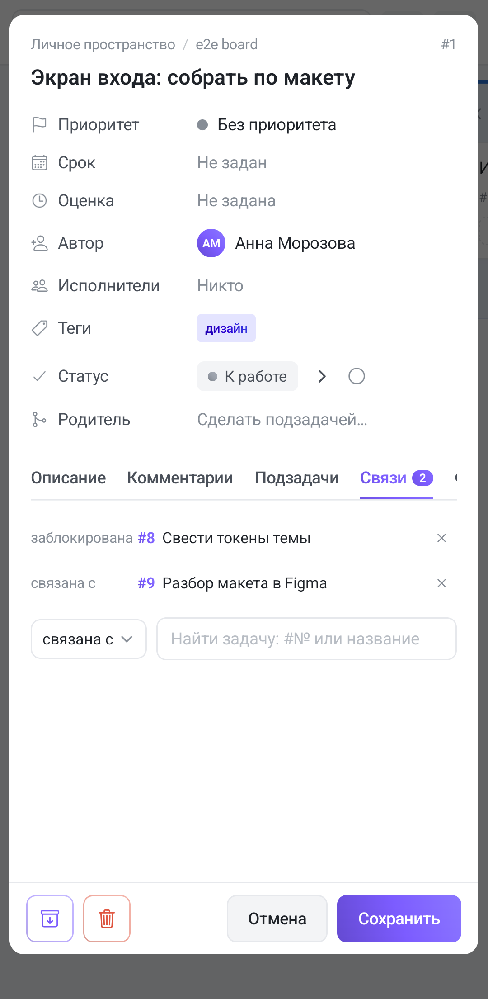

Вкладка **«Связи»** — четвёртая в ряду вкладок задачи. Типы связей, их смысл и правила те же, что в браузере; здесь — то, что на телефоне устроено иначе.

## Четыре типа

| Тип | Читается как |
|---|---|
| **связана с** | «эти две задачи про одно» |
| **блокирует** | «пока не сделаю эту, ту не начать» |
| **заблокирована** | «жду, пока сделают ту» |
| **дублирует** | «то же самое, что и та» |

«Блокирует» и «заблокирована» — **одна связь с двух сторон**. Какую выбрать, зависит только от того, из какой задачи вы её ставите.

## Строка связи

Слева — подпись типа в **колонке фиксированной ширины**, поэтому номера задач выстраиваются друг под другом и список читается столбиком. Дальше — значок источника (у связей из интеграции), номер `#N` акцентным градиентом, название и крестик справа.

У выполненной задачи название **зачёркнуто** — видно, снята блокировка или нет. Касание строки открывает связанную задачу поверх текущей.

## Как поставить

Под списком — ряд из двух элементов: слева **выпадающий список типа**, справа **поле поиска** с подсказкой «Найти задачу: #№ или название».

Поиск идёт **по номеру и по названию сразу**: `2727` найдёт и задачу #2727, и любую, у которой эти цифры внутри номера. Найденное показывается списком, у каждой строки под названием — вторая строка **«проект / доска»**. В браузере то же самое сделано группировкой; на телефоне подпись у каждой строки, потому что заголовок группы съел бы и без того узкую ширину.

**Касание по строке сразу создаёт связь** — отдельной кнопки «Добавить» нет, а поле поиска очищается. Выбран тип «связана с» по умолчанию, так что если нужна блокировка — сначала смените тип, потом ищите.

Список подсказок **обрезается тридцатью строками**. Если нужной задачи не видно, уточните запрос — по номеру это надёжнее всего.

Быстрее всего связи ставятся [командами в комментарии](/help/comments): `/blocks #2591`, `/blocked_by #2591`, `/relate #2591`, `/duplicates #2591`, `/unlink #2591`.

## Удаление — через подтверждение

Крестик **не удаляет сразу**: рядом с ним раскрывается окошко «Убрать связь?» — как и в браузере.

У связи из интеграции текст другой и честный: **«Эта связь вернётся при следующем синке GitLab. Удалить?»**. Пока связь есть в источнике, синхронизация её восстановит — убирать надо там.

## Связь односторонняя — и это видно

То же ограничение, что и в браузере, и на телефоне об него спотыкаются чаще, потому что вкладку с пустым списком легко принять за «связей нет».

Связь **хранится у той задачи, из которой её поставили**. Поставили из #10 «блокирует #20» — во вкладке «Связи» задачи **#10** строка будет, а во вкладке **#20** её **не будет**: там останется запись «добавил(а) связь» в [истории](/help/task-history). Нужна видимость с обеих сторон — поставьте связь с обеих; повторная связь между теми же задачами дубликата не создаёт.

## На Ганте

Вот где ограничение не действует. **[Гант](/help/board-layouts) собирает блокировки со всей доски** и рисует стрелку «конец блокирующей → начало заблокированной» независимо от того, с какой стороны связь заведена. В счётчиках над диаграммой показано их число.

Две вещи про телефон:

- **Протянуть связь от полосы к полосе нельзя** — этот жест в приложении не реализован. Заводите связь здесь, во вкладке, или командой в комментарии.
- **Снять стрелку прямо на диаграмме тоже нельзя** — крестика на дуге нет, идти надо в задачу.

Кнопка **«Авто»** на Ганте раскладывает строки по графу зависимостей — блокирующая всегда выше заблокированной.

Стрелки, как и в браузере, **не двигают даты** и **не рисуются к подзадачам**: дуга всегда цепляется за полосу родителя.

## Пустая вкладка

Если связей нет, вместо списка стоит «Связей пока нет», а под ним — обычный ряд «тип + поиск».
