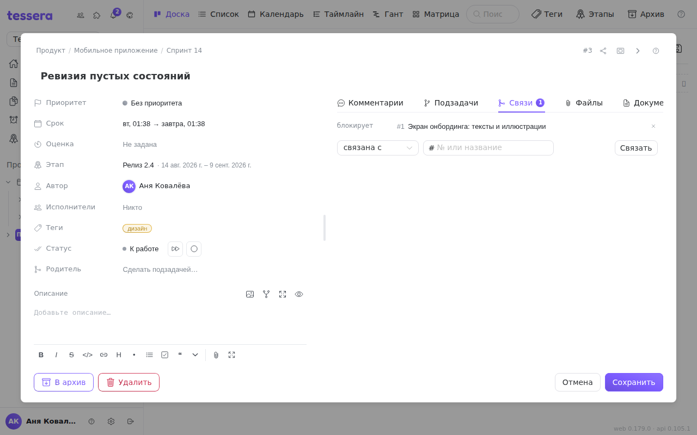

Связь — это утверждение об **отношении двух задач**: одна мешает другой, одна повторяет другую или они просто про одно и то же. Связи живут во вкладке **«Связи»** окна задачи, а блокировки вдобавок рисуются стрелками на [диаграмме Ганта](/help/board-layouts).

## Четыре типа

| Тип | Читается как | Когда ставить |
|---|---|---|
| **связана с** | «эти две задачи про одно» | Ни одна не мешает другой, но, работая над одной, стоит помнить о второй. |
| **блокирует** | «пока не сделаю эту, ту не начать» | Вы держите чужую работу. |
| **заблокирована** | «жду, пока сделают ту» | Вас держит чужая работа. |
| **дублирует** | «то же самое, что и та» | Задачу завели дважды. Обычно после этого дубликат закрывают, а работу ведут в оригинале. |

**«Блокирует» и «заблокирована» — это одна и та же связь с двух сторон.** Какую из двух выбрать, зависит только от того, из какой задачи вы её ставите. Если вы стоите в задаче, которая ждёт, — «заблокирована»; если в той, которую ждут, — «блокирует».

## Как поставить

Внизу вкладки: слева выбор типа, справа поле поиска. В поле можно **ввести номер** задачи или **начать печатать название** — подсказка ищет по всему пространству и группирует найденное по «проект · доска», поэтому одноимённые задачи из разных проектов не перепутаются.

Связать можно с задачей на любой доске пространства, включая подзадачу: блокировки между подзадачами — обычное дело.

Строка связи ведёт себя как ссылка: клик открывает связанную задачу. У выполненной задачи название зачёркнуто, так что видно, снята блокировка или нет. Крестик справа связь снимает.

Быстрее всего связи ставятся [командами в комментарии](/help/comments): `/blocks #2591`, `/blocked_by #2591`, `/relate #2591`, `/duplicates #2591`, `/unlink #2591`.

## Связь односторонняя — и это видно

Тонкость, о которую легко споткнуться. Связь **хранится у той задачи, из которой её поставили**. Если из #10 сказать «блокирует #20», то:

- во вкладке «Связи» задачи **#10** будет строка «блокирует #20»;
- во вкладке «Связи» задачи **#20** зеркальной строки **не появится** — там будет запись в [истории](/help/task-history) «добавил(а) связь с #10».

Так что не удивляйтесь пустой вкладке «Связи» у заблокированной задачи. Если связь должна быть видна с обеих сторон — поставьте её с обеих сторон; повторная связь между теми же задачами не создаёт дубликата.

На **[Ганте](/help/board-layouts) это ограничение не действует**: диаграмма собирает блокировки со всей доски и рисует стрелку независимо от того, с какой стороны связь заведена.

## Связи из интеграции

Связь, созданную интеграцией (например GitLab), помечает серый значок с названием источника. Свои связи ничем не помечены — подпись «Tessera» на каждой строке была бы шумом.

Удалить такую связь можно, но подтверждение честно предупредит: **«Эта связь вернётся при следующем синке»**. Пока связь есть в GitLab, синхронизация будет восстанавливать её. Убирать надо в источнике.

## Блокировки на диаграмме Ганта

Гант — единственное место, где зависимости видно целиком.

**Стрелки.** Каждая блокировка рисуется дугой **от конца блокирующей задачи к началу заблокированной** (finish-to-start). Стрелки строятся по всем блокировкам доски сразу, а пара, связанная с обеих сторон, даёт одну стрелку, а не две.

**Создание перетаскиванием.** У правого края каждого отрезка есть точка привязки. Потяните за неё к другому отрезку — за курсором пойдёт живая дуга, а отпускание создаст связь «эта задача **блокирует** ту». Дубли не создаются: если пара уже связана (в любую сторону), перетаскивание ничего не сделает.

**Удаление.** Наведите на стрелку — в её середине появится крестик.

**Порядок «Авто».** Кнопка **«Авто»** на Ганте выстраивает строки **по графу зависимостей**: блокирующая задача идёт раньше заблокированной, и цепочка `A → Б → В` читается сверху вниз, даже если в исходном списке они лежали вперемешку. Задачи из циклической зависимости не теряются — они дописываются в конец в обычном порядке.

«Авто» — это отдельный режим, а не ещё один уровень сортировки: нажатие на кнопку **сбрасывает группировку, сортировку и фильтры**. И наоборот — стоит добавить любую группировку или сортировку, режим тихо выключается (а стоит их убрать — возвращается). Двух порядков одновременно быть не может, и Tessera не делает вид, что может.

Две вещи, которых Гант не делает и делать не должен:

- **Стрелки не двигают даты.** Tessera не пересчитывает расписание за вас: связь показывает зависимость, а решение о переносе остаётся вашим.
- **Стрелки не рисуются к подзадачам.** Подзадачи показаны тонкими под-отрезками внутри строки родителя, и стрелка всегда цепляется за отрезок родителя. Саму связь между подзадачами поставить можно — она просто не рисуется дугой.

Задачи без единой даты в диаграмму не попадают — они собраны в списке «без расписания» под ней, и связи у них по-прежнему видны в окне задачи.
