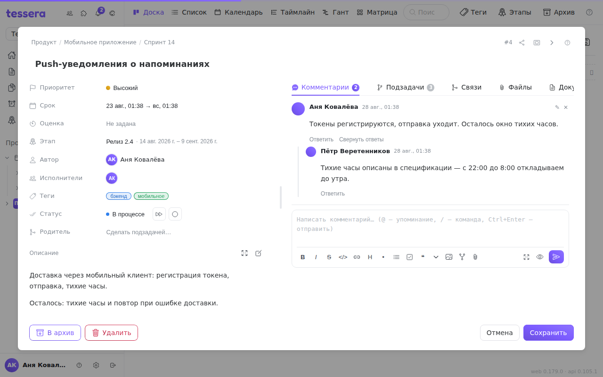

A card on the board shows a task in two lines. Everything else — the estimate, the milestone, the author, the relations, the files, the history — lives in the **task window**. It opens with a click on the card and closes with `Esc` or a click outside it.

The window is split in half: **fields on the left**, **tabs** with the task's content on the right. The divider between the halves can be dragged, and a double click on it hides the right half entirely (and brings it back).

## Three ways to open a task

The **How to open a task** button in the window header switches the presentation:

- **Modal window** — the familiar centred dialog. The default.
- **Full screen** — the window fills the screen, for tasks with a long description.
- **Side panel** — the task moves into a panel on the right and the board stays live on the left: you can see which column the task is in and what sits next to it.

The choice is remembered **on this device**, not in your profile: a 27" monitor suits the side panel, a laptop the modal, and forcing one on the other would be uncomfortable. On a narrow screen there is no choice — a task always opens as a full-screen sheet.

## The window header

- The **breadcrumbs** “project · board” at the top aren't just a caption. Clicking them opens the list of boards: that's how a task is **moved to another board**, with all of its history.
- The **arrow button** copies a link to the task, shaped `/board/<board>?task=<number>`. Send it to a colleague and it opens the board with that task already unfolded.
- The **title** is edited right in the header — it's an ordinary input, not a separate form.
- If the task is linked to GitLab, an **Open issue in GitLab** link appears next to it.

## The fields on the left

| Field | What it does |
|---|---|
| **Priority** | Five levels; the coloured priority dot is visible on the card too. |
| **Due** | Opens the calendar: start date, due date, time, plus **recurrence** and **notifications**. |
| **Estimate** | How much work the task is, in the project's units. |
| **Milestone** | The milestone the task belongs to; a new one can be created here as well. |
| **Author** | Who created the task. Read-only. |
| **Assignees** | Any number of people, including members from GitLab. |
| **Tags** | The same tags the board can lay itself out by. |
| **Status** | The board column. Next to it: a “Move →” button for the next column and a “Done” tick. |
| **Parent** | Make the task a subtask of another one, or detach it from its parent. |

### The estimate: what a card can't edit

The estimate is entered in the units configured for the project: **time** (`3d 4h`, `90m`, `1w`), **story points** or **custom units**. If the project works on a scale (Fibonacci, T-shirts, linear), the popover offers a ready list of values instead of a text field.

Next to its own estimate a task shows **`Σ` — the sum of its subtasks' estimates**. These are two different numbers and they are deliberately not added together: `Σ` answers “how much will the children take”, the own estimate “how much the task itself will”.

On a board card the estimate and the milestone are shown as **read-only chips** (unless you have hidden them in [Customising the board](/help/board-customize)). They can only be changed here, in the task window — which is the main reason to open a task that already looks complete on the board.

### Due date, recurrence and notifications

The calendar has three parts:

1. **Start and due** — two dates, each with a time. The start date is what [the timeline and the Gantt chart](/help/board-layouts) need: without it a task is drawn as a point rather than a bar.
2. **Recurrence** — daily, weekly, monthly, yearly, or **on selected dates you tick in the calendar**. A repeat fires on an event: when the task is completed, when it enters a chosen column, or simply on schedule. You can ask it to **create a duplicate** (so the history stays with the original), to **skip weekends** and to **repeat forever**.
3. **Notifications** — how early to remind (at the due time, 15 minutes, an hour, 3 hours, a day before) and whether to repeat the reminder. “Default” takes the setting from [Notifications](/help/notifications).

## The tabs on the right

Every tab label carries a counter, so a closed tab still tells you whether there is anything inside.

- **Description** — the [Markdown editor](/help/markdown-editor) with a toolbar, attachments and diagrams.
- **[Comments](/help/comments)** — the discussion, with reply threads, mentions and commands.
- **Subtasks** — this task's children; the same ones the card shows when [subtasks are expanded](/help/board-composer).
- **[Relations](/help/task-links)** — blocks, duplicates and plain “relates to”.
- **Files** — the task's attachments. Files dropped into the description land here too.
- **[Documents](/help/task-documents)** — documents that point at this task.
- **[History](/help/task-history)** — the journal of changes.

## The bottom of the window

At the bottom: **Archive** and **Delete**. The difference matters: [the archive](/help/archive) keeps the task whole and lets you bring it back, deleting is irreversible.

If the task has subtasks, archiving asks what to do with them: archive them along with the parent, or detach them and leave them on the board.

An archived task opens **read-only** — the window says so outright, and instead of the action buttons there is “Restore from the archive”.
